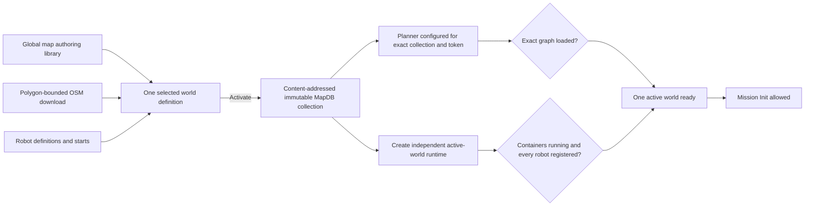

# Project Planning

> **Documentation label: CURRENT**
> Living roadmap and migration constraints. Read
> [Architecture](docs/ARCHITECTURE.md) first for the current system boundaries.

## Purpose

This file is the living high-level plan for the project. It records the main objective, the order of major work, and the compatibility rules that should guide implementation choices.

Read it at the start of every new working session involving architecture, ROS integration, mission contracts, the UI/backend boundary, LLM integration, scenarios, or benchmarking. Keep detailed implementation notes in their relevant technical documents; keep this file focused on project-wide goals.

Prefer minimal, reviewable changes. Change only the layer needed for the stated
requirement, preserve existing contracts by default, and avoid combining a
focused fix with unrelated refactoring or cleanup.

If a new session reveals a recurring problem, compatibility trap, or important fact that future sessions could otherwise miss, add a short entry to the **Session Problem Log** at the end. Do not log temporary progress, routine test results, or problems already explained in the documentation.

## Main Objective

The first objective is to create a reliable multi-robot system with a clear, practical UI and a backend that uses the correct mission, task, map, agent, REST, and ROS contracts.

Once that system works reliably, integrate an LLM that accepts natural language, retrieves the correct operational and contract context, and creates valid mission definitions. Then create representative multi-robot scenarios and a repeatable benchmark. In the far future, the LLM may control the wider system through safe, observable, and explicitly bounded tools.

The LLM and benchmark must build on a working multi-robot system; they should not replace or bypass the system's contracts.

## Non-Negotiable Compatibility Rules

`legacy_ros/` is a frozen, read-only compatibility reference. Never implement fixes, features, configuration changes, or documentation updates inside that directory. All ROS backend development belongs in `backend/`; compatibility work must inspect and test `legacy_ros/` without modifying it. Do not copy backend changes back into the legacy tree or require the two trees to remain synchronized.

Preserve message and service structures, topic and service names, numeric enums, mission and task-plan shapes, and coordinate conventions. Keep legacy normalization and ROS behavior in the editable backend. Any necessary contract migration requires documentation, compatibility handling, tests, and user approval. Verify compatibility against the frozen Dockerized legacy stack without changing its source.

## World Model And Invariants

A **world definition** is the saved input that can create one simulated
reality: its selected map assets, frozen OSM road imports, robot definitions,
and starting locations. It is an authoring/launch recipe. A mission is an
operation performed inside the launched **active world**. Roads and other
world assets therefore belong to active-world state, not to the mission
description.

The existing implementation and compatibility API use `scenario`,
`scenario_id`, and `/api/scenarios/*`. Keep those stable until an explicit
contract migration; use **Worlds**, **World Builder**, **world definition**,
and **active world** in operator-facing language.

Launch is a one-way materialization boundary. After it succeeds, runtime code
must not consult the mutable source definition. The planner, C2 display,
mission validation, and robot processes read the frozen launched snapshot and
subsequent live-world revisions. Editing or selecting a definition affects
only a future launch. Definition identity may remain on runtime records as
provenance, but not as a runtime data dependency.

There are three related concepts which must not be conflated:

| Concept | Purpose | Source of truth |
| --- | --- | --- |
| World-definition catalog | Saved launch definitions and immutable launched versions available for reuse | `MapDB._scenario_versions` and the versioned MapDB collections |
| Selected world definition | The definition currently being edited or previewed in World Builder | Browser definition-library state, reconciled with `GET /api/scenarios` |
| Active world | The launched reality controlling the planner, ROS coordination, robot containers and C2 mission validation | Durable legacy-named `MapDB._active_scenario` record plus its frozen collection, reconciled with planner config and live Docker/ROS/Mongo checks; `active_scenario.json` is a generated cache |

Selecting a definition in World Builder changes only the definition being
edited. It does **not** change simulated reality. Only a successful **Launch**
(implemented by the compatibility `activate` endpoint) replaces the active
world.



Launch is a transaction boundary (the compatibility API calls it activation):

1. Validate the draft and resolve only its referenced map features.
2. Normalize its downloaded OSM LineStrings as scenario `road` features.
3. Hash the complete definition and create or reuse
   `MapDB.scenario_<scenario-id>_<version>`. A published version is immutable.
4. Write the planner configuration with that exact collection and a unique
   activation token.
5. Stop the previous scenario containers, clear scenario-dependent runtime
   records, and restart central coordination, the planner, the C2 REST bridge,
   and rosbridge.
6. Create only the requested scenario robot containers.
7. Mark the scenario ready only after the planner reports the exact collection
   and token, required containers are running, and every configured canonical
   robot ID is registered.

The following rules are non-negotiable for world-definition and active-world work:

- Exactly one world may be active. Retained immutable collections
  are history/catalog entries and must never be merged into the active graph.
- MongoDB is the durable activation authority. The runtime JSON file is a
  generated/degraded cache, and a cached `ready` value never overrides failed
  live readiness checks.
- Repeating activation of the same content-hash version while its runtime is
  still healthy is idempotent and must not restart or clear the backend.
- `MapDB.rma` and the full `map_features`/GeoJSON response are authoring
  libraries, not a fallback runtime reality.
- World Builder may show unattached objective points as available authoring
  references, but must distinguish them from assets included in the selected
  definition. C2 must render the launched active-world snapshot plus explicit
  live-world changes, never the mutable source definition. A
  failed, activating or stale runtime may disable missions and show an error,
  but it must never reveal all global map features or combine scenarios.
- OSM road imports remain owned by one scenario. Do not put roads in mission
  JSON, append them to another scenario during selection, or use the general
  OSM reference overlay as planner input.
- Changing any world-definition content creates a new immutable version on launch.
  Never edit an existing versioned collection in place.
- A running robot container is not proof of readiness. Docker state, ROS/Mongo
  registration and the planner's exact collection/token marker must all agree.
- A previously verified `stale` runtime may recover automatically only after
  those checks all agree again, including the exact planner collection/token
  marker. `activating` and `failed` states never auto-promote to ready.
- Browser-local definition selection, the catalog's `runtime_active` label and backend
  readiness are different facts. Use stable scenario IDs when reconciling
  them; do not synchronize them by unioning arrays or by copying the previous
  scenario's non-empty state.
- Active-world replacement must be atomic from the consumer's point
  of view. Clear or key cached Leaflet layers, selected features, pending edits,
  roads and robot overlays by scenario ID so the previous scenario cannot
  survive a switch or appear during an intermediate render.

Before changing World Builder, map filtering, definition persistence, launch,
planner loading or robot launching, trace and test both directions:

```text
select definition A -> preview A -> launch A -> active world is materialized from A
select definition B -> preview B while the active world remains unchanged -> launch B -> active world is replaced from B
```

Also test the same sequence when activation is `activating`, `failed` or
`stale`; none of those states authorizes a fallback to the global feature
library.

## ZE Plan

- [x] Run the actual legacy ROS fog, planner, fleet, edge, and autonomy components in Docker.
- [x] Provide a map-based UI and FastAPI compatibility adapter around the legacy runtime.
- [ ] Complete and verify a reliable multi-robot mission flow with a clear UI, diagnostics, and modular backend boundaries.
- [ ] Update the backend to adapt to STANAG 4817, and make sure all features tested and working.
- [ ] Integrate with MQTT system.
- [x] Create the bounded revisioned operational-picture foundation provided to the LLM on every message.
- [x] Add the first NL-to-mission draft pipeline with deterministic schema/semantic/environment membership validation, separate command-readiness gating, and explicit operator review.
- [ ] Add request-scoped planner preflight, full scenario/fleet feasibility checks, authentication, and evaluation before any model command tools.
- [ ] Add database-backed activation fencing and restart resume/rollback before running more than one API worker.
- [ ] Enforce write-once scenario collections or add bounded recurring content-digest verification.
- [ ] Test for small reapetable mission.
- [ ] Create large level scenarios for benchmarking.

## Evolve The Editable ROS Runtime

This is the subtasks of task 3 of ZE Plan

- [x] Create an editable ROS runtime derived from the frozen compatibility reference so it can evolve without modifying `legacy_ros/`.
- [ ] We select and think of different behaviour of different elements to our needs. Maybe architectural changes.
- [ ] Derive separate navigation and coverage graph views from one revisioned
  active-world graph: ordinary point navigation must not route through the
  current geofence/workspace coverage lattice, while coverage retains a
  task-local sweep graph and uses the navigation view for transit.
- [ ] We implement the changes one by one and test them, with unit tests where possible.
- [ ] Test with the UI.


## ZE Log

- **2026-08-27 — A live HTTP gateway can be absent from the ROS graph after a
  host network change:** Long-running host-network `c2-ros-rest` and
  `rosbridge` containers kept accepting HTTP/WebSocket connections after their
  CycloneDDS sockets were bound to a vanished host interface. Init returned
  HTTP 200, but `/c2_node` was absent and the planner received nothing; repeated
  `ddsi_udp_conn_write ... retcode -1` messages were the tell. The local
  all-in-one simulation now uses `ROS_LOCALHOST_ONLY=1` with an expanded
  CycloneDDS automatic participant-index range, and real scenario activation
  restarts both gateways with coordination and the planner. If this
  recurs, check the ROS graph for `/c2_node` and `/rosbridge_websocket`, not only
  ports 5001/9090. A deployment with remote ROS hosts needs an explicit stable
  CycloneDDS interface/discovery configuration instead of localhost-only mode.

- **2026-08-27 — Diagnostic graph rendering can make a ready planner appear
  hung:** The planner logged `MAP IS LOADED` and then synchronously annotated an
  80,684-edge graph on its single ROS executor. State timers, `CreatePlanner`,
  and `GetPlan` could not run while it rendered. Automatic graph-image rendering
  is now kept out of initialization and planning callbacks; diagnostics must not
  block command or feedback paths.

## Session Problem Log

- **2026-08-27 — A bounded log tail is not durable planner readiness:** Large
  task-plan JSON output pushed the planner's startup collection/token marker
  beyond the last 1,000 Docker log lines, causing a healthy unchanged planner
  to become `stale` and disabling Init/Re-init. Activation-time marker proof is
  now retained while the same Docker planner process `StartedAt` remains in
  place; a restarted process must prove the marker again.

- **2026-08-27 — Mission proposal editability is not command readiness:** A
  temporary stale runtime caused the assistant to refuse a harmless change to
  an already grounded mission, while the browser also kept the first model
  envelope instead of adopting a same-ID revision. Canonical proposal editing
  is now allowed when the hidden environment identity still matches; Init and
  Re-init retain the strict READY check. A revision replaces the browser
  working copy, marks the prior plan as belonging to the old definition, and
  disables Approve/Start until the operator explicitly Re-initializes it.

- **2026-08-12 — Cross-scenario map leakage:** C2 used the global map feature
  library whenever `activeScenarioRuntime.ready` was false. A transient missing
  robot registration changed the active scenario to a latched `stale` state;
  although all five containers and registrations were subsequently present,
  the UI then rendered assets belonging to multiple saved scenarios. Runtime
  readiness and map visibility must be handled independently: a non-ready
  scenario blocks mission commands, while the map remains scoped to that one
  scenario (or explicitly empty), never to all authoring assets.
