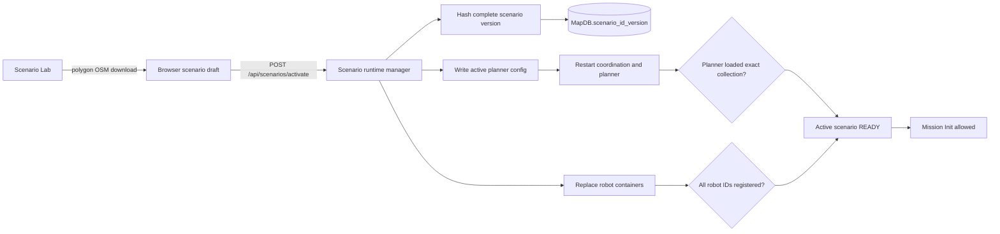

# Architecture

C2 iMUGS2 uses a stable adapter boundary around the actual legacy ROS runtime. The long-term replacement code remains modular, but compatibility work must not require the browser to understand ROS or the core domain to depend on legacy infrastructure.

Read [PROJECT_PLANNING.md](../PROJECT_PLANNING.md) before changing these boundaries.

## Runtime Layers

```text
React/Vite/Leaflet UI
  -> FastAPI JSON + SSE adapter
     -> legacy REST client for mission commands
     -> rosbridge client for ROS diagnostics and live reads
     -> scenario activation + immutable MapDB snapshots
  -> Dockerized legacy ROS stack
     -> C2 -> interface -> orchestrator -> mission manager
     -> planner -> fleet manager -> edge supervisor -> autonomy sim
```

The UI never constructs ROS messages or connects directly to rosbridge. The backend owns partial structural validation, legacy alias translation, coordinate conversion, feature inlining, and feedback normalization. The canonical JSON Schemas are currently design contracts rather than validators executed by the mission endpoint.

## Replacement Core

The independent core is organized around ports in `src/c2_imugs2/ports.py`:

- `PlannerPort`
- `AgentRepositoryPort`
- `MapRepositoryPort`
- `MissionRepositoryPort`
- `PlanRepositoryPort`
- `EdgeDispatcherPort`

`MissionService` orchestrates these ports. `SimplePlanner` and the file-backed repositories are development implementations, not substitutes for the real legacy runtime during compatibility testing.

Any future planner adapter should preserve the logical boundary:

```text
mission_config + selected agents -> validated task_plan
```

## Code Ownership

| Area | Main files | Responsibility |
| --- | --- | --- |
| UI | `frontend/src/App.tsx`, `MapView.tsx`, `api.ts` | Operator workflow, map rendering, API/SSE consumption |
| Compatibility API | `src/c2_imugs2/api.py` | Stable UI endpoints and normalized runtime state |
| Legacy command adapter | `legacy_rest.py` | Old REST actions and canonical-to-legacy field translation |
| ROS read adapter | `rosbridge.py` | Diagnostics and topic subscriptions |
| Map adapter | `legacy_map.py` | Legacy GeoJSON, runtime features, explicit polygon-bounded OSM queries |
| Scenario runtime | `scenario_runtime.py`, `scenario_launch.py` | Freeze a scenario version, switch the planner, replace and verify robot containers |
| Domain contracts | `domain.py`, `mission_config.py`, `task_plan.py`, `schemas/` | Enums, normalization, and validation |
| Modular core | `mission_service.py`, `ports.py`, `repositories.py`, `planner.py` | Replaceable non-ROS orchestration |
| Legacy runtime | `legacy_ros/` | Actual old nodes and embedded ROS interfaces |

## Compatibility Boundary

Canonical data stays clean inside the UI/backend, while adapters preserve the old external contract. For example:

```text
canonical transit.optimization
  -> legacy_rest.py
  -> legacy transit.optimalization
```

Runtime user features are also converted at this boundary: the UI may refer to a saved feature, but the adapter sends inline geometry when the old planner cannot resolve that runtime `feature_id`.

Scenario roads are not mission geometry. The mission carries objectives and constraints; the active scenario's roads live in its MapDB snapshot.

## One Active Scenario

Scenario activation is the transaction boundary that changes simulated reality:



Only one scenario may be active. Each activation creates or reuses a content-addressed, immutable collection named `MapDB.scenario_<id>_<version>`. Old version collections are retained for reproducibility; they are not merged into the active graph. `MapDB.rma` remains the legacy seed and Scenario Lab authoring library, not the planner's source after activation. Central coordination is restarted during the switch so mission nodes from the previous reality cannot survive into the new one.

OSM has one operational path: the operator explicitly downloads roads inside a Scenario Lab polygon, the browser keeps those GeoJSON LineStrings in the scenario draft, and activation freezes them as `road` features in the versioned MapDB collection. The deployed planner has `load_osm_from_network: false`; it does not make a second live OSMnx download.

Activation stays non-ready unless both checks pass:

- the planner logs that it loaded the exact versioned MapDB collection and produced a non-empty graph;
- every configured robot container is running and its canonical ID appears in `RuntimeDB.ConnectedVehicles`.

Mission Init is rejected with HTTP `409` while no scenario is ready or when a mission names a robot outside the active scenario.

The old REST status command is stateful: its body has no mission id and `/c2_node` targets the last mission it initialized. FastAPI's mission-specific approve/start URLs do not remove that legacy limitation. Likewise, an HTTP success is only command acceptance; ROS mission feedback is the authoritative state.

Do not change message layouts, enum values, topic/service names, or mission/task JSON structures as an architectural shortcut. Add or replace an adapter instead.

## Live State

`GET /api/events` emits normalized SSE events:

```text
diagnostics.updated
mission.updated
agent.updated
planner.updated
```

Mission status and path availability are separate. Planner readiness is not evidence of a route; a usable route comes from mission feedback containing waypoint tasks.

## Replacement Strategy

Replace one boundary at a time:

1. Define and test the stable input/output contract.
2. Add the new implementation behind the existing port or adapter.
3. Compare it with the legacy runtime.
4. Switch callers only after compatibility is verified.

This lets the planner, ROS transport, storage, UI, and later LLM tooling evolve independently without a broad legacy rewrite.
