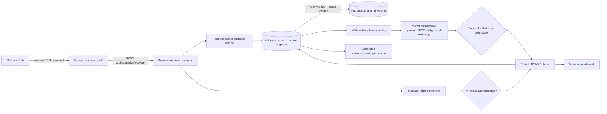

# Architecture

> **Documentation label: PRIMARY**
> This is the most important technical document for coding agents and human
> maintainers. It describes the current system boundaries; implementation
> details still need confirmation against source, Compose, and tests.

C2 iMUGS2 uses a stable adapter boundary around the editable ROS runtime in `backend/`. That runtime preserves the required legacy contracts while evolving independently. The long-term replacement code remains modular, but compatibility work must not require the browser to understand ROS or the core domain to depend on legacy infrastructure. `legacy_ros/` is a frozen, read-only comparison reference.

Read [PROJECT_PLANNING.md](../PROJECT_PLANNING.md) before changing these boundaries.

## Change Discipline

Prefer the smallest change that satisfies the requirement. Modify only the
owning layer, preserve stable contracts by default, and avoid adjacent
refactors, broad renames, or legacy-tree synchronization unless they are
explicitly requested. Because the editable backend is a work in progress,
record current behavior without presenting it as permanent architecture.

## Runtime Layers

```text
React/Vite/Leaflet UI
  -> FastAPI JSON + SSE adapter
     -> thin mission, scenario, and assistant routers over application services
     -> legacy REST client for mission commands
     -> rosbridge client for ROS diagnostics and live reads
     -> scenario activation + immutable MapDB snapshots
     -> revisioned OperationalPicture read model
     -> LangChain chat adapter -> LM Studio OpenAI-compatible API
  -> Dockerized editable ROS backend (`docker-compose.backend.yml`)
     -> C2 -> interface -> orchestrator -> mission manager
     -> planner -> fleet manager -> edge supervisor -> autonomy sim
```

The UI never constructs ROS messages or connects directly to rosbridge. The
backend executes the canonical mission JSON Schema and semantic checks after
legacy-alias normalization, and owns coordinate conversion, feature inlining,
compatibility translation, and feedback normalization. Generated assistant
proposals pass through the same deterministic schema/semantic validator,
including finite coordinate/range and Point, LineString, or closed single-ring
Polygon checks, and remain editable drafts until an operator explicitly
initializes them.

## Frontend UI Conventions

The frontend uses Tailwind with shadcn-style shared primitives from
`frontend/src/components/ui/`. New UI work should compose those primitives
before introducing local visual variants. Buttons, badges, tabs, inputs,
alerts, and cards should share the existing neutral surfaces, border radii,
focus behavior, spacing scale, and semantic tones.

Operator controls should favor compact, glanceable state over permanently
expanded explanation. Dense runtime information belongs in small status chips
or summaries with accessible hover/focus text; longer raw or diagnostic detail
belongs in the Diagnostics view or an explicit disclosure. Responsive panels
must preserve access to every action without forcing the map below its useful
minimum size.

Pane hierarchy belongs directly below the workspace title and above section
tabs, readiness, runtime state, and commands. A selected mission keeps that
same context header across Mission, Plan, Assets, and Diagnostics; Back returns
to the Missions collection and its default Mission section.

## Replacement Core

The independent core is organized around ports in `src/c2_imugs2/ports.py`:

- `PlannerPort`
- `AgentRepositoryPort`
- `MapRepositoryPort`
- `MissionRepositoryPort`
- `PlanRepositoryPort`
- `EdgeDispatcherPort`

`MissionService` orchestrates these ports. `SimplePlanner` and the file-backed repositories are development implementations, not substitutes for the real editable ROS backend during integration testing.

Any future planner adapter should preserve the logical boundary:

```text
mission_config + selected agents -> validated task_plan
```

## Code Ownership

| Area | Main files | Responsibility |
| --- | --- | --- |
| UI | `frontend/src/App.tsx`, `MapView.tsx`, `api.ts` | Operator workflow, map rendering, API/SSE consumption |
| Compatibility API | `src/c2_imugs2/api.py`, `api_routers.py`, `application_services.py` | Composition, stable UI endpoints, and mission/scenario command orchestration |
| Assistant | `assistant/`, `operational_picture.py`, `operational_context.py`, `live_operational.py` | Versioned prompts, one-shot LangChain calls, and a bounded source-labelled picture on every message |
| Persistence maintenance | `mongo_maintenance.py` | Idempotent indexes and explicit dry-run-first feedback compaction |
| Legacy command adapter | `legacy_rest.py` | Old REST actions and canonical-to-legacy field translation |
| ROS read adapter | `rosbridge.py` | Diagnostics and topic subscriptions |
| Map adapter | `legacy_map.py` | Legacy GeoJSON, runtime features, explicit polygon-bounded OSM queries |
| Scenario runtime | `scenario_runtime.py`, `scenario_launch.py` | Freeze a scenario version, switch the planner, replace and verify robot containers |
| Domain contracts | `domain.py`, `mission_config.py`, `task_plan.py`, `schemas/` | Enums, normalization, and validation |
| Modular core | `mission_service.py`, `ports.py`, `repositories.py`, `planner.py` | Replaceable non-ROS orchestration |
| Editable ROS runtime | `backend/` | Writable ROS nodes, planner, edge runtime, configuration, and embedded interfaces |
| Frozen legacy reference | `legacy_ros/` | Read-only historical runtime used only for inspection and compatibility comparison |

## Compatibility Boundary

Canonical data stays clean inside the UI/backend, while adapters preserve the old external contract. For example:

```text
canonical transit.optimization
  -> legacy_rest.py
  -> legacy transit.optimalization
```

Runtime user features are also converted at this boundary: the UI may refer to
a saved feature, but the adapter sends inline geometry when the editable
backend planner's inherited compatibility path cannot resolve that runtime
`feature_id`.

The canonical schema permits missions without `transit`. The inherited planner
does not, so mission initialization adds a conservative `max_speed` only to the
backend-bound copy: the minimum positive speed declared by the selected active
scenario agents, or `1.0 m/s` when none is available. Explicit mission speed
wins, and the canonical mission stored by the adapter remains unchanged. The
editable planner also defaults safely for direct ROS clients that bypass the
adapter.

Scenario roads are not mission geometry. The mission carries objectives and constraints; the active scenario's roads live in its MapDB snapshot.

## One Active Scenario

Scenario activation is the transaction boundary that changes simulated reality:



Only one scenario may be active. MongoDB's `MapDB._active_scenario` singleton
is the durable authority; `data/runtime/active_scenario.json` is a generated
cache. Each activation has an idempotency/content hash, durable activation ID
and phase record in `MapDB._scenario_activations`, and creates or reuses a
content-addressed, immutable collection named
`MapDB.scenario_<id>_<version>`. Re-activating the same verified content is a
no-op. Old version collections are retained for reproducibility; they are not
merged into the active graph. `MapDB.rma` remains the legacy seed and Scenario
Lab authoring library, not the planner's source after activation. Central
coordination and both ROS gateways are restarted during a real switch so
mission nodes or DDS participants from the previous reality cannot survive
into the new one. Because the editable simulation runs every ROS participant
on one host-network namespace, it pins DDS discovery to loopback with
`ROS_LOCALHOST_ONLY=1` and raises CycloneDDS's automatic participant-index
range for the multi-process fleet. Remote-robot deployments must replace that
with an explicit stable CycloneDDS network/discovery configuration.

“Immutable” is currently an application invariant: creation/reuse verifies the
complete content hash, while routine READY checks verify collection identity
and count. MongoDB does not yet deny a privileged same-count mutation. Use
write-once database permissions or a recurring digest proof before treating
the stored map hash as continuous tamper evidence.

Activation serialization is currently process-local and Compose runs one API
worker. The phase and singleton writes are durable diagnostics, but they are
not a MongoDB transaction, distributed lock, or automatic restart-resume
protocol. Multi-worker deployment therefore requires database-backed fencing
and explicit resume/rollback recovery before it is safe.

OSM has one operational path: the operator explicitly downloads roads inside a Scenario Lab polygon, the browser keeps those GeoJSON LineStrings in the scenario draft, and activation freezes them as `road` features in the versioned MapDB collection. The deployed planner has `load_osm_from_network: false`; it does not make a second live OSMnx download.

Mission endpoints may fall between graph junctions. The planner projects those endpoints onto risk-safe edges and splits the selected edges only in a request-local graph copy. These virtual endpoint nodes must never be written to, or reused to mutate, the active scenario's immutable MapDB snapshot or its base routing graph.

Diagnostic graph-image rendering is not run synchronously during map
initialization or mission planning. Both are ROS executor callbacks, so a large
render would prevent planner state, services, and mission feedback from making
progress even after the map-ready marker was logged.

Activation stays non-ready unless all checks pass:

- the planner logs that it loaded the exact versioned MapDB collection and produced a non-empty graph;
- coordination, the planner, the C2 REST bridge, and rosbridge containers are running;
- every configured robot container is running and its canonical ID appears in `RuntimeDB.ConnectedVehicles`.

The exact planner collection/token marker is captured during activation. Large
plan JSON logs may later move that startup line beyond Docker's bounded log
tail; readiness therefore retains the verified proof only while Docker reports
the same planner process `StartedAt`. A planner process started after
verification must emit the exact marker again.

Mission Init is rejected with HTTP `409` while no scenario is ready or when a mission names a robot outside the active scenario.

The old REST status command is stateful: its body has no mission id and `/c2_node` targets the last mission it initialized. FastAPI's mission-specific approve/start URLs do not remove that legacy limitation. Likewise, an HTTP success is only command acceptance; ROS mission feedback is the authoritative state.

Do not change message layouts, enum values, topic/service names, or mission/task JSON structures as an architectural shortcut. Add or replace an adapter instead.

## Live State

`GET /api/events` emits normalized SSE events:

```text
diagnostics.updated
mission.updated
agent.updated
planner.updated
```

Mission status and path availability are separate. Planner readiness is not evidence of a route; a usable route comes from mission feedback containing waypoint tasks.

## Operational Context And LLM Assistant

The assistant reasons about the editable backend, not `legacy_ros/`. A backend
provider builds bounded internal runtime, agent, mission, plan, health, and
warning sections with stable IDs, freshness and provenance. It also reads
mission-relevant Point and single-ring Polygon facts from the exact active
MapDB collection, within strict feature and coordinate budgets; mutable map
authoring files are excluded until activation. The first message receives a
full `OperationalPicture`; later messages request a checksum-bound keyed diff
from the conversation's previous revision. The orchestrator materializes and
validates the new full picture before including it in that message's prompt.
Every answer reports the revision it used.

Internal scenario/version/collection/hash/activation identity is retained for
post-generation stale-proposal checks but projected out of model messages. The
LLM sees a `current_environment` abstraction containing readiness, map
summary, bounded active features, fleet, missions, plans, health, and warnings;
it does not know the scenario-management mechanism.

The model boundary uses LangChain's OpenAI chat adapter against the configured
LM Studio server. It performs exactly one non-streaming model invocation per
operator message, disables provider retries, permits only one in-flight
generation and rejects concurrent work instead of queueing a burst, bounds
conversation history, and never lets the model query ROS, MongoDB, Docker, or
runtime files directly. Qwen thinking is enabled explicitly at its maximum
`xhigh` effort, and the completion budget is large enough that reasoning does
not consume the entire response before the final answer. Prompts are versioned text files in
`src/c2_imugs2/assistant/prompt_templates/` and selected with
`C2_IMUGS2_LLM_PROMPT_VERSION`.

`POST /api/assistant/messages` returns the canonical response envelope after
that request completes. A hidden UI gate, `?assistantDebug=1`, reveals all
advanced inspection surfaces: Scenario Lab, Contracts, C2 Diagnostics, and the
assistant's per-turn Debug switch. When requested, the safe trace contains the exact
redacted messages sent to the model, the final provider event, and any actual
provider tool calls; deterministic context and validation events are shown
separately. No tools are currently bound to the model. The query parameter is
a discoverability gate, not an authorization boundary. The browser retains up
to 20 conversations with 80 visible transcript items each in local storage,
supports New/select/delete navigation, and migrates the former single-session
store. Validated assistant mission working copies stay in a separate local
draft store, so deleting chat does not delete a mission. Backend conversation
and operational-picture state remain bounded and in process, so model-side
continuity after an API restart is best-effort even though browser transcripts
remain available.

The assistant is proposal-only. It has no Init, Approve, Start, scenario
activation, Docker, or database-write tool. A proposal must pass canonical
schema, inline-geometry semantics, environment vehicle-membership validation,
and an exact comparison between the environment binding in the picture used
for generation and the current post-generation binding. Proposal editability
and command readiness are deliberately separate: a complete proposal bound to
the same temporarily stale environment may still be revised, while Init and
Re-init remain blocked until the runtime is READY. A new model proposal leaves
`mission_id` empty and the adapter assigns it programmatically; a revision
preserves the existing mission ID and replaces that mission's browser working
copy. If the mission was already initialized, its existing status and route
are labelled as belonging to the previous definition, and Approve/Start remain
disabled until explicit Re-init produces state for the revised configuration.
A valid proposal is registered immediately as a local draft, appears both in
the conversation and the normal mission list, and can be selected to preview
its geometry on the map. Conversation-card Validate, Init/Re-init, Approve, and Start
controls call the same deterministic UI/backend paths as the manual workspace;
none is invoked by the model. Init remains an explicit operator command,
Approve requires planner feedback, and Start requires acceptance. Because the
inherited status body has no mission ID, the adapter also requires the route ID
to equal the last successfully initialized backend target before forwarding a
status command. Draft validation does not prove map containment, behavior
compatibility, or route feasibility.

The current API has wildcard CORS and no authentication, so it is suitable only
for a trusted operator network. The assistant's one-in-flight guard is load
protection, not access control or a complete rate limiter.

Mongo indexes are bootstrapped safely at API startup in the normal Compose
deployment and whenever a new immutable scenario collection is created.
Feedback compaction is a separate maintenance operation and is dry-run by
default; applying deletions requires an explicit CLI flag. The command also has
a default 100,000-document memory guard and requires explicit mission scoping
or an operator-raised cap for larger histories.

## Replacement Strategy

Replace one boundary at a time:

1. Define and test the stable input/output contract.
2. Add the new implementation behind the existing port or adapter.
3. Compare it with the frozen legacy runtime without changing the legacy tree.
4. Switch callers only after compatibility is verified.

This lets the planner, ROS transport, storage, UI, and later LLM tooling evolve independently without a broad legacy rewrite.
