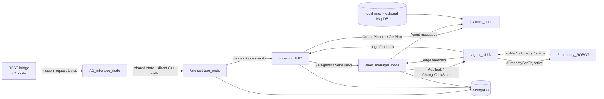

# Legacy ROS Backend: Component Functions And Robot Workflows

This document covers only the robot backend copied into `backend/`: central
coordination, planning, fleet management, the edge task supervisor, autonomy
simulation, and MongoDB persistence. Operator-facing layers and surrounding
diagnostic tools are intentionally out of scope.

Status labels:

- **Active** — used by the default one-robot backend path.
- **Limited** — executable code exists, but important cases are incomplete or fragile.
- **Inactive** — declared, stubbed, mismatched, or commented out.
- **Simulator** — useful for integration tests, but not a real vehicle controller.

## Feature Index

| Feature | Status |
| --- | --- |
| [F1. Mission command ingress](#f1-mission-command-ingress) | Limited |
| [F2. Mission parsing and runtime creation](#f2-mission-parsing-and-runtime-creation) | Active |
| [F3. Per-mission lifecycle state machine](#f3-per-mission-lifecycle-state-machine) | Active |
| [F4. Robot registration and connectivity cache](#f4-robot-registration-and-connectivity-cache) | Limited |
| [F5. Planner creation and agent selection](#f5-planner-creation-and-agent-selection) | Limited |
| [F6. Map and routing-graph construction](#f6-map-and-routing-graph-construction) | Active |
| [F7. Goal interpretation and allocation](#f7-goal-interpretation-and-allocation) | Limited |
| [F8. Route calculation](#f8-route-calculation) | Active single robot; limited multi-robot |
| [F9. Task-plan generation and storage](#f9-task-plan-generation-and-storage) | Active |
| [F10. Per-robot task dispatch](#f10-per-robot-task-dispatch) | Active |
| [F11. Edge task parsing and execution gating](#f11-edge-task-parsing-and-execution-gating) | Active |
| [F12. Waypoint, speed, and autonomy control](#f12-waypoint-speed-and-autonomy-control) | Active + Simulator |
| [F13. Robot feedback and mission completion](#f13-robot-feedback-and-mission-completion) | Active completion; limited progress |
| [F14. Pause, resume, stop, delete, and replan](#f14-pause-resume-stop-delete-and-replan) | Limited |
| [F15. Persistence, logging, and restart recovery](#f15-persistence-logging-and-restart-recovery) | Limited |

## Robot Workflow Index

| Robot workflow | Status |
| --- | --- |
| [W1. Bring one robot online](#w1-bring-one-robot-online) | Active |
| [W2. Run one robot to one destination](#w2-run-one-robot-to-one-destination) | Active |
| [W3. Send one robot to a coverage area](#w3-send-one-robot-to-a-coverage-area) | Limited |
| [W4. Run a multi-robot point mission](#w4-run-a-multi-robot-point-mission) | Limited |
| [W5. Pause, resume, stop, or delete a robot mission](#w5-pause-resume-stop-or-delete-a-robot-mission) | Limited |
| [W6. Replan after a robot or environment change](#w6-replan-after-a-robot-or-environment-change) | Limited |
| [W7. Complete a multi-robot mission](#w7-complete-a-multi-robot-mission) | Limited |
| [W8. Handle missing robots or unusable routes](#w8-handle-missing-robots-or-unusable-routes) | Limited |

## Architecture And ROS Review

The backend is a centralized ROS 2 architecture. Three C++ nodes run in one
`MultiThreadedExecutor`; the orchestrator then creates a separate C++ mission
manager node for every mission. Planning is a Python ROS node. Each robot has
one C++ edge task-supervisor node and an autonomy implementation; the current
default autonomy is a simulator.



The central process is assembled in
[executor.cpp](../backend/fog/centralized-coordination/src/centralized_coordination/src/executor.cpp).

| Component | Runtime node(s) | Main implementation |
| --- | --- | --- |
| REST-to-ROS bridge | `/c2_node` | C++ `cpprestsdk` listener and ROS publisher |
| Central coordination | `/c2_interface_node`, `/orchestrator_node`, `/fleet_manager_node` | C++ nodes in one executor |
| Per-mission control | `/mission_<uuid_with_underscores>` | Dynamically created C++ node and detached spin thread |
| Planner | `/planner_node` | Python, NetworkX/OSMnx, SciPy, OR-Tools, and Gurobi |
| Per-robot edge | `/agent_<uuid_with_underscores>` | C++ task parser and objective supervisor |
| Current autonomy | `/autonomy_test_node_Themis_Fr` | C++ kinematic test simulator |
| Persistence | MongoDB | Mission, plan, feedback, vehicle, connection, and log collections |

ROS topics carry asynchronous state and feedback; ROS services perform
request/response operations:

```text
Main topics
  /multi_robot/mission_init_request
  /multi_robot/change_mission_status_request
  /multi_robot/mission_feedback
  /multi_robot/planner/state
  /multi_robot/planner/agent
  /multi_robot/edge/agent_profile
  /multi_robot/edge/feedback
  <robot-prefix>/edge/multi_robot/{vehicle_profile,localization,autonomy_status}
  <robot-prefix>/edge/multi_robot/autonomy_set_objective

Main services
  /multi_robot/planner/{create,get_plan}
  multi_robot/fleet_manager/{get_agents,send_tasks,change_mission_status}
  multi_robot/edge/agent_<uuid>/{add_task,change_state,change_task_state}
  multi_robot/mission_<uuid>/{mission_status_change,environment_change,vehicle_change}
```

The architecture separates mission control, planning, fleet dispatch, edge
execution, and autonomy reasonably well. Its main debt is coordination state:
JSON is embedded inside ROS strings, timers poll shared state, Interface and
Orchestrator use direct C++ pointers, REST and Planner each cache one current
mission, and cleanup/error paths are incomplete. The per-mission node design
therefore does not make concurrent missions safe end to end.

## Backend And ROS Function Details

### F1. Mission Command Ingress

Source: [MissionHandler.cpp](../backend/fog/command-control/src/backend/ros2-rest-api/ros2_ws/src/c2_ros2_rest_api/src/MissionHandler.cpp)
and [c2_rest.cpp](../backend/fog/command-control/src/backend/ros2-rest-api/ros2_ws/src/c2_ros2_rest_api/src/c2_rest.cpp).

| Function | Input | Effect |
| --- | --- | --- |
| `MissionHandler::handle_post_request()` | `action=initialize` or `change_status` | Selects one of the two supported commands |
| `C2::setMissionConfig()` | Parsed mission JSON | Caches the JSON and its inner `mission_id` |
| `C2::sendInitMission()` | Cached mission | Publishes `InitMissionRequest` |
| `C2::sendChangeStatus()` | Request enum | Publishes `ChangeMissionStatusRequest` for the cached mission |

```text
POST /mission_control
  initialize    -> /multi_robot/mission_init_request
  change_status -> /multi_robot/change_mission_status_request
```

The outer HTTP `mission_id` is checked but ignored; the ID comes from the inner
mission config. An HTTP response only confirms ROS publication. Status changes
always target the last mission cached by `/c2_node`, because their body contains
no mission ID. A status response may arrive later and is only printed; the init
response is constructed by C2 Interface but never published. This makes
concurrent mission control unsafe.

### F2. Mission Parsing And Runtime Creation

Source: [c2_interface_node.cpp](../backend/fog/centralized-coordination/src/centralized_coordination/src/c2_interface_node.cpp)
and [orchestrator_node.cpp](../backend/fog/centralized-coordination/src/centralized_coordination/src/orchestrator_node.cpp).

| Function | Small responsibility |
| --- | --- |
| `Interface::_initMissionCallback()` | Parses the JSON string into the legacy `MissionConfig` model |
| `Interface::getC2InterfaceStatus()` | Returns and clears a shared “new mission” flag |
| `OrchestratorNode::_TimerLoop()` | Polls that flag every five seconds |
| `OrchestratorNode::_addMission()` | Inserts or replaces `RuntimeDB.MissionConfig` |
| `OrchestratorNode::_createMissionManagerNode()` | Starts `/mission_<uuid>` and creates its service clients |

```text
InitMissionRequest
  -> parse MissionConfig
  -> shared InterfaceC2State flag
  -> Orchestrator polling loop
  -> Mongo MissionConfig
  -> dynamic MissionManager node
```

Mission “completeness” validation is currently a hard-coded `true`. The
callback constructs an `InitMissionResponse` but never publishes it, so mission
feedback—not the init response—is the useful ROS acknowledgement.

### F3. Per-Mission Lifecycle State Machine

Source: [mission_manager.cpp](../backend/fog/centralized-coordination/src/centralized_coordination/src/mission_manager.cpp).

| Function | Small responsibility |
| --- | --- |
| `_convert_requested_status_to_mission_status()` | Maps request enums to runtime states |
| `_updateAllowedTransitions()` | Builds the allowed next-state table |
| `_stateMachineCallback()` | Applies a pending transition every 50 ms |
| `_stateMachineActions()` | Starts planning, dispatch, execution, pause, stop, or delete actions |

```text
Request: INIT=0 APPROVE=1 START=2 PAUSE=3 STOP=4 DELETE=5
normal:  NONE(0) -> PLANNED(1) -> ACCEPTED(4) -> STARTED(5) -> COMPLETED(10)
pause:   STARTED -> PAUSED(6) -> STARTED
replan:  STARTED/PAUSED -> PLANNED_ALTERNATIVE(2) -> ACCEPTED
side:    STOPPED(8) and DELETED(9) are allowed from several states
failure: FAILED(7) immediately schedules NONE; PLANNED_FAILED(3) also exists
```

`NONE` starts planning, `ACCEPTED` sends tasks, and `STARTED` changes edge
tasks to `EXECUTE`. Completion is not requested externally; it is derived from
robot feedback. Entering `FAILED` immediately schedules a transition back to
`NONE`, which can start another planning attempt rather than remaining failed.

### F4. Robot Registration And Connectivity Cache

Source: [fleet_manager_node.cpp](../backend/fog/centralized-coordination/src/centralized_coordination/src/fleet_manager_node.cpp)
and [agent_tasks_supervisor_node.cpp](../backend/edge/agent-tasks-supervisor/ros2ws/src/agent_tasks_supervisor/src/agent_tasks_supervisor_node.cpp).

| Function | Interface and effect | Status |
| --- | --- | --- |
| Edge `_vehicle_profile_subscriber_callback()` | Autonomy profile topic -> agent-profile JSON | Active |
| Edge `_agent_profile_publisher_callback()` | Publishes the profile every two seconds | Active |
| Fleet `_agent_profile_subscriber_callback()` | Profile topic -> register or refresh an in-memory robot | Active |
| Fleet `_initAgent()` / `_createEdgeClient()` | Creates robot state and three robot-specific service clients | Active |
| Fleet `_EdgeConnection_timer_callback()` | Sends heartbeats; timeout removes only the Mongo connection row | Limited |
| Fleet `GetAgents_callback()` | Service returns requested robots from Fleet's in-memory cache | Limited |

```text
autonomy profile -> edge agent_profile -> Fleet registration
                  -> VehicleDB.Vehicles
                  -> RuntimeDB.ConnectedVehicles

Fleet heartbeat -> edge resets fog timeout
edge profile     -> Fleet resets robot timeout
```

The timeout does not remove Fleet's in-memory robot or the planner's agent
cache, and `GetAgents_callback()` does not consult `ConnectedVehicles`.
Disconnected robots can therefore remain selectable. The default compose stack
provides one robot, Themis Fr; a second needs its own edge/autonomy pair, UUID,
and topic prefix.

### F5. Planner Creation And Agent Selection

Source: [mission_manager.cpp](../backend/fog/centralized-coordination/src/centralized_coordination/src/mission_manager.cpp)
and [planner_node.py](../backend/fog/planner/ros2ws/src/planner/planner/planner_node.py).

| Function | Interface and effect | Status |
| --- | --- | --- |
| `MissionManager::_createPlanner()` | `GetAgents` then `CreatePlanner(config, agents)` | Limited |
| `PlannerNode.set_mission_service_callback()` | Parses mission config but ignores `request.agents` | Limited |
| `PlannerNode.agent_subscriber_callback()` | `/planner/agent` -> cache latest odometry without expiry | Limited |
| `PlannerNode.planning_timer_callback()` | Filters the independent cache by `mission.vehicles` | Active |
| `PlannerNode.state_timer_callback()` | Publishes mission-keyed planner state | Active |

```text
mission.vehicles
  -> Fleet GetAgents (profile lookup)
  -> CreatePlanner(config, agents) (agents field ignored)
  -> match IDs against the independent /planner/agent cache
  -> state 0 initialized -> 1 planning -> 2 plan ready
```

No matching cached robot leaves the planner in state `1`; a stale disconnected
robot may still match. Although state messages are keyed by mission,
`current_mission_id`, `mission_defined`, and `paths` are global fields, so
overlapping mission planning can overwrite results.

### F6. Map And Routing-Graph Construction

Source: [planner_node.py](../backend/fog/planner/ros2ws/src/planner/planner/planner_node.py)
and [graph.py](../backend/fog/planner/ros2ws/src/path_planning_lib/path_planning_lib/graph.py).

| Function | Small responsibility |
| --- | --- |
| `PlannerNode.initialize_map()` | Loads free lines, free polygons, risk polygons, and an OSMnx graph |
| `mark_osm_road_edges()` | Marks usable OSM road classes as road edges |
| `add_risks_to_edges()` | Marks graph edges intersecting risk polygons |
| `connect_graphs()` | Connects local road/free-area graphs to the OSM graph |
| `load_local_feature_geometries()` | Builds `feature_id -> geometry` lookup from local GeoJSON |
| `_graph_with_mission_roads()` | Temporarily adds inline mission `LineString` roads and connectors |

```text
OSM all-private graph
  + local free road LineStrings
  + graph points inside free/workspace polygons
  + risk flags
  + optional mission roads
  = one NetworkX MultiDiGraph used for planning
```

The default configuration loads RMA GeoJSON locally and queries OSM around its
centroid. MapDB reading exists as an alternative configuration, not the default.

### F7. Goal Interpretation And Allocation

Source: [multi_robot_path_planning.py](../backend/fog/planner/ros2ws/src/path_planning_lib/path_planning_lib/multi_robot_path_planning.py),
[task_allocation.py](../backend/fog/planner/ros2ws/src/path_planning_lib/path_planning_lib/task_allocation.py),
and [max_coverage.py](../backend/fog/planner/ros2ws/src/path_planning_lib/path_planning_lib/max_coverage.py).

```text
NAVIGATE=0
  goals == configured vehicle IDs -> sensible current Hungarian test case
  goals < configured vehicle IDs  -> surplus empty allocations; fragile
  goals > configured vehicle IDs  -> defective mTSP branch
  Polygon, or LineString without point goals -> coverage-style candidate points

COVERAGE=1
  one robot    -> first reachable non-risk graph point inside geometry
  many robots  -> MCLP coverage-point selection + Hungarian assignment
```

The branch is chosen from configured `mission.vehicles`, while assignment uses
the independently cached agents; disagreement between those lists is fragile.
For NAVIGATE with point goals, LineStrings are route-graph inputs, not
destinations. Coverage selects destination points, not a complete area sweep.
The mTSP implementation indexes a robot list by UUID and is broken; surplus
robots can receive empty allocations. `NAVIGATE_NO_PLANNING=2` is defined but
rejected by the active solver.

### F8. Route Calculation

Source: [mapf.py](../backend/fog/planner/ros2ws/src/path_planning_lib/path_planning_lib/mapf.py)
and [multi_robot_path_planning.py](../backend/fog/planner/ros2ws/src/path_planning_lib/path_planning_lib/multi_robot_path_planning.py).

| Function | Small responsibility |
| --- | --- |
| `AStar.search()` | Finds a graph route while blocking risk edges |
| `AStar.step_cost()` | Penalizes road or non-road edges according to `road_usage` |
| `AStar.nearest_routable_node()` | Snaps start and destination to usable graph nodes |
| `_path_to_point()` | Converts graph states to `[lon, lat]`, appends the exact destination, and simplifies the path |
| `_a_star_or_direct_path()` | Falls back to the robot's current position if A* fails |

```text
road_usage = 0.0  -> strongly prefer non-road edges
road_usage = 0.5  -> no road preference
road_usage = 1.0  -> road edges only, then append exact destination
risk = true       -> always blocked
```

The default `mapf=independent_agents` runs A* separately for each robot and
does not deconflict their routes. CBS code exists but is incomplete, while
Fleet Manager's high-level collision-avoidance body is commented out.

### F9. Task-Plan Generation And Storage

Source: [planner_node.py](../backend/fog/planner/ros2ws/src/planner/planner/planner_node.py)
and [mission_manager.cpp](../backend/fog/centralized-coordination/src/centralized_coordination/src/mission_manager.cpp).

| Function | Small responsibility |
| --- | --- |
| `PlannerNode.path_to_plan_json()` | Creates one task per routed robot |
| `PlannerNode.get_plan_service_callback()` | Returns the currently cached routes as JSON |
| `MissionManager::_register_planning_result()` | Extracts feedback waypoints and planned robot IDs |
| `databaseUpdatePlanning()` | Replaces the mission's `RuntimeDB.Planning` document |

```json
{
  "mission_id": "<uuid>",
  "tasks": {
    "<robot-uuid>": {
      "task_id": "<uuid>",
      "primitives": [{"primitive_type": "waypoint"}],
      "objectives": [{"primitives": [{"parameters": {
        "coordinates": [4.3924, 50.8441], "speed": 1.3
      }}]}]
    }
  }
}
```

An unresolved geometry may produce `"tasks": {}`. Mission Manager only checks
for the different string `"tasks":[]`, so it can store the empty plan and mark
the mission `PLANNED`. `GetPlan` echoes the requested ID but serializes the
planner's shared current path cache, not a plan selected by that ID.

### F10. Per-Robot Task Dispatch

Source: [fleet_manager_node.cpp](../backend/fog/centralized-coordination/src/centralized_coordination/src/fleet_manager_node.cpp).

| Function | Small responsibility |
| --- | --- |
| `SendTasks_callback()` | Queues plan dispatch for one mission |
| `_setAgentTasksFromPlanning()` | Parses task metadata into Fleet's robot structures |
| `_sendAllTasksForMission()` | Iterates the plan's `tasks` object |
| `_sendAgentTask()` | Calls that robot's `AddTask` service with task JSON |
| `_changeAgentTaskStatus()` | Calls that robot's `ChangeTaskState` service |

```text
APPROVE -> MissionManager -> Fleet send_tasks
        -> read RuntimeDB.Planning
        -> for each tasks[robot_uuid]
        -> multi_robot/edge/agent_<uuid>/add_task
```

Dispatch is agent-specific, but the mission-level lifecycle command applies to
all robot tasks found in the stored plan.

### F11. Edge Task Parsing And Execution Gating

Source: [agent_tasks_supervisor_node.cpp](../backend/edge/agent-tasks-supervisor/ros2ws/src/agent_tasks_supervisor/src/agent_tasks_supervisor_node.cpp).

| Function | Small responsibility |
| --- | --- |
| `_addTaskService_callback()` | Replaces the current task and parses primitives/objectives |
| `_changeTaskStateService_callback()` | Sets `STOPPED`, `STARTED`, `PAUSED`, or another task state |
| `_taskControl_timer_callback()` | Decides whether a real objective or a null objective may be sent |
| `_set_objective_publisher_callback()` | Encodes current primitives into `AutonomySetObjective` |

```text
objective enabled only when:
  task received
  AND task_state == STARTED(1)
  AND start time passed
  AND fog connected
  AND autonomy connected
```

Approve loads a task in stopped/pending state. Start changes it to `STARTED`;
pause, stop, or a connection timeout makes the edge publish a null objective.
The shipped configuration disables start-time scheduling. If enabled, the
active `AddTask` callback never reads `request.std`, so `_current_task_std` is
uninitialized and the time gate is unsafe.

### F12. Waypoint, Speed, And Autonomy Control

Source: [agent_tasks_supervisor_node.cpp](../backend/edge/agent-tasks-supervisor/ros2ws/src/agent_tasks_supervisor/src/agent_tasks_supervisor_node.cpp)
and [test_autonomy.cpp](../backend/edge/agent-tasks-supervisor/ros2ws/src/agent_tasks_supervisor/src/test/test_autonomy.cpp).

| Function | Small responsibility |
| --- | --- |
| `_check_if_primitive_completed()` | Tests distance and/or autonomy completion status |
| `_switch_to_next_objective()` | Advances to the next waypoint objective |
| `_speed_control_timer_callback()` | Converts requested waypoint speed into commanded maximum speed |
| Autonomy `_objective_subscriber_callback()` | Extracts the first `waypoint` primitive |
| Autonomy `_motion_control_callback()` | Moves simulated odometry toward that waypoint every 100 ms |

```text
default edge policy:
  waypoint complete within 3 m
  requested speed capped by edge speed limit
  next objective sent after completion
  last objective -> task_state COMPLETED(3)
```

The default simulator publishes vehicle profile, odometry, and autonomy status.
Its motion model is a simple straight-line integration and is not obstacle-aware
or representative of a real vehicle controller. The edge currently hard-codes
its speed limit to `5`; the received profile's maximum speed is read but not
assigned to that limit.

### F13. Robot Feedback And Mission Completion

Source: [agent_tasks_supervisor_node.cpp](../backend/edge/agent-tasks-supervisor/ros2ws/src/agent_tasks_supervisor/src/agent_tasks_supervisor_node.cpp),
[fleet_manager_node.cpp](../backend/fog/centralized-coordination/src/centralized_coordination/src/fleet_manager_node.cpp),
[mission_manager.cpp](../backend/fog/centralized-coordination/src/centralized_coordination/src/mission_manager.cpp),
and the serializers [MissionFeedbackTask.hpp](../backend/fog/centralized-coordination/src/message_packages/c2_msgs/json/MissionFeedbackTask.hpp)
and [MissionFeedbackTaskWaypoint.hpp](../backend/fog/centralized-coordination/src/message_packages/c2_msgs/json/MissionFeedbackTaskWaypoint.hpp).

```text
autonomy odometry/status
  -> edge objective progression
  -> /multi_robot/edge/feedback every 2 s
     -> Fleet refreshes robot odometry -> /multi_robot/planner/agent
     -> MissionManager attempts to remove passed waypoints
     -> task_state COMPLETED records the robot as finished
  -> all planned robot IDs finished
  -> mission COMPLETED=10
  -> /multi_robot/mission_feedback + RuntimeDB.MissionFeedback every 1 s
```

`MissionManager::_agent_task_completed()` compares the set of finished robots
with the robots that had tasks in the plan. Published mission feedback is
truncated to 50 remaining waypoints per task. Once a mission is inactive, later
feedback publications clear the task list. Progress trimming is defective: edge
feedback reports an objective ID while the stored waypoint entry uses a
primitive ID, so passed waypoints generally are not matched and removed. The
outward JSON serializers also omit the populated `TaskId` and `waypoint_id`,
which further limits feedback correlation.

### F14. Pause, Resume, Stop, Delete, And Replan

Source: [mission_manager.cpp](../backend/fog/centralized-coordination/src/centralized_coordination/src/mission_manager.cpp)
and [orchestrator_node.cpp](../backend/fog/centralized-coordination/src/centralized_coordination/src/orchestrator_node.cpp),
plus [c2_interface_node.cpp](../backend/fog/centralized-coordination/src/centralized_coordination/src/c2_interface_node.cpp).

| Function | Interface and effect | Status |
| --- | --- | --- |
| `Interface::_changeMissionVehicleCallback()` | Vehicle-change topic -> shared orchestrator flag | Limited |
| `OrchestratorNode::_addVehiclesToMission()` / `_deleteVehiclesFromMission()` | Updates `mission.vehicles` in Mongo; skips availability checks | Limited |
| `Interface::_environmentResetDataCallback()` | Reset topic -> replan trigger + success; resets no data | Inactive stub |
| `Interface::_environmentUploadDataCallback()` | Upload topic -> replan trigger + success; ignores payload | Inactive stub |
| `Interface::_environmentGetVersionCallback()` | Version request -> constant `1` | Inactive stub |
| `MissionManager::_deleteMission()` | Calls orchestrator delete service | Limited |

```text
PAUSE  -> mission PAUSED  -> every edge task PAUSE(2)   -> null objective
START  -> mission STARTED -> every edge task EXECUTE(1) -> resume objective
STOP   -> mission STOPPED -> every edge task STOP(0)    -> null objective
DELETE -> mission DELETED -> delete MissionConfig only

environment/vehicle change
  -> mission PAUSED
  -> alternative planning requested
  -> PLANNED_ALTERNATIVE
  -> operator must APPROVE, then START the new plan
```

Delete is incomplete: it does not stop/delete edge tasks, destroy the dynamic
mission node, or remove Planning/Feedback. Planner deletion also has a service
name mismatch, and `_deletePlanner()` is never called. Vehicle change edits
`mission.vehicles`, but the planner's `set_agents` client has no matching server
and that call is disabled. The replan timer can therefore return the already
cached plan instead of recalculating for the changed robot set.

### F15. Persistence, Logging, And Restart Recovery

Source: [mongodb_handler.hpp](../backend/fog/centralized-coordination/src/centralized_coordination/include/custom_libraries/mongodb_handler.hpp),
[orchestrator_node.cpp](../backend/fog/centralized-coordination/src/centralized_coordination/src/orchestrator_node.cpp),
and [mission_manager.cpp](../backend/fog/centralized-coordination/src/centralized_coordination/src/mission_manager.cpp).

```text
RuntimeDB.MissionConfig       one current config per mission
RuntimeDB.Planning            one current task plan per mission
RuntimeDB.MissionFeedback     append-only periodic snapshots
RuntimeDB.ConnectedVehicles   current heartbeat records
RuntimeDB.Logs                appended component logs
VehicleDB.Vehicles            latest profile per robot
```

On coordination startup, `_recoverMissionsFromDatabase()` recreates a mission
manager for every stored config. `setInitialMissionStatus()` restores the latest
feedback state and suppresses replanning only for `STOPPED`, `DELETED`, and
`FAILED`. Even a recovered `COMPLETED` mission is replanned. Edge tasks are not
recovered after an edge restart; `_recover_agent_task_callback()` is a TODO.
Feedback continues after logical deletion, and C2 Interface publishes logs on
`/multi_robot/swarm_log` while persistence listens on `/multi_robot/log`.

## Robot Workflow Details

### W1. Bring One Robot Online

Precondition: one autonomy node and one edge node share a unique robot prefix
and UUID.

```text
autonomy profile + localization
  -> edge agent_profile + feedback
  -> Fleet registration, service clients, and Mongo records
  -> /planner/agent odometry cache
```

The default robot is Themis Fr with UUID
`f9992bb3-9871-451f-90a0-9207eb9fe6c5`.

### W2. Run One Robot To One Destination

For the full source-level path through the editable `backend/` workflow, see the
[editable-backend walkthrough](SINGLE_ROBOT_MISSION_CODE_WALKTHROUGH.md). For
the current vendored runtime—including its deterministic MapDB seed, planner
readiness guard, and exact `legacy_ros/` line links—see the
[legacy ROS walkthrough](LEGACY_SINGLE_ROBOT_MISSION_CODE_WALKTHROUGH.md).

Relevant mission fields:

```json
{
  "mission_id": "11111111-2222-4333-8444-555555555555",
  "behavior": 0,
  "vehicles": ["f9992bb3-9871-451f-90a0-9207eb9fe6c5"],
  "objective": {"geometries": [{"geometry": {
    "geometry_type": "Point",
    "coordinates": [4.39243, 50.84405]
  }}]},
  "transit": {
    "optimalization": {"road_usage": 1.0},
    "desired_vehicle_constraints": {"max_speed": 1.3}
  }
}
```

```text
INIT
  -> mission node -> cached robot lookup -> graph route -> waypoint task
  -> mission PLANNED
APPROVE
  -> mission ACCEPTED -> task copied from Mongo to the robot edge
START
  -> edge task EXECUTE -> autonomy objectives -> simulated movement
robot reaches final waypoint
  -> task COMPLETED -> mission COMPLETED
```

Wait for a non-empty plan before Approve and for `ACCEPTED` before Start.
The current legacy compose uses `25 m` graph-connection thresholds, waits for
the live robot cache instead of publishing an empty plan, and has been verified
to produce a real non-empty Themis route from a clean seeded volume.

### W3. Send One Robot To A Coverage Area

Use `behavior=1` with an inline Polygon or resolvable polygon `feature_id`:

```text
Polygon
  -> graph nodes inside polygon
  -> sort candidate nodes by distance from robot
  -> first candidate with a risk-free route
  -> ordinary waypoint task
```

This sends the robot to one coverage point. It does not sweep, patrol, or prove
that the polygon was fully observed. With no reachable candidate, the planner
returns the current robot position and can still report `PLANNED`.

### W4. Run A Multi-Robot Point Mission

```text
two registered/cached robots + two goals
  -> Euclidean Hungarian assignment
  -> independent A* route for robot A
  -> independent A* route for robot B
  -> tasks[robot-A] + tasks[robot-B]
  -> Fleet dispatches one AddTask call per robot
```

The default stack launches one robot. Multi-robot routes are not deconflicted,
unequal goal/vehicle counts are fragile or broken, and concurrent missions
share the planner cache. A two-robot/two-goal mission is the smallest useful
parity test.

### W5. Pause, Resume, Stop, Or Delete A Robot Mission

Mission status requests drive the stored task and mission state:

```text
PAUSE(3) -> PAUSED -> task PAUSE(2) -> edge publishes null objective
START(2) -> STARTED -> task EXECUTE(1) -> edge republishes current objective
STOP(4)  -> STOPPED -> task STOP(0) -> edge publishes null objective
DELETE(5) -> DELETED(9) -> multi_robot/delete_mission
          -> remove RuntimeDB.MissionConfig only
```

Pause/resume retains the current task and objective index. Stop also leaves the
task loaded, and the transition table permits `STARTED` from `STOPPED`; the
enum comment promising “stop and re-init” is not implemented by the edge.
Delete does not stop/delete edge tasks, destroy the mission node, or remove its
Planning and Feedback documents.

### W6. Replan After A Robot Or Environment Change

```text
vehicle add/remove or environment-change notification on a started mission
  -> Orchestrator targets the mission manager
  -> mission moves to PAUSED
  -> replanning flag causes another planner GetPlan cycle
  -> result is labeled PLANNED_ALTERNATIVE
  -> APPROVE sends the returned tasks; START executes them
```

This workflow is only partially trustworthy. Environment upload/reset does not
actually update planner map data. Vehicle changes update Mongo, but the active
path neither calls a working `set_agents` service nor recreates the planner;
`GetPlan` can simply return its old cached routes. Test and repair this flow
before relying on it.

### W7. Complete A Multi-Robot Mission

```text
robot A task COMPLETED -> finished = {A}; mission remains STARTED
robot B task COMPLETED -> finished = {A, B}
planned robots          = {A, B}
sets match              -> mission COMPLETED
```

The completion set is derived from robots that received planned tasks, not
directly from `mission.vehicles`. A robot missing from the task plan is therefore
not waited for.

### W8. Handle Missing Robots Or Unusable Routes

| Condition | Current backend behavior |
| --- | --- |
| Robot profile absent | Fleet returns fewer/no robots; planner waits with no matching agents |
| Previously registered robot disconnects | Fleet/planner may still select stale cached state; the edge suppresses objectives if autonomy times out |
| Objective `feature_id` unresolved | Geometry is skipped; planner may return `tasks: {}` |
| No risk-free A* path | Planner returns the robot's current position as a one-point route |
| No reachable coverage node | Same current-position fallback |
| After prior connection, planner state stops for 10 s | Service state becomes `3`; an issue is recorded only on a later plan/replan attempt |
| Unsupported behavior `2` | Planner raises `Unsupported behavior` without a robust error transition |
| Two missions overlap | Global planner mission/path cache can return or overwrite the wrong plan |

```text
Do not treat PLANNED alone as success.
Usable plan = tasks object is non-empty
              AND every intended robot has objectives
              AND each route contains meaningful movement.
```

## Source Reading Order

For the complete robot-control path:

```text
MissionHandler.cpp -> c2_rest.cpp -> c2_interface_node.cpp
-> orchestrator_node.cpp -> mission_manager.cpp
-> planner_node.py -> multi_robot_path_planning.py -> mapf.py
-> fleet_manager_node.cpp -> agent_tasks_supervisor_node.cpp
-> test_autonomy.cpp
```

More exhaustive per-node interface tables remain in
[Legacy ROS Node Contracts](legacy_nodes/README.md). The replacement fork is in
[backend](../backend/); `legacy_ros/` is based on the pinned upstream snapshot
and carries the compatibility-preserving seed/readiness/route fixes recorded in
the [comparison](LEGACY_ROS_UPSTREAM_COMPARISON.md). The editable backend fork
was synchronized with those runtime fixes on 2026-08-10; its separate compose
file retains backend-specific container names and runtime data directories.
