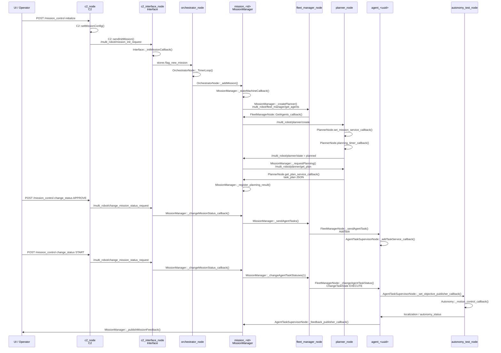

# Legacy ROS Mission Flow Diagram

## System View

```mermaid
flowchart LR
  UI[UI / Operator] -->|HTTP POST| REST[c2-ros-rest<br/>/c2_node]
  UI -->|optional read via WebSocket 9090| RB[rosbridge_websocket]

  REST -->|/multi_robot/mission_init_request| C2I[c2_interface_node<br/>Interface]
  REST -->|/multi_robot/change_mission_status_request| C2I

  C2I -->|flag_new_mission| ORCH[orchestrator_node<br/>OrchestratorNode]
  ORCH -->|creates per mission| MM[mission_<mission_id><br/>MissionManager]

  MM -->|get agents| FM[fleet_manager_node<br/>FleetManagerNode]
  FM -->|Agent msg| PLANNER[planner_node<br/>PlannerNode]
  MM -->|create/get plan| PLANNER
  PLANNER -->|task_plan JSON| MM

  MM -->|send tasks / task state| FM
  FM -->|AddTask / ChangeTaskState| EDGE[agent_<uuid><br/>AgentTaskSupervisorNode]

  EDGE -->|AutonomySetObjective| AUTO[autonomy_test_node_Themis_Fr<br/>Autonomy sim]
  AUTO -->|localization / status / profile| EDGE
  EDGE -->|edge feedback / agent profile| FM
  EDGE -->|edge feedback| MM

  MM -->|/multi_robot/mission_feedback| UI
  RB -->|exposes ROS graph| UI
```



## Mission Sequence



## Read This First

If you only remember one thing:

```text
UI -> C2 REST -> C2 Interface -> Orchestrator -> Mission Manager -> Planner
   -> Fleet Manager -> Edge Agent -> Autonomy Sim -> Feedback back up
```

`rosbridge` is only a WebSocket gateway for browser/debug access to ROS. It is not the mission brain.
