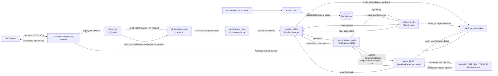
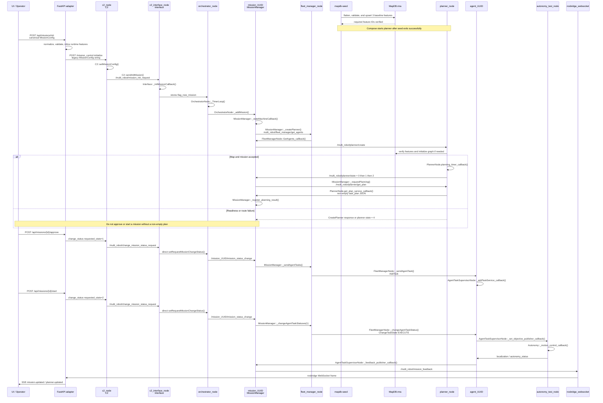

# Legacy ROS Mission Flow Diagram

> **Documentation label: REFERENCE**
> Frozen compatibility-reference flow. For the current system, use
> [Architecture](ARCHITECTURE.md).

For per-node contracts, inputs/outputs, internal behavior, and concrete workflow examples, see [legacy_nodes/README.md](legacy_nodes/README.md).

## System View


```mermaid
flowchart LR
  UI[UI / Operator] -->|canonical HTTP JSON| API[FastAPI compatibility adapter]
  API -->|legacy HTTP POST| REST[c2-ros-rest<br/>/c2_node]

  REST -->|/multi_robot/mission_init_request| C2I[c2_interface_node<br/>Interface]
  REST -->|/multi_robot/change_mission_status_request| C2I

  C2I -->|in-process InterfaceC2State| ORCH[orchestrator_node<br/>OrchestratorNode]
  ORCH -->|creates per mission| MM[mission_UUID<br/>MissionManager]

  MAP[baseline RMA GeoJSON] --> SEED[mapdb-seed]
  SEED -->|validated idempotent upsert| DB[(MapDB.rma)]

  MM -->|get agents| FM[fleet_manager_node<br/>FleetManagerNode]
  FM -->|Agent msg| PLANNER[planner_node<br/>PlannerNode]
  DB -->|roads, geofence, risk| PLANNER
  MM -->|create/get plan| PLANNER
  PLANNER -->|task_plan JSON| MM

  MM -->|send tasks / task state| FM
  FM -->|AddTask / ChangeTaskState| EDGE[agent_UUID<br/>AgentTaskSupervisorNode]

  EDGE -->|AutonomySetObjective| AUTO[autonomy_test_node_Themis_Fr<br/>Autonomy sim]
  AUTO -->|localization / status / profile| EDGE
  EDGE -->|edge feedback / agent profile| FM
  EDGE -->|edge feedback| MM

  MM -->|/multi_robot/mission_feedback| RB[rosbridge_websocket]
  PLANNER -->|/multi_robot/planner/state| RB
  EDGE -->|/multi_robot/edge/feedback| RB
  RB -->|WebSocket ROS frames| API
  API -->|normalized SSE events| UI
```

## Mission Sequence

The sequence below is the current clean-volume path. Compose first runs the
idempotent map seed and starts the planner only after the three required RMA
features have been verified. `CreatePlanner` synchronously initializes the graph
if the periodic poll has not done so yet. Readiness and route errors return
planner state `4`; they no longer terminate the planner process. See the
[legacy single-robot walkthrough](LEGACY_SINGLE_ROBOT_MISSION_CODE_WALKTHROUGH.md)
for exact source links.


```mermaid
sequenceDiagram
  participant UI as UI / Operator
  participant API as FastAPI adapter
  participant REST as c2_node<br/>C2
  participant C2I as c2_interface_node<br/>Interface
  participant ORCH as orchestrator_node
  participant MM as mission_UUID<br/>MissionManager
  participant FM as fleet_manager_node
  participant SEED as mapdb-seed
  participant DB as MapDB.rma
  participant PL as planner_node
  participant EDGE as agent_UUID
  participant AUTO as autonomy_test_node
  participant RB as rosbridge_websocket

  SEED->>DB: flatten, validate, and upsert 3 baseline features
  DB-->>SEED: required feature IDs verified
  Note over SEED,PL: Compose starts planner after seed exits successfully

  UI->>API: POST /api/missions/init<br/>canonical MissionConfig
  API->>API: normalize, validate, inline runtime features
  API->>REST: POST /mission_control initialize<br/>legacy MissionConfig string
  REST->>REST: C2::setMissionConfig()
  REST->>C2I: C2::sendInitMission()<br/>/multi_robot/mission_init_request
  C2I->>C2I: Interface::_initMissionCallback()
  C2I->>ORCH: stores flag_new_mission

  ORCH->>ORCH: OrchestratorNode::_TimerLoop()
  ORCH->>MM: OrchestratorNode::_addMission()
  MM->>MM: MissionManager::_stateMachineCallback()

  MM->>FM: MissionManager::_createPlanner()<br/>multi_robot/fleet_manager/get_agents
  FM->>MM: FleetManagerNode::GetAgents_callback()
  MM->>PL: /multi_robot/planner/create
  PL->>DB: verify features and initialize graph if needed
  alt Map and mission accepted
    PL->>PL: PlannerNode.planning_timer_callback()
    PL->>MM: /multi_robot/planner/state = 0 then 1 then 2
    MM->>PL: MissionManager::_requestPlanning()<br/>/multi_robot/planner/get_plan
    PL->>MM: PlannerNode.get_plan_service_callback()<br/>non-empty task_plan JSON
    MM->>MM: MissionManager::_register_planning_result()
  else Readiness or route failure
    PL-->>MM: CreatePlanner response or planner state = 4
    Note over UI,MM: Do not approve or start a mission without a non-empty plan
  end

  UI->>API: POST /api/missions/{id}/approve
  API->>REST: change_status requested_state=1
  REST->>C2I: /multi_robot/change_mission_status_request
  C2I->>ORCH: direct setRequestMissionChangeStatus()
  ORCH->>MM: /mission_UUID/mission_status_change
  MM->>FM: MissionManager::_sendAgentTasks()
  FM->>EDGE: FleetManagerNode::_sendAgentTask()<br/>AddTask
  EDGE->>EDGE: AgentTaskSupervisorNode::_addTaskService_callback()

  UI->>API: POST /api/missions/{id}/start
  API->>REST: change_status requested_state=2
  REST->>C2I: /multi_robot/change_mission_status_request
  C2I->>ORCH: direct setRequestMissionChangeStatus()
  ORCH->>MM: /mission_UUID/mission_status_change
  MM->>FM: MissionManager::_changeAgentTaskStatuses(1)
  FM->>EDGE: FleetManagerNode::_changeAgentTaskStatus()<br/>ChangeTaskState EXECUTE
  EDGE->>AUTO: AgentTaskSupervisorNode::_set_objective_publisher_callback()
  AUTO->>AUTO: Autonomy::_motion_control_callback()
  AUTO->>EDGE: localization / autonomy_status
  EDGE->>MM: AgentTaskSupervisorNode::_feedback_publisher_callback()
  MM->>RB: /multi_robot/mission_feedback
  RB->>API: rosbridge WebSocket frame
  API->>UI: SSE mission.updated / planner.updated
```

## Read This First

If you only remember one thing:

```text
UI -> FastAPI -> C2 REST -> C2 Interface -> Orchestrator -> Mission Manager
   -> Planner / Fleet Manager -> Edge Agent -> Autonomy Sim
   -> ROS feedback -> rosbridge -> FastAPI SSE -> UI
```

`rosbridge` is only a WebSocket gateway used by the FastAPI read adapter. The browser does not connect to it directly, and it is not the mission brain.

The deployed RMA planner uses `25 m` local-to-OSM graph connection thresholds,
and local road LineStrings are traversable in both directions. The real stack
has been verified to produce a non-empty single-robot plan through this path.
