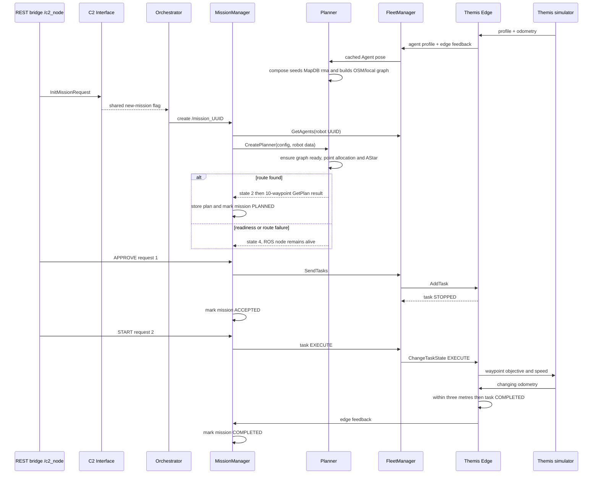

# True Legacy ROS Single-Robot Mission: Complete Code Walkthrough

This is the legacy-specific copy of the editable-backend walkthrough. It follows
one request to send **Themis Fr** to one GPS point, starting at the old REST
boundary and staying inside `legacy_ros/`; the UI and the new FastAPI adapter are
not involved. The planner began from
`multi-agent-framework/submodules/fog/planner` commit `b154575f5a5f` and has a
small, documented compatibility layer for deterministic MapDB startup and
non-fatal planning failures.

This is a runnable path, not a hypothetical happy path. The exact mission below
was exercised against the Docker stack: Planner published state `2`, legacy
mission feedback became `PLANNED(1)`, and Themis received a 10-waypoint path.
The steps continue through APPROVE, START, movement, and completion to explain
each downstream handoff in code.

Every source reference uses a repository-relative GitHub line anchor such as
`#L31-L77`. The visible label also contains the line range, so the location is
still clear in editors that do not interpret the anchor. These links describe
the current source snapshot and can move when lines are added or removed.

## Walkthrough Index

1. [The concrete example](#1-the-concrete-example)
2. [The whole execution at a glance](#2-the-whole-execution-at-a-glance)
3. [The robot becomes available](#3-the-robot-becomes-available)
4. [INIT enters through REST and becomes a ROS message](#4-init-enters-through-rest-and-becomes-a-ros-message)
5. [Central coordination creates the mission runtime](#5-central-coordination-creates-the-mission-runtime)
6. [The mission runtime requests a plan](#6-the-mission-runtime-requests-a-plan)
7. [The planner assigns the point and calculates a route](#7-the-planner-assigns-the-point-and-calculates-a-route)
8. [The route becomes a stored robot task](#8-the-route-becomes-a-stored-robot-task)
9. [APPROVE sends a stopped task to the robot edge](#9-approve-sends-a-stopped-task-to-the-robot-edge)
10. [START changes that task to executing](#10-start-changes-that-task-to-executing)
11. [The edge turns each waypoint into an autonomy objective](#11-the-edge-turns-each-waypoint-into-an-autonomy-objective)
12. [The simulator moves and reports its position](#12-the-simulator-moves-and-reports-its-position)
13. [The edge and mission manager detect completion](#13-the-edge-and-mission-manager-detect-completion)
14. [What to watch while it runs](#14-what-to-watch-while-it-runs)
15. [What the true legacy path reveals](#15-what-the-true-legacy-path-reveals)

## 1. The Concrete Example

The example uses these fixed inputs. UUIDs generated later for the task,
primitive, and objectives will be different on each run.

| Value | Example |
| --- | --- |
| Mission | `44444444-5555-4666-8777-888888888888` |
| Robot | `f9992bb3-9871-451f-90a0-9207eb9fe6c5` |
| Robot name/prefix | `Themis Fr` / `Themis_Fr` |
| Simulated start | `[4.392588, 50.844317]` |
| Destination | `[4.39167, 50.84417]` |
| Behavior | `0`, `NAVIGATE` |
| Route preference field | `road_usage = 1.0`, parsed upstream but ignored by this planner |
| Requested speed | `1.3 m/s` |

Coordinate pairs keep the order `[longitude, latitude]`. The REST request below
may contain a flat Point pair. `MissionGeometry` parses it and serializes it as
`[[longitude, latitude]]` before MissionManager forwards the stored config to
Python. That conversion is required: the true planner reads only
`coordinates[0]`, so it does not independently accept both shapes. In ROS
odometry, the simulator stores longitude in `position.x` and latitude in
`position.y`.

### Runtime configuration behind those values

**File purpose — `docker-compose.legacy-ros.yml`:** assembles the vendored legacy
ROS runtime and wires the central coordinator, planner, REST bridge, MongoDB,
and the robot's edge/autonomy pair. MongoDB and the one-shot map seed are at
[L4-L37](../docker-compose.legacy-ros.yml#L4-L37); Planner is gated on a
successful seed at [L75-L93](../docker-compose.legacy-ros.yml#L75-L93); the
one-robot service and its UUID/topic prefix are at
[L121-L141](../docker-compose.legacy-ros.yml#L121-L141).

**File purpose — `seed-mapdb.js`:** validates the checked-in RMA GeoJSON,
flattens FeatureCollections, and idempotently upserts one Mongo document per
valid feature without deleting unrelated data. Loading and validation are at
[L24-L100](../legacy_ros/docker/seed-mapdb.js#L24-L100); the upsert and required
feature checks are at [L103-L143](../legacy_ros/docker/seed-mapdb.js#L103-L143).
The resulting `MapDB.rma` baseline contains one road, one geofence, and one risk
polygon.

**File purpose — `config_autonomy.yaml`:** supplies the simulated vehicle's
initial pose, coordinate mode, dynamics, and profile. The Themis values are at
[L6-L23](../legacy_ros/config/config_autonomy.yaml#L6-L23).

**File purpose — `config_agent-tasks-supervisor.yaml`:** configures the edge
executor's connection checks, waypoint completion, and speed control. The
active settings are at
[L1-L22](../legacy_ros/config/config_agent-tasks-supervisor.yaml#L1-L22): start
times are disabled, completion tolerance is `3.0 m`, and speed mode is `1`.

**File purpose — `config_planner.yaml`:** selects planner mode and the RMA map
source. The runtime values are at
[L1-L21](../legacy_ros/config/config_planner.yaml#L1-L21): `MapDB.rma`, a `60 m`
OSM radius, and `25 m` local/OSM graph-connection thresholds. The upstream
`15 m` value left the two valid RMA components 21.45 m apart; `25 m` gives three
road and seven polygon crosslinks without the excessive shortcuts created by
the older `45 m` setting. The active initializer always reads MongoDB; the
local folder is the seed source, not a second runtime map source.

**File purpose — `executor.cpp`:** boots the three central ROS nodes in one
multithreaded executor and connects C2 Interface and Orchestrator with direct
C++ pointers. The complete wiring is at
[`main()`, L15-L48](../legacy_ros/fog/centralized-coordination/src/centralized_coordination/src/executor.cpp#L15-L48).

### Mission configuration

This is the decoded mission object the ROS backend ultimately receives:

```json
{
  "mission_id": "44444444-5555-4666-8777-888888888888",
  "behavior": 0,
  "vehicles": [
    "f9992bb3-9871-451f-90a0-9207eb9fe6c5"
  ],
  "objective": {
    "geometries": [
      {
        "geometry": {
          "geometry_type": "Point",
          "coordinates": [4.39167, 50.84417]
        }
      }
    ]
  },
  "transit": {
    "optimalization": {
      "road_usage": 1.0
    },
    "desired_vehicle_constraints": {
      "max_speed": 1.3
    }
  }
}
```

**File purpose — `MissionConfig.hpp`:** defines the legacy mission JSON data
model and its parser/serializer boundary. The C++ model accepts the flat pair at
[`MissionGeometry::FromJson()`, L55-L84](../legacy_ros/fog/centralized-coordination/src/message_packages/c2_msgs/json/MissionConfig.hpp#L55-L84)
and emits a list of coordinate pairs at
[`MissionGeometry::ToJson()`, L90-L115](../legacy_ros/fog/centralized-coordination/src/message_packages/c2_msgs/json/MissionConfig.hpp#L90-L115).
Consequently, the Python planner later receives:

```json
"coordinates": [[4.39167, 50.84417]]
```

The `road_usage` value survives in the JSON, but no active planner
function reads it.

The REST bridge has an unusual double-JSON contract: `mission_config` in the
outer request must be a **string containing JSON**, not a nested object.
Conceptually, the three requests are:

```jsonc
// 1. INIT. The <escaped JSON string> is the object above, JSON-encoded again.
{
  "action": "initialize",
  "mission_id": "44444444-5555-4666-8777-888888888888",
  "mission_config": "<escaped JSON string>"
}

// 2. Send only after mission feedback says status 1 (PLANNED).
{"action": "change_status", "requested_state": 1}

// 3. Send after status 4 and Edge feedback/logs confirm the task is installed.
{"action": "change_status", "requested_state": 2}
```

The status numbers are part of the ROS contract.

**File purpose — `c2_msgs/json/Enums.hpp`:** defines the shared numeric mission
statuses, requests, and behaviors used by the coordinator. See mission statuses
at [L28-L41](../legacy_ros/fog/centralized-coordination/src/message_packages/c2_msgs/json/Enums.hpp#L28-L41),
requests at [L43-L51](../legacy_ros/fog/centralized-coordination/src/message_packages/c2_msgs/json/Enums.hpp#L43-L51),
and behaviors at [L53-L58](../legacy_ros/fog/centralized-coordination/src/message_packages/c2_msgs/json/Enums.hpp#L53-L58).

```text
Mission request: INIT=0, APPROVE=1, START=2
Mission status:  NONE=0, PLANNED=1, ACCEPTED=4, STARTED=5, COMPLETED=10
```

**File purpose — `task_msgs/json/Enums.hpp`:** defines the separate task-level
request and runtime state numbers used between Fleet and Edge. See
[L16-L32](../legacy_ros/fog/centralized-coordination/src/message_packages/task_msgs/json/Enums.hpp#L16-L32).

```text
Task request: EXECUTE=1
Task state:   STOPPED=0, STARTED=1, COMPLETED=3
```

## 2. The Whole Execution At A Glance



The key distinction is:

```text
INIT    requests a plan and needs an initialized database-backed graph
APPROVE installs that plan as a stopped robot task
START   allows the robot task to execute
```

## 3. The Robot Becomes Available

This is a prerequisite, not a result of `INIT`: Themis should already have
advertised a profile and pose. If the matching live pose has not arrived yet,
the planning timer remains in state `1` and waits instead of publishing an
empty state-`2` plan.

### 3.1 The simulator publishes its identity data and pose

**File purpose — `test_autonomy.cpp`:** implements the current test autonomy: a
small kinematic robot simulator that accepts objectives and publishes vehicle
profile, status, and odometry. Its constructor starts the interfaces and motion
timer at
[`Autonomy::Autonomy()`, L7-L18](../legacy_ros/edge/agent-tasks-supervisor/ros2ws/src/agent_tasks_supervisor/src/test/test_autonomy.cpp#L7-L18).

The simulator:

- builds its initial global odometry from `start_location` in
  [`_initOdometry()`, L103-L137](../legacy_ros/edge/agent-tasks-supervisor/ros2ws/src/agent_tasks_supervisor/src/test/test_autonomy.cpp#L103-L137);
- builds the vehicle constraints and sensor profile in
  [`_initVehicleProfile()`, L139-L210](../legacy_ros/edge/agent-tasks-supervisor/ros2ws/src/agent_tasks_supervisor/src/test/test_autonomy.cpp#L139-L210);
- publishes localization every `500 ms` and profile/status every `1 s` through
  the interfaces created in
  [`_initInterface()`, L41-L60](../legacy_ros/edge/agent-tasks-supervisor/ros2ws/src/agent_tasks_supervisor/src/test/test_autonomy.cpp#L41-L60).

```text
/Themis_Fr/edge/multi_robot/vehicle_profile
/Themis_Fr/edge/multi_robot/localization
/Themis_Fr/edge/multi_robot/autonomy_status
```

### 3.2 Edge translates autonomy data into robot-level data

**File purpose — `agent_tasks_supervisor_node.cpp`:** is the per-robot Edge
executor. It is the adapter between generic Fleet tasks and this robot's
autonomy topics, and it owns execution gating and waypoint completion.
Its autonomy-side topic bindings are in
[`_initAutonomyInterface()`, L58-L78](../legacy_ros/edge/agent-tasks-supervisor/ros2ws/src/agent_tasks_supervisor/src/agent_tasks_supervisor_node.cpp#L58-L78),
and its fog-side publishers/services are in
[`_initFogInterface()`, L81-L107](../legacy_ros/edge/agent-tasks-supervisor/ros2ws/src/agent_tasks_supervisor/src/agent_tasks_supervisor_node.cpp#L81-L107).

The profile callback converts the autonomy profile into a JSON agent profile at
[`_vehicle_profile_subscriber_callback()`, L670-L746](../legacy_ros/edge/agent-tasks-supervisor/ros2ws/src/agent_tasks_supervisor/src/agent_tasks_supervisor_node.cpp#L670-L746).
The edge republishes that profile every two seconds at
[`_agent_profile_publisher_callback()`, L250-L255](../legacy_ros/edge/agent-tasks-supervisor/ros2ws/src/agent_tasks_supervisor/src/agent_tasks_supervisor_node.cpp#L250-L255).

```text
Themis autonomy profile
  -> Edge adds agent_id = f999...e6c5
  -> /multi_robot/edge/agent_profile
```

### 3.3 Fleet registers the robot and feeds its live pose to the planner

**File purpose — `fleet_manager_node.cpp`:** maintains the central in-memory
robot registry and dispatches mission tasks to each robot's Edge services.
The profile callback registers or refreshes Themis at
[`_agent_profile_subscriber_callback()`, L267-L298](../legacy_ros/fog/centralized-coordination/src/centralized_coordination/src/fleet_manager_node.cpp#L267-L298),
while
[`_initAgent()`, L345-L355](../legacy_ros/fog/centralized-coordination/src/centralized_coordination/src/fleet_manager_node.cpp#L345-L355)
stores the robot and
[`_createEdgeClient()`, L363-L390](../legacy_ros/fog/centralized-coordination/src/centralized_coordination/src/fleet_manager_node.cpp#L363-L390)
creates its `add_task` and state-change clients.

When Edge feedback arrives, Fleet copies its odometry and publishes a compact
planner `Agent` message at
[`_edge_feedback_subscriber_callback()`, L301-L343](../legacy_ros/fog/centralized-coordination/src/centralized_coordination/src/fleet_manager_node.cpp#L301-L343).

**File purpose — `planner_node.py`:** is the ROS boundary around path planning;
it caches missions and agent poses, triggers path calculation, reports planner
state, and converts paths into task JSON. Themis's latest pose is cached in
[`agent_subscriber_callback()`, L195-L203](../legacy_ros/fog/planner/ros2ws/src/planner/planner/planner_node.py#L195-L203).

At this point the information needed later is:

```text
Fleet registry:  robot UUID -> profile + Edge service clients
Planner cache:   robot UUID -> Buddy(localization=[longitude, latitude])
```

## 4. INIT Enters Through REST And Becomes A ROS Message

### 4.1 The HTTP handler decodes the double JSON

**File purpose — `main.cpp`:** boots `/c2_node`, binds the legacy REST listener,
and spins the ROS node. The exact `http://localhost:5001/mission_control`
binding is at
[`main()`, L6-L27](../legacy_ros/fog/command-control/src/backend/ros2-rest-api/ros2_ws/src/c2_ros2_rest_api/src/main.cpp#L6-L27).

**File purpose — `MissionHandler.cpp`:** owns the `/mission_control` HTTP POST
handler and routes the two supported actions to the ROS-facing `C2` node.
[`MissionHandler::handle_post_request()`, L31-L77](../legacy_ros/fog/command-control/src/backend/ros2-rest-api/ros2_ws/src/c2_ros2_rest_api/src/MissionHandler.cpp#L31-L77)
does the following:

```text
read action
if initialize:
    require outer mission_id and mission_config
    read mission_config as a string
    parse that string as JSON
    cache it in C2
    publish InitMissionRequest
```

The outer HTTP `mission_id` is only checked and printed. The effective ID comes
from `mission_config.mission_id` in the next file.

### 4.2 The REST ROS node publishes the request

**File purpose — `c2_rest.cpp`:** holds the last initialized mission and turns
REST handler calls into legacy ROS mission-request topics.
[`C2::setMissionConfig()`, L12-L16](../legacy_ros/fog/command-control/src/backend/ros2-rest-api/ros2_ws/src/c2_ros2_rest_api/src/c2_rest.cpp#L12-L16)
extracts and caches the inner mission ID.
[`C2::sendInitMission()`, L18-L24](../legacy_ros/fog/command-control/src/backend/ros2-rest-api/ros2_ws/src/c2_ros2_rest_api/src/c2_rest.cpp#L18-L24)
serializes the JSON again into this ROS message:

```text
topic: /multi_robot/mission_init_request
InitMissionRequest
  mission_id: UUID bytes for 44444444-5555-4666-8777-888888888888
  mission_config: "{...JSON string...}"
```

The publisher/subscriber topic setup is visible in
[`C2::initSwarmManagerInterface()`, L45-L60](../legacy_ros/fog/command-control/src/backend/ros2-rest-api/ros2_ws/src/c2_ros2_rest_api/src/c2_rest.cpp#L45-L60).
HTTP `200` means the request was published; it does not mean that planning
succeeded.

## 5. Central Coordination Creates The Mission Runtime

### 5.1 C2 Interface parses the ROS string

**File purpose — `c2_interface_node.cpp`:** is the central ROS ingress boundary.
It converts ROS mission requests into typed/shared coordinator state and routes
later status requests to the orchestrator.
[`Interface::_initMissionCallback()`, L114-L182](../legacy_ros/fog/centralized-coordination/src/centralized_coordination/src/c2_interface_node.cpp#L114-L182)
parses `mission_config`, replaces its mission ID with the ID carried in the ROS
message, and sets `flag_new_mission`.

```cpp
MissionConfig::FromJsonString(request->mission_config)
state.flag_new_mission = true
state.mission_id = mission_id
state.mission_info.mission_config = parsed_config
```

The validation placeholder at line 142 is always `true`. The callback constructs
an init response at lines 161–164 but never publishes it.

**File purpose — `MissionConfig.hpp`:** defines the legacy C++ mission model and
its JSON parser/serializer. The top-level parser reads ID, behavior, vehicles,
objective, and transit at
[`MissionConfig::FromJson()`, L974-L1062](../legacy_ros/fog/centralized-coordination/src/message_packages/c2_msgs/json/MissionConfig.hpp#L974-L1062).
The objective's `geometries[]` array is parsed at
[`MissionObjective::FromJson()`, L424-L462](../legacy_ros/fog/centralized-coordination/src/message_packages/c2_msgs/json/MissionConfig.hpp#L424-L462),
and each inline Point wrapper is decoded at
[`MissionGeometry::FromJson()`, L22-L87](../legacy_ros/fog/centralized-coordination/src/message_packages/c2_msgs/json/MissionConfig.hpp#L22-L87).
For direct legacy REST calls, note that transit reads the historical spelling
`optimalization`, not canonical `optimization`; that branch is at
[L913-L921](../legacy_ros/fog/centralized-coordination/src/message_packages/c2_msgs/json/MissionConfig.hpp#L913-L921).

### 5.2 Orchestrator notices the flag, persists the config, and creates one node

**File purpose — `orchestrator_node.cpp`:** owns the central mission registry. It
polls C2 Interface state, persists mission configuration, creates one
`MissionManager` node per mission, and routes later lifecycle commands to it.

The orchestrator checks the shared flag every five seconds in
[`_TimerLoop()` and `_managerActions()`, L83-L130](../legacy_ros/fog/centralized-coordination/src/centralized_coordination/src/orchestrator_node.cpp#L83-L130).
It stores the config and creates the runtime in
[`_addMission()`, L323-L360](../legacy_ros/fog/centralized-coordination/src/centralized_coordination/src/orchestrator_node.cpp#L323-L360).

The actual runtime node is created and spun on a detached thread in
[`_createMissionManagerNode()`, L425-L458](../legacy_ros/fog/centralized-coordination/src/centralized_coordination/src/orchestrator_node.cpp#L425-L458):

```text
logical mission ID: 44444444-5555-4666-8777-888888888888
ROS node:           /mission_44444444_5555_4666_8777_888888888888
status service:     multi_robot/mission_44444444_5555_4666_8777_888888888888/mission_status_change
```

There can therefore be roughly five seconds between `INIT` and construction of
the mission runtime.

## 6. The Mission Runtime Requests A Plan

### 6.1 `NONE` means “begin initialization/planning” here

**File purpose — `mission_manager.cpp`:** implements one mission's lifecycle.
It coordinates Planner and Fleet, stores the plan, follows Edge feedback, and
publishes mission feedback.

Its constructor loads the persisted mission config, creates its ROS interfaces,
sets the initial state, and starts the timers at
[`MissionManager::MissionManager()`, L15-L47](../legacy_ros/fog/centralized-coordination/src/centralized_coordination/src/mission_manager.cpp#L15-L47).
The state machine runs every `50 ms`; the planning loop runs every `1 s`.

The action for initial status `NONE(0)` is at
[`_stateMachineActions()`, L632-L668](../legacy_ros/fog/centralized-coordination/src/centralized_coordination/src/mission_manager.cpp#L632-L668):

```cpp
case NONE:
    active_mission = true;
    reload mission config;
    create planner;
    planning_needed = true;
```

### 6.2 MissionManager asks Fleet for exactly the configured robot

**File purpose — `mission_manager.cpp`:** remains the per-mission coordinator;
this function prepares the inputs for Planner rather than calculating a route.
[`MissionManager::_createPlanner()`, L337-L394](../legacy_ros/fog/centralized-coordination/src/centralized_coordination/src/mission_manager.cpp#L337-L394)
reads `mission_config.vehicles`, asks Fleet for those UUIDs, and then sends the
config and returned agent messages to `/multi_robot/planner/create`.

```text
vehicles = [f999...e6c5]
  -> Fleet GetAgents([f999...e6c5])
  -> CreatePlanner(id, complete config JSON, returned Agent messages)
```

**File purpose — `fleet_manager_node.cpp`:** is the robot registry queried by
the mission runtime. [`GetAgents_callback()`, L421-L467](../legacy_ros/fog/centralized-coordination/src/centralized_coordination/src/fleet_manager_node.cpp#L421-L467)
looks up the requested UUID in Fleet's in-memory list and returns the robot's
profile and last odometry.

## 7. The Planner Assigns The Point And Calculates A Route

### 7.1 First, the database-backed graph must exist

**File purpose — `planner_node.py`:** is the ROS boundary around map loading,
mission planning, planner state, and task-plan serialization. The upstream
constructor still leaves direct map initialization commented out at
[L49-L126](../legacy_ros/fog/planner/ros2ws/src/planner/planner/planner_node.py#L49-L126),
so this repository supplies both startup data and an on-demand readiness guard.

There are two safe initialization paths:

- [`watch_db_changes()`, L165-L176](../legacy_ros/fog/planner/ros2ws/src/planner/planner/planner_node.py#L165-L176)
  is invoked by the three-second
  [`graph_timer_callback()`, L419-L421](../legacy_ros/fog/planner/ros2ws/src/planner/planner/planner_node.py#L419-L421)
  and initializes when the document count changes;
- [`_ensure_map_ready()`, L694-L711](../legacy_ros/fog/planner/ros2ws/src/planner/planner/planner_node.py#L694-L711)
  synchronously initializes during `CreatePlanner` if the timer has not already
  done so, and gives a specific error if the seed is absent;
- [`initialize_map()`, L459-L577](../legacy_ros/fog/planner/ros2ws/src/planner/planner/planner_node.py#L459-L577)
  reads roads, workspace/geofence polygons, and risk polygons from MongoDB,
  downloads an OSMnx graph around their centroid, connects the graphs, marks
  risk edges, and only then creates `self.mr_path_planner`.

**File purpose — `utils.py`:** contains planner geometry and map-loading helper
functions. Its database feature query is at
[`read_features_from_db()`, L235-L298](../legacy_ros/fog/planner/ros2ws/src/path_planning_lib/path_planning_lib/utils.py#L235-L298).

The local seed makes a clean compose volume deterministic. The RMA source road
is also made bidirectional in
[`generate_graph_from_linestring()`, L184-L227](../legacy_ros/fog/planner/ros2ws/src/path_planning_lib/path_planning_lib/graph.py#L184-L227).
Together with the `25 m` runtime connection threshold, the verified graph has
one strongly connected component. If map loading still fails—for example due
to unavailable OSM data—the callback returns planner state `4` and keeps the
ROS executor alive.

### 7.2 The ROS planner stores the mission and replans every second

[`set_mission_service_callback()`, L290-L322](../legacy_ros/fog/planner/ros2ws/src/planner/planner/planner_node.py#L290-L322)
ensures the map, stores the mission, assigns the current mission ID, publishes
state `0` under that same ID, sets `mission_defined`, and returns service state
`1`. Its broad exception path calls
[`_set_create_planner_failure()`, L713-L722](../legacy_ros/fog/planner/ros2ws/src/planner/planner/planner_node.py#L713-L722),
which returns state `4` without terminating `rclpy.spin()`.

The one-second
[`planning_timer_callback()`, L221-L287](../legacy_ros/fog/planner/ros2ws/src/planner/planner/planner_node.py#L221-L287)
then executes:

```python
agents_to_plan = cached_agents whose id is in mission.vehicles
if no matching live agent: remain in state 1 and wait
set nominal speed
with paths_mutex:
    new_paths = solve_mission(mission_id, agents_to_plan)
    reject an empty result
planner_state[mission_id] = 2
self.paths = new_paths
```

The `agents` supplied in the `CreatePlanner` request are ignored; planning uses
only the `/multi_robot/planner/agent` cache from step 3. A missing agent now
waits; an empty route or solver exception releases the lock, publishes state
`4`, and disables retry for that failed request. On success,
`mission_defined` remains true, so the legacy behavior still recalculates every
second and overwrites the single global `self.paths` cache.

### 7.3 Python interprets the Point and allocates it to Themis

**File purpose — `multi_robot_path_planning.py`:** stores mission JSON, resolves
feature references from MongoDB, allocates objectives, invokes path search, and
turns route nodes into coordinate paths. Mission ingestion and database-only
`feature_id` resolution are at
[`update_mission()`, L23-L46](../legacy_ros/fog/planner/ros2ws/src/path_planning_lib/path_planning_lib/multi_robot_path_planning.py#L23-L46).

The full behavior interpreter is
[`solve_mission()`, L48-L182](../legacy_ros/fog/planner/ros2ws/src/path_planning_lib/path_planning_lib/multi_robot_path_planning.py#L48-L182).
Its Point branch at
[L63-L77](../legacy_ros/fog/planner/ros2ws/src/path_planning_lib/path_planning_lib/multi_robot_path_planning.py#L63-L77)
does exactly `points.append(coordinates[0])`; this is why the earlier C++
normalization to `[[lon, lat]]` matters.

**File purpose — `task_allocation.py`:** assigns destinations to robots before
route search. It builds the Euclidean cost matrix at
[`compute_cost_matrix()`, L19-L50](../legacy_ros/fog/planner/ros2ws/src/path_planning_lib/path_planning_lib/task_allocation.py#L19-L50)
and applies Hungarian allocation at
[`hungarian_allocation()`, L52-L73](../legacy_ros/fog/planner/ros2ws/src/path_planning_lib/path_planning_lib/task_allocation.py#L52-L73).
For one cached robot and one Point, lines
[79–100](../legacy_ros/fog/planner/ros2ws/src/path_planning_lib/path_planning_lib/multi_robot_path_planning.py#L79-L100)
produce:

```python
{
    "f9992bb3-9871-451f-90a0-9207eb9fe6c5": [
        [4.39167, 50.84417]
    ]
}
```

### 7.4 AStar snaps both ends and weights risk

**File purpose — `mapf.py`:** implements the low-level AStar and multi-agent
search types. For this one-robot use case:

- [`AStar.__init__()`, L18-L23](../legacy_ros/fog/planner/ros2ws/src/path_planning_lib/path_planning_lib/mapf.py#L18-L23)
  stores only the graph, robot, and first allocated destination. It never reads
  `road_usage`.
- [`step_cost()`, L32-L39](../legacy_ros/fog/planner/ros2ws/src/path_planning_lib/path_planning_lib/mapf.py#L32-L39)
  uses edge length and multiplies it by `100` for risk edges. Risk edges remain
  traversable.
- [`search()`, L71-L125](../legacy_ros/fog/planner/ros2ws/src/path_planning_lib/path_planning_lib/mapf.py#L71-L125)
  snaps the current position and destination to their nearest graph nodes,
  searches outgoing neighbors, and returns the stable tuple `(None, inf)` if no
  route exists.

Back in `multi_robot_path_planning.py`, the single-agent block at
[L123-L145](../legacy_ros/fog/planner/ros2ws/src/path_planning_lib/path_planning_lib/multi_robot_path_planning.py#L123-L145)
calls
[`_search_route()`, L182-L197](../legacy_ros/fog/planner/ros2ws/src/path_planning_lib/path_planning_lib/multi_robot_path_planning.py#L182-L197),
which rejects the empty tuple result with a clear `RuntimeError`. The planning
timer converts that exception to state `4` while keeping the node alive. A
successful route emits graph-node `[x, y]` coordinates; it neither appends the
exact requested GPS Point nor simplifies the route.

For this exact live run, the result was:

```python
{
    "f9992bb3-9871-451f-90a0-9207eb9fe6c5": [
        [4.3925979, 50.8443434],
        [4.3923021488298595, 50.8442681286928],
        # ...seven intermediate graph nodes...
        [4.391670213379427, 50.84417059346137]
    ]
}
```

The last node is the seeded-road vertex nearest the requested destination.
There is still no fabricated direct-line or current-position fallback.

## 8. The Route Becomes A Stored Robot Task

### 8.1 Planner converts every route coordinate to an objective

**File purpose — `planner_node.py`:** besides coordinating planning, owns the
legacy plan JSON boundary consumed by Fleet and Edge.
[`path_to_plan_json()`, L326-L386](../legacy_ros/fog/planner/ros2ws/src/planner/planner/planner_node.py#L326-L386)
creates:

- one random task UUID for Themis;
- one reusable primitive definition of type `waypoint`;
- one objective per route coordinate, each referring to that primitive and
  supplying `coordinates`, `speed`, and `max_speed`;
- one entry in `tasks` keyed by the robot UUID.

The result has this shape:

```jsonc
{
  "mission_id": "44444444-5555-4666-8777-888888888888",
  "tasks": {
    "f9992bb3-9871-451f-90a0-9207eb9fe6c5": {
      "task_id": "<generated-task-uuid>",
      "primitives": [
        {
          "primitive_id": "<generated-primitive-uuid>",
          "primitive_type": "waypoint",
          "completion": {"ends_objective": true, "ends_task": false}
        }
      ],
      "objectives": [
        {
          "objective_id": "<generated-objective-uuid>",
          "parallel_execution": true,
          "primitives": [{
            "primitive_id": "<generated-primitive-uuid>",
            "parameters": {
              "coordinates": [4.3925979, 50.8443434],
              "speed": 1.3,
              "max_speed": 1.3
            }
          }]
        }
      ]
    }
  }
}
```

The example shows one objective for space; a normal graph path produces
several. The final objective is the last snapped graph node, not necessarily the
requested Point. [`get_plan_service_callback()`, L389-L408](../legacy_ros/fog/planner/ros2ws/src/planner/planner/planner_node.py#L389-L408)
returns the cached path only when the request ID matches the mission that
produced it and that mission is in planner state `2`. A mismatch or failed
mission gets `tasks: {}` instead of another mission's stale route. Because
serialization creates fresh task, primitive, and objective UUIDs, repeated
valid `GetPlan` calls can return different identifiers for the same path.

### 8.2 MissionManager waits for planner state `2`, gets, records, and exposes it

**File purpose — `mission_manager.cpp`:** is responsible for turning “planner
ready” into a mission plan, rather than assuming the state message itself
contains a usable route.

The planner-state subscriber filters state messages by this mission ID in
[`_planner_state_subscriber_callback()`, L410-L445](../legacy_ros/fog/centralized-coordination/src/centralized_coordination/src/mission_manager.cpp#L410-L445).
The planning timer sees state `2` and calls `GetPlan` in
[`_getPlanning_try()` and `_plannification_timer_callback()`, L583-L626](../legacy_ros/fog/centralized-coordination/src/centralized_coordination/src/mission_manager.cpp#L583-L626).

[`_requestPlanning()`, L273-L319](../legacy_ros/fog/centralized-coordination/src/centralized_coordination/src/mission_manager.cpp#L273-L319)
receives the plan, then schedules mission status `PLANNED(1)`.
[`_register_planning_result()`, L462-L536](../legacy_ros/fog/centralized-coordination/src/centralized_coordination/src/mission_manager.cpp#L462-L536)
records the planned robot/task/waypoints for feedback and stores the complete
plan in `RuntimeDB.Planning`.

**File purpose — `mongodb_handler.hpp`:** is the thin persistence layer for
runtime mission configurations, plans, feedback, vehicles, and connection
records. The `Planning` collection name and plan replacement operation are at
[`RuntimeDatabase::MongoDbHandler`, L36-L93](../legacy_ros/fog/centralized-coordination/src/centralized_coordination/include/custom_libraries/mongodb_handler.hpp#L36-L93).

```text
planner state 2
  -> GetPlan
  -> plan.tasks[Themis]
  -> RuntimeDB.Planning
  -> mission feedback contains waypoints
  -> mission PLANNED(1)
```

This is the safe point at which to send `APPROVE`.

There is a false-positive branch to recognize. If the agent cache was empty,
the planner can return `"tasks": {}`. MissionManager checks only for the exact
text `"tasks":[]` at
[`_requestPlanning()`, L273-L319](../legacy_ros/fog/centralized-coordination/src/centralized_coordination/src/mission_manager.cpp#L273-L319),
so the empty object can still be stored and the mission can still become
`PLANNED(1)`. A non-empty robot-keyed task is the real approval prerequisite.

## 9. APPROVE Sends A Stopped Task To The Robot Edge

### 9.1 The same REST/ROS ingress carries request `1`

**File purpose — `MissionHandler.cpp`:** routes HTTP mission commands. Its
`change_status` branch reads `requested_state` and calls the ROS node at
[`handle_post_request()`, L37-L43](../legacy_ros/fog/command-control/src/backend/ros2-rest-api/ros2_ws/src/c2_ros2_rest_api/src/MissionHandler.cpp#L37-L43).

**File purpose — `c2_rest.cpp`:** publishes the status request for its cached
mission. [`C2::sendChangeStatus()`, L33-L39](../legacy_ros/fog/command-control/src/backend/ros2-rest-api/ros2_ws/src/c2_ros2_rest_api/src/c2_rest.cpp#L33-L39)
publishes `mission_request_status=1` with the cached mission UUID.

**File purpose — `c2_interface_node.cpp`:** routes central ROS status requests
into orchestration. [`Interface::_changeMissionStatusCallback()`, L185-L209](../legacy_ros/fog/centralized-coordination/src/centralized_coordination/src/c2_interface_node.cpp#L185-L209)
converts the UUID and calls the orchestrator directly.

**File purpose — `orchestrator_node.cpp`:** finds the correct per-mission
runtime and forwards the request to its service in
[`_changeMissionStatus()`, L465-L497](../legacy_ros/fog/centralized-coordination/src/centralized_coordination/src/orchestrator_node.cpp#L465-L497).

### 9.2 MissionManager maps APPROVE to ACCEPTED and queues dispatch

**File purpose — `mission_manager.cpp`:** owns the lifecycle rules and actions
for this particular mission.
[`_changeMissionStatus_callback()`, L876-L921](../legacy_ros/fog/centralized-coordination/src/centralized_coordination/src/mission_manager.cpp#L876-L921)
validates the requested transition and queues the new state.
[`_convert_requested_status_to_mission_status()`, L925-L954](../legacy_ros/fog/centralized-coordination/src/centralized_coordination/src/mission_manager.cpp#L925-L954)
maps `APPROVE(1)` to `ACCEPTED(4)`.

The `50 ms`
[`_stateMachineCallback()`, L545-L578](../legacy_ros/fog/centralized-coordination/src/centralized_coordination/src/mission_manager.cpp#L545-L578)
applies that state. Its `ACCEPTED` action calls `_sendAgentTasks()` at
[`_stateMachineActions()`, L656-L660](../legacy_ros/fog/centralized-coordination/src/centralized_coordination/src/mission_manager.cpp#L656-L660),
which queues Fleet dispatch in
[`_sendAgentTasks()`, L1056-L1076](../legacy_ros/fog/centralized-coordination/src/centralized_coordination/src/mission_manager.cpp#L1056-L1076).

### 9.3 Fleet reloads the plan and calls Themis's AddTask service

**File purpose — `fleet_manager_node.cpp`:** translates the stored mission plan
into one concrete task-service request per robot.

The sequence is explicit in these functions:

1. [`SendTasks_callback()`, L469-L487](../legacy_ros/fog/centralized-coordination/src/centralized_coordination/src/fleet_manager_node.cpp#L469-L487)
   only sets a flag and targeted mission ID.
2. [`_setAgentTasksFromPlanning()`, L490-L559](../legacy_ros/fog/centralized-coordination/src/centralized_coordination/src/fleet_manager_node.cpp#L490-L559)
   reloads `RuntimeDB.Planning` and parses primitives/objectives.
3. [`_sendAllTasksForMission()`, L596-L606](../legacy_ros/fog/centralized-coordination/src/centralized_coordination/src/fleet_manager_node.cpp#L596-L606)
   iterates the robot-keyed tasks.
4. [`_sendAgentTask()`, L561-L594](../legacy_ros/fog/centralized-coordination/src/centralized_coordination/src/fleet_manager_node.cpp#L561-L594)
   calls the robot-specific `AddTask` service with `task_type=0` (`DRIVE`) and
   `override=true`.

```text
/multi_robot/edge/agent_f9992bb3_9871_451f_90a0_9207eb9fe6c5/add_task
  task_id: <generated-task-uuid>
  task_type: 0
  override: true
  task_config: "{primitives:[...], objectives:[...]}"
```

### 9.4 Edge parses the task but deliberately leaves it stopped

**File purpose — `agent_tasks_supervisor_node.cpp`:** owns the robot's current
task and converts its JSON graph into executable in-memory objectives.
[`_addTaskService_callback()`, L759-L893](../legacy_ros/edge/agent-tasks-supervisor/ros2ws/src/agent_tasks_supervisor/src/agent_tasks_supervisor_node.cpp#L759-L893)
rebuilds primitive definitions, merges each objective's parameter overrides,
installs the task, and returns state `0`.

```text
Edge current task
  task_state = STOPPED(0)
  objectives = [route graph node 0, route graph node 1, ..., final snapped node]
  current_objective_index = 0
```

`APPROVE` therefore makes a task available on the robot; it does **not** move
the robot. Before sending `START`, wait for mission feedback to say
`ACCEPTED(4)` and for `/multi_robot/edge/feedback` or the Fleet/Edge logs to
confirm that the stopped task is installed. `ACCEPTED` alone is not a strict
dispatch-complete barrier.

## 10. START Changes That Task To Executing

The HTTP-to-MissionManager route is the same as in step 9, now with
`requested_state=2`.

**File purpose — `mission_manager.cpp`:** maps the command to mission state and
fans it out as a task command.
[`_convert_requested_status_to_mission_status()`, L925-L954](../legacy_ros/fog/centralized-coordination/src/centralized_coordination/src/mission_manager.cpp#L925-L954)
maps `START(2)` to `STARTED(5)`. The `STARTED` state action calls
`_changeAgentTaskStatuses(1)` at
[`_stateMachineActions()`, L661-L668](../legacy_ros/fog/centralized-coordination/src/centralized_coordination/src/mission_manager.cpp#L661-L668).
[`_changeAgentTaskStatuses()`, L1078-L1097](../legacy_ros/fog/centralized-coordination/src/centralized_coordination/src/mission_manager.cpp#L1078-L1097)
sends task request `1`, meaning `EXECUTE`, to Fleet.

**File purpose — `fleet_manager_node.cpp`:** fans that mission-wide task status
out to each robot named in the stored plan.
[`ChangeMissionTaskStatuses_callback()`, L608-L629](../legacy_ros/fog/centralized-coordination/src/centralized_coordination/src/fleet_manager_node.cpp#L608-L629)
queues the request;
[`_changeMissionTaskStatuses()` and `_changeAgentTaskStatus()`, L631-L670](../legacy_ros/fog/centralized-coordination/src/centralized_coordination/src/fleet_manager_node.cpp#L631-L670)
load the plan and call Themis's `change_task_state` service.

```text
/multi_robot/edge/agent_f9992bb3_9871_451f_90a0_9207eb9fe6c5/change_task_state
  task_id: <generated-task-uuid>
  task_requested_state: EXECUTE(1)
```

**File purpose — `agent_tasks_supervisor_node.cpp`:** applies robot-level task
commands. [`_changeTaskStateService_callback()`, L987-L995](../legacy_ros/edge/agent-tasks-supervisor/ros2ws/src/agent_tasks_supervisor/src/agent_tasks_supervisor_node.cpp#L987-L995)
sets the current task state to `STARTED(1)`.

## 11. The Edge Turns Each Waypoint Into An Autonomy Objective

### 11.1 The execution gate must be open

**File purpose — `agent_tasks_supervisor_node.cpp`:** gates task execution so
that a loaded task cannot command autonomy until both halves are connected and
the task is started.
[`_taskControl_timer_callback()`, L333-L357](../legacy_ros/edge/agent-tasks-supervisor/ros2ws/src/agent_tasks_supervisor/src/agent_tasks_supervisor_node.cpp#L333-L357)
runs every `200 ms` and requires:

```cpp
connected_to_autonomy
&& connected_to_fog
&& current_task.task_state == STARTED
&& start_time_passed
```

The current config sets `use_start_time=false`, so loading the task makes the
last condition true. Localization refreshes autonomy connectivity in
[`_localization_subscriber_callback()`, L608-L615](../legacy_ros/edge/agent-tasks-supervisor/ros2ws/src/agent_tasks_supervisor/src/agent_tasks_supervisor_node.cpp#L608-L615),
and Fleet heartbeat messages refresh fog connectivity in
[`_connection_check_subscriber_callback()`, L618-L625](../legacy_ros/edge/agent-tasks-supervisor/ros2ws/src/agent_tasks_supervisor/src/agent_tasks_supervisor_node.cpp#L618-L625).

### 11.2 Edge selects speed and publishes the current objective

**File purpose — `agent_tasks_supervisor_node.cpp`:** also converts the current
task objective into the autonomy message understood by Themis.
[`_speed_control_timer_callback()`, L524-L574](../legacy_ros/edge/agent-tasks-supervisor/ros2ws/src/agent_tasks_supervisor/src/agent_tasks_supervisor_node.cpp#L524-L574)
uses speed mode `1` to cap the task waypoint speed. Then
[`_set_objective_publisher_callback()`, L280-L327](../legacy_ros/edge/agent-tasks-supervisor/ros2ws/src/agent_tasks_supervisor/src/agent_tasks_supervisor_node.cpp#L280-L327)
publishes every `500 ms`:

```text
/Themis_Fr/edge/multi_robot/autonomy_set_objective
AutonomySetObjective
  null_objective: false
  objective.id: <current-objective-uuid>
  objective.max_speed: 1.3
  objective.primitives[0]: JSON waypoint with [longitude, latitude]
```

## 12. The Simulator Moves And Reports Its Position

### 12.1 It accepts the first waypoint primitive

**File purpose — `test_autonomy.cpp`:** is the kinematic stand-in for a real
vehicle autonomy stack. It consumes Edge objectives but does no obstacle
avoidance or vehicle dynamics.
[`Autonomy::_objective_subscriber_callback()`, L64-L101](../legacy_ros/edge/agent-tasks-supervisor/ros2ws/src/agent_tasks_supervisor/src/test/test_autonomy.cpp#L64-L101)
parses the first primitive whose type is `waypoint` and saves its coordinates as
`_current_arrival_point`.

### 12.2 Its 100 ms loop advances the GPS position

**File purpose — `test_autonomy.cpp`:** updates the simulated pose for the
active objective.
[`Autonomy::_motion_control_callback()`, L214-L280](../legacy_ros/edge/agent-tasks-supervisor/ros2ws/src/agent_tasks_supervisor/src/test/test_autonomy.cpp#L214-L280)
computes the longitude/latitude difference, approximates metres as degrees, and
moves by `max_speed × 0.1 s` on each tick.

```text
start [4.392588, 50.844317]
  -> move toward route waypoint 0
  -> move toward route waypoint 1
  -> ...
  -> approach the graph node nearest [4.39167, 50.84417]
```

The updated odometry is published by
[`_localization_publisher_callback()`, L283-L293](../legacy_ros/edge/agent-tasks-supervisor/ros2ws/src/agent_tasks_supervisor/src/test/test_autonomy.cpp#L283-L293)
every `500 ms`. Edge receives that message, and its next feedback also lets
Fleet refresh the planner's cached robot position.

## 13. The Edge And Mission Manager Detect Completion

### 13.1 Edge completes each objective using odometry

**File purpose — `agent_tasks_supervisor_node.cpp`:** owns waypoint progression
and task completion independently of the simulator's own status flag.
[`_objectiveControl_timer_callback()`, L359-L440](../legacy_ros/edge/agent-tasks-supervisor/ros2ws/src/agent_tasks_supervisor/src/agent_tasks_supervisor_node.cpp#L359-L440)
checks the current objective every `500 ms`.
[`_check_if_primitive_completed()`, L442-L495](../legacy_ros/edge/agent-tasks-supervisor/ros2ws/src/agent_tasks_supervisor/src/agent_tasks_supervisor_node.cpp#L442-L495)
calculates GPS distance between odometry `x/y` and the waypoint and considers it
complete within the configured `3.0 m`.

[`_switch_to_next_objective()` and `_task_completed()`, L496-L523](../legacy_ros/edge/agent-tasks-supervisor/ros2ws/src/agent_tasks_supervisor/src/agent_tasks_supervisor_node.cpp#L496-L523)
advance through the route. After the final objective:

```cpp
current_task.task_state = COMPLETED; // numeric value 3
```

### 13.2 Edge publishes robot/task feedback

**File purpose — `agent_tasks_supervisor_node.cpp`:** exposes the robot's latest
task and odometry to the central backend.
[`_feedback_publisher_callback()`, L257-L277](../legacy_ros/edge/agent-tasks-supervisor/ros2ws/src/agent_tasks_supervisor/src/agent_tasks_supervisor_node.cpp#L257-L277)
publishes every two seconds on `/multi_robot/edge/feedback`:

```text
agent_id: f9992bb3-9871-451f-90a0-9207eb9fe6c5
task_id: <generated-task-uuid>
task_state: COMPLETED(3)
current_objective_id: <final-objective-uuid>
odometry: within 3 m of the final snapped graph node
```

### 13.3 The one planned robot finishing completes the mission

**File purpose — `mission_manager.cpp`:** correlates global Edge feedback with
the robot/task IDs belonging to this mission and derives overall completion.
[`_edge_feedback_subscriber_callback()`, L779-L822](../legacy_ros/fog/centralized-coordination/src/centralized_coordination/src/mission_manager.cpp#L779-L822)
matches both IDs and calls `_agent_task_completed()` for task state `3`.

[`_agent_task_completed()`, L247-L267](../legacy_ros/fog/centralized-coordination/src/centralized_coordination/src/mission_manager.cpp#L247-L267)
compares the finished and planned robot sets. Here they are identical:

```text
planned  = {f999...e6c5}
finished = {f999...e6c5}
equal    = true
  -> schedule mission COMPLETED(10)
```

The state machine applies `COMPLETED`; its action makes the mission inactive at
[`_stateMachineActions()`, L692-L696](../legacy_ros/fog/centralized-coordination/src/centralized_coordination/src/mission_manager.cpp#L692-L696).
Finally,
[`_publishMissionFeedback()`, L827-L871](../legacy_ros/fog/centralized-coordination/src/centralized_coordination/src/mission_manager.cpp#L827-L871)
persists feedback and publishes `/multi_robot/mission_feedback` every second.
Because the mission is now inactive, that final feedback has status `10` but an
empty task/path list.

## 14. What To Watch While It Runs

Start the vendored legacy ROS stack:

```bash
docker compose -f docker-compose.legacy-ros.yml up --build
```

Before sending `INIT`, verify the deterministic map seed and planner startup:

```bash
docker exec c2-imugs2-mongodb mongosh --quiet --eval \
  'db.getSiblingDB("MapDB").getCollection("rma").countDocuments({})'

docker inspect c2-imugs2-mapdb-seed \
  --format '{{.State.Status}} {{.State.ExitCode}}'

docker logs --tail 100 c2-imugs2-planner
```

The baseline count is `3`, the one-shot seed ends as `exited 0`, and Planner
eventually logs `MAP IS LOADED`. `CreatePlanner` can arrive before that log: its
readiness guard initializes synchronously from the same three records.

In another terminal, construct the inner JSON and let `jq` encode it as the
outer request's string field. The flat Point is intentional—the C++ conversion
shown in step 1 makes it nested before Python sees it. `road_usage` is retained
to show the historical contract even though this planner ignores it.

```bash
mission_config=$(
  jq -nc '{
    mission_id: "44444444-5555-4666-8777-888888888888",
    behavior: 0,
    vehicles: ["f9992bb3-9871-451f-90a0-9207eb9fe6c5"],
    objective: {geometries: [{geometry: {
      geometry_type: "Point",
      coordinates: [4.39167, 50.84417]
    }}]},
    transit: {
      optimalization: {road_usage: 1.0},
      desired_vehicle_constraints: {max_speed: 1.3}
    }
  }'
)

jq -nc \
  --arg mission_id "44444444-5555-4666-8777-888888888888" \
  --arg mission_config "$mission_config" \
  '{action:"initialize", mission_id:$mission_id, mission_config:$mission_config}' |
curl -sS -X POST http://localhost:5001/mission_control \
  -H 'Content-Type: application/json' --data-binary @-
```

After feedback contains a non-empty path and status `PLANNED(1)`, approve it:

```bash
curl -sS -X POST http://localhost:5001/mission_control \
  -H 'Content-Type: application/json' \
  --data '{"action":"change_status","requested_state":1}'
```

After feedback says `ACCEPTED(4)` and Edge feedback or logs show the stopped
task is installed, start it:

```bash
curl -sS -X POST http://localhost:5001/mission_control \
  -H 'Content-Type: application/json' \
  --data '{"action":"change_status","requested_state":2}'
```

The most useful live topics are:

```bash
docker exec c2-imugs2-centralized-coordination bash -lc \
  'source /opt/ros/humble/setup.bash && \
   source /app/centralized_coordination/install/setup.bash && \
   ros2 topic echo /multi_robot/mission_feedback'

docker exec c2-imugs2-centralized-coordination bash -lc \
  'source /opt/ros/humble/setup.bash && \
   source /app/centralized_coordination/install/setup.bash && \
   ros2 topic echo /multi_robot/edge/feedback'

docker exec c2-imugs2-centralized-coordination bash -lc \
  'source /opt/ros/humble/setup.bash && \
   source /app/centralized_coordination/install/setup.bash && \
   ros2 topic echo /multi_robot/planner/state'
```

The expected observations are:

| Moment | Planner | Mission | Edge task | Robot |
| --- | --- | --- | --- | --- |
| Compose startup | seed `exited 0`; graph loads from 3 rows | absent | none | profile/pose publishing |
| INIT / planning | mission ID gets `0 -> 1`; waits here if pose is absent | `NONE(0)` | none | stationary |
| Non-empty plan received | `2` | `PLANNED(1)` | none | stationary |
| Readiness/route failure | `4`, node stays alive and path cache is empty | planning failure | none | stationary |
| After APPROVE | `2` | `ACCEPTED(4)` | `STOPPED(0)` | stationary |
| After START | `2` | `STARTED(5)` | `STARTED(1)` | pose changes |
| Final waypoint | `2` | then `COMPLETED(10)` | `COMPLETED(3)` | within 3 m |

Timing matters because several stages are timer-driven: the planner checks the
database count every three seconds and recalculates a defined mission every
second; Orchestrator polls every five seconds; MissionManager changes state
every `50 ms`; Fleet processes queued work every `500 ms`; Edge checks execution
every `200 ms`; and Edge feedback is published every two seconds.

## 15. What The True Legacy Path Reveals

The exact linked code exposes these important limits:

1. **Map initialization is now deterministic but still uses external OSM.**
   Compose validates and idempotently seeds three RMA features before Planner;
   the poll or `CreatePlanner` guard builds the graph. Initial OSM acquisition
   can still fail or be slow, in which case Planner reports state `4`.
2. **HTTP success is only ingress success.** The REST handler replies before the
   asynchronous ROS planning or dispatch result is known.
3. **The CreatePlanner agent payload is ignored.** The planner uses its separate,
   non-expiring `/multi_robot/planner/agent` cache. The local guard now waits in
   state `1` for a missing matching robot.
4. **`road_usage` has no effect.** AStar selects nearest graph nodes without a
   road-only filter. Risk edges remain usable at one hundred times their normal
   cost.
5. **The requested Point is not the final coordinate contract.** The path starts
   and ends on snapped graph nodes; the exact start and destination are not
   appended.
6. **No-route handling is explicit and non-fatal.** `AStar.search()` returns a
   stable empty tuple result, `_search_route()` raises a descriptive error, and
   the timer clears cached paths and publishes state `4`. There is no fake
   fallback path.
7. **The old empty-plan check remains fragile, but the planner now guards it.**
   MissionManager still checks only literal `"tasks":[]`; see
   [`_requestPlanning()`, L273-L319](../legacy_ros/fog/centralized-coordination/src/centralized_coordination/src/mission_manager.cpp#L273-L319).
   The timer now refuses empty path dictionaries before publishing state `2`.
8. **Planning state and results remain global and repeatedly regenerated.** On
   success `mission_defined` remains set, `self.paths` is shared, and every
   `GetPlan` call creates new task/objective UUIDs. Concurrent missions are
   unsafe even though state `0` is now keyed to the correct mission.
9. **APPROVE and START are separate barriers.** APPROVE installs a stopped task;
   START executes it. Sending START before ACCEPTED can be rejected, and
   overlapping Fleet calls can race.
10. **Completion comes from Edge's three-metre check.** The simulator's autonomy
    status is not required for this configured path.
11. **Progress and final completion are different.** Final completion reliably
    matches robot ID, task ID, and task state. Waypoint trimming compares an
    objective UUID with primitive UUIDs and generally does not advance correctly.
12. **The REST bridge holds one current mission ID.** A later initialization
    changes the target used by all subsequent status requests.

The verified complete source path is:

```text
MissionHandler -> C2 -> Interface -> Orchestrator -> MissionManager
  -> Planner / TaskAllocator / AStar
  -> MissionManager -> FleetManager -> AgentTaskSupervisor
  -> Test Autonomy -> AgentTaskSupervisor -> MissionManager
```
