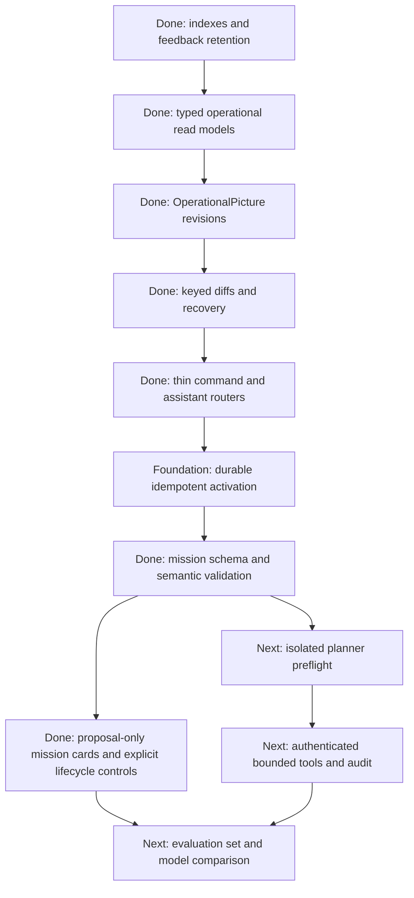

# LLM Assistant Context And Memory Architecture

> **Documentation label: CURRENT**
> Implemented assistant/context foundation plus clearly identified remaining
> hardening. Verify volatile configuration and endpoint details against source,
> Compose, and tests.

This architecture supports natural-language mission drafting and runtime
explanation against the editable backend. It deliberately does not grant the
model command or infrastructure access.
Project priorities and compatibility rules are in
[PROJECT_PLANNING.md](../PROJECT_PLANNING.md), and current ownership boundaries
are defined by [ARCHITECTURE.md](ARCHITECTURE.md).

## Current Boundary

```text
Browser
  -> FastAPI compatibility API
     -> /api/assistant/messages and revisioned operational-picture reads
     -> mission commands through the old REST protocol
     -> normalized ROS reads through rosbridge
     -> scenario activation, MongoDB, and Docker orchestration
  -> editable ROS runtime in backend/

legacy_ros/
  -> frozen, read-only compatibility evidence only
```

All new ROS behavior and assistant-facing integration belongs in `backend/` or
the FastAPI/core layers. The old REST payloads, ROS names, and legacy spellings
remain compatibility contracts, but they do not make `legacy_ros/` the active
implementation. The assistant uses current `backend/` behavior and live
backend observations for implementation behavior. It should consult
`legacy_ros/` and `docs/legacy_nodes/` only when an answer explicitly needs
frozen compatibility evidence.

## Core Rule

```text
The LLM does not read ROS, MongoDB, runtime files, or Docker directly.
It receives a current operational picture from backend-owned context tools.
```

The backend must resolve contradictions and freshness before returning context.
Giving the model raw infrastructure access would bypass scenario scoping,
normalization, authorization, retention limits, and the distinction between a
declared state and an observed live state.

## Current Persistence Model

The editable stack uses the MongoDB files under `data/backend-mongo/`. The
separate `data/legacy-mongo/` store belongs to the frozen comparison stack and
must not be used as current operational context. The every-message provider
currently reads bounded summaries from `ConnectedVehicles`, `Vehicles`,
`MissionConfig`, `MissionFeedback`, and `Planning`; the richer uses in the
table are requirements for future bounded retrieval tools, not claims that raw
records or `Logs` enter every prompt.

| Source | Current role | Assistant rule |
| --- | --- | --- |
| `RuntimeDB.MissionConfig` | Mission configurations accepted by the compatibility runtime | Return the canonicalized config and identify adapter translation; do not treat HTTP acceptance as execution success |
| `RuntimeDB.Planning` | Raw planner task JSON per mission | Use for full plan detail, after validating mission and scenario identity |
| `RuntimeDB.MissionFeedback` | Periodic mission snapshots | Prefer the latest valid snapshot and compact the history; waypoint tasks, not planner `READY`, prove path availability |
| `RuntimeDB.Logs` | Runtime log records | Group repeated messages and bound by mission, severity, and time/order |
| `RuntimeDB.ConnectedVehicles` | Currently registered vehicle IDs | Treat as observed connectivity, not as the complete scenario fleet definition |
| `VehicleDB.Vehicles` | Vehicle profiles advertised by the backend runtime | Join with scenario agents and connectivity; do not silently substitute one source for another |
| `MapDB.rma` | Seeded map authoring library and startup fallback | Never use as the active planning world after a scenario has been activated |
| `MapDB._scenario_versions` | Catalog metadata for immutable scenario versions | Resolve scenarios by stable `scenario_id` plus `version`/`map_collection` |
| `MapDB.scenario_<id>_<version>` | Application-frozen features and OSM roads for one scenario version | Use only the recorded collection. Its content hash is verified when created/reused; current READY polling checks identity/count, not a full digest on every read |
| `MapDB._active_scenario` | Durable singleton for the active activation state | Read through the runtime manager and reconcile with live readiness proofs before calling it usable |
| `MapDB._scenario_activations` | Durable idempotent activation record keyed by activation ID | Use phase/status for diagnostics; a recorded transition does not replace live readiness checks |
| `data/runtime/active_scenario.json` | Generated local cache of the durable marker | Useful for degraded diagnostics only; it is not sufficient proof of readiness |
| `data/runtime/active_planner.yaml` | Generated planner collection/token configuration | Verification evidence, not a user-editable knowledge source |
| `data/runtime/user_features_<map>.geojson` | Mutable authoring features | Not active merely because they exist; they enter runtime only through a frozen scenario snapshot |
| Browser scenario draft | Scenario currently selected or edited in the UI | Draft state is neither catalog truth nor active runtime truth |

The active world is therefore not a single Mongo document. It is a validated
conjunction of the recorded scenario/version, exact immutable MapDB collection,
planner collection and activation token, running coordination/planner/robot
containers, and all required vehicle registrations. An assistant must surface
`inactive`, `activating`, `ready`, `stale`, and `failed` states instead of
falling back to the global map library.

Application code treats versioned map collections as immutable, but the
current Mongo deployment does not technically prevent a privileged writer from
changing a document after activation. A same-count mutation would not be found
by normal READY polling. Enforce write-once database permissions or add a
bounded periodic/server-side digest proof before treating the recorded
`map_feature_hash` as continuous tamper evidence.

### Database Observation That Drove The Design, 2026-08-22

A read-only inspection of the persisted editable-backend database found:

- five immutable scenario versions and one active-scenario marker;
- an active five-robot scenario marked `stale`, with zero currently registered
  vehicles because the ROS runtime was not running;
- 81,472 `RuntimeDB.MissionFeedback` documents, compared with one mission
  configuration, one plan, and 18 log records;
- only MongoDB's default `_id` index on all inspected collections at inspection
  time.

These counts are historical observations, not contracts. The API Compose path
now performs safe, idempotent index bootstrap, new scenario collections receive
feature ID/type/2dsphere indexes when created, and feedback maintenance has a
dry-run-first compaction command with a default 100,000-document guard. Larger
runs require mission scoping or an explicitly raised cap after a memory review.
The observation still explains why assistant queries use projections, strict
limits, freshness labels, and summaries rather than raw history retrieval.

## Operational Authority

When sources disagree, assistant tools should apply this order within the
documentation authority rules:

| Question | Authoritative interpretation |
| --- | --- |
| What scenario is usable now? | `ScenarioRuntimeManager.validated_active()` and all of its live readiness proofs |
| What map can this mission use? | The exact versioned `map_collection` recorded for the validated active scenario |
| Which robots belong to the scenario? | The immutable scenario definition |
| Which robots are connected now? | Registered IDs plus current vehicle/edge observations; report missing or mismatched IDs explicitly |
| What is the mission state? | Latest valid ROS/Mongo mission feedback, not an optimistic HTTP acknowledgement |
| Does a route exist? | Non-empty waypoint tasks in mission feedback; use `Planning` for additional plan detail |
| What contract applies? | Schemas and the ROS Compatibility ICD, interpreted through current adapters and `backend/` source |
| How did the frozen system behave? | `legacy_ros/` and `REFERENCE` documents, explicitly labelled as comparison evidence |

Every result should include `observed_at`, source identifiers, scenario ID and
version when applicable, a freshness/status field, and warnings for missing or
contradictory evidence.

A non-successful editable-backend REST command is recorded as `*_failed`
without promoting mission status. The operational picture exposes only the
bounded success flag, HTTP status code, and a warning; it never copies an
upstream response body into the model context.

## Operational Picture On Every Message

Every model invocation receives a materialized `OperationalPicture`. The first
message in a conversation gets a full picture. Each later message asks the
backend for a revisioned diff from the last picture already held in context.
The orchestration layer applies the diff and injects the resulting full current
picture into the new model input.

This provides deterministic change tracking and recovery without asking the
model to reconstruct current truth from conversational prose. It does not
reduce database-read or prompt-token cost: the provider rebuilds one bounded
read model and the model receives the full materialized picture on every
message. A delta is conversation-state/inspection transport data; the
materialized picture is what the model reasons over. A true no-op read reuses
the previous revision, timestamp, checksum, and history entry.

The implemented protocol uses:

- an opaque, monotonic `picture_revision` scoped to one backend runtime;
- `base_revision` and `picture_revision` on every delta;
- `changed` values as complete replacements at documented object boundaries;
- `removed` paths or stable entity IDs, never implicit deletion;
- `observed_at`, per-section freshness, warnings, and source references;
- stable keys such as mission ID, agent ID, scenario ID/version, and feature ID;
- a full-snapshot fallback after compaction, backend restart, missing base,
  schema-version change, or checksum mismatch.

The backend picture includes a bounded view of mission-relevant features from
the exact active MapDB collection: `objective`, `geofence`, `workspace`, and
`risk`. Valid Point and single-ring Polygon geometry is included within strict
per-feature and total-coordinate budgets so names such as `parade` can be
resolved without another model request. Oversized or invalid geometry retains
its stable ID, name, type, coordinate count, and omission status. Roads remain
summarized because their full geometry is too large for every prompt. Mutable
`user_features_<map>.geojson` authoring data is not active truth and is excluded
until activation freezes it into the active collection.

Do not use JSON Merge Patch for arrays of agents, missions, tasks, or warnings;
array-position changes are ambiguous. Diff keyed entities by stable ID and
replace small ordered arrays, such as a bounded warning list, as a whole.

A response envelope can take this shape:

```json
{
  "schema_version": "1.0",
  "mode": "delta",
  "base_revision": "runtime-a:1842",
  "picture_revision": "runtime-a:1847",
  "observed_at": "2026-08-22T14:32:05Z",
  "changed": {
    "missions/mission-123": {
      "id": "mission-123",
      "kind": "mission",
      "observed_at": "2026-08-22T14:32:05Z",
      "freshness": "fresh",
      "source_ids": ["adapter-runtime", "RuntimeDB.MissionFeedback"],
      "data": {
        "mission_id": "mission-123",
        "adapter_state": {
          "command_phase": "start",
          "backend_command": {"ok": true, "status_code": 200}
        },
        "backend_feedback": {
          "status": 5,
          "status_name": "STARTED",
          "has_paths": true,
          "path_summary": {"path_count": 1, "waypoint_count": 12}
        },
        "effective_status": 5,
        "effective_status_name": "STARTED",
        "effective_status_source": "RuntimeDB.MissionFeedback"
      }
    }
  },
  "removed": [
    "warnings/planner-waiting"
  ],
  "picture_checksum": "8bde75a9f5d03f0a5bcb87f216950ecc1e73f2d4ce9e8613a82cf4e5a7d81234",
  "sources": [
    {
      "id": "adapter-runtime",
      "kind": "fastapi_state",
      "observed_at": "2026-08-22T14:32:05Z",
      "freshness": "fresh",
      "details": {}
    },
    {
      "id": "RuntimeDB.MissionFeedback",
      "kind": "mongodb_collection",
      "observed_at": "2026-08-22T14:32:04Z",
      "freshness": "fresh",
      "details": {"bounded_rows": 12, "observation_limit": 256}
    }
  ]
}
```

The orchestration layer rejects a delta unless its `base_revision` matches the
materialized picture, validates every replacement boundary, and verifies the
result checksum. On failure it requests one full context snapshot before the
single model invocation. Each assistant response records the
`picture_revision` it used so operators can reproduce the answer.

The materialized backend picture retains the complete internal runtime binding
needed for stale-proposal validation. Before prompt rendering, the orchestrator
projects it into a model-facing `current_environment` view. Scenario IDs,
versions, collection names, content hashes, activation IDs/tokens, and source
document IDs never enter the model messages. The model sees current readiness,
map bounds and counts, bounded active feature facts, fleet, missions, plans,
health, and warnings. Full roads, large omitted feature geometry, and full
waypoint arrays require a future bounded retrieval operation rather than being
copied into every message.

## Assistant Setup And Per-Message Sequence

```mermaid
sequenceDiagram
    autonumber
    actor Operator
    participant UI as Assistant Panel
    participant Store as Browser Local Storage
    participant API as FastAPI Assistant Router
    participant Chat as LangChain Orchestrator
    participant Context as Operational Context Service
    participant Read as Backend Read-Model Provider
    participant Live as Runtime Manager + Adapter State + MongoDB
    participant LLM as LM Studio qwen/qwen3.8-27b
    participant ROS as Editable ROS Backend

    Note over API,LLM: API process setup (no model request)
    API->>Context: Create bounded revision service
    API->>Chat: Register prompt v2, xhigh thinking, and one-in-flight guard
    Note over API,Chat: Model provider remains lazy until first use
    UI->>Store: Restore bounded transcript and conversation ID
    Store-->>UI: Prior messages and valid proposal envelopes
    UI->>UI: Re-register restored valid proposals as local mission drafts

    Operator->>UI: First message
    opt URL contains ?assistantDebug=1 and Debug is enabled
        UI->>UI: Request safe diagnostic capture for this turn
    end
    UI->>API: POST /api/assistant/messages
    API->>Chat: First use: construct provider and load prompt version
    API->>Chat: chat(conversation, message, debug)
    Chat->>Context: get_operational_update(no base revision)
    Context->>Read: Build bounded normalized read model
    Read->>Live: Read validated runtime, active map features, fleet, missions, plans, health
    Live-->>Read: Source-labelled observations
    Read-->>Context: Operational read model
    Context-->>Chat: Full picture R1
    Chat->>Chat: Validate and store materialized picture R1
    Chat->>Chat: Project model-safe current_environment; retain internal binding
    Chat->>LLM: One non-streaming invoke: prompts + history + current environment R1 + message
    LLM-->>Chat: Final JSON envelope and any actual tool calls
    Chat-->>API: Answer tagged with R1 internal binding and optional draft
    opt mission_proposal is present
        API->>Live: Validate schema/semantics and read current internal binding
        Live-->>API: Post-generation runtime binding
        API->>API: Require exact R1/current identity match
    end
    API-->>UI: Answer, revision, validation, optional safe trace
    UI->>Store: Persist bounded transcript and conversation ID
    opt Valid mission proposal
        UI->>UI: Register local draft in mission list and conversation card
        UI-->>Operator: Show status, Validate, Open, and allowed lifecycle actions
        Operator->>UI: Click Open or Validate
        UI->>UI: Select ordinary mission state and render geometry on map
        Operator->>UI: Click Init
        UI->>API: POST /api/missions/init with selected validated config
        API->>ROS: Legacy-compatible initialize command
        ROS-->>API: Mission/planner feedback through existing read side
        API-->>UI: /api/events mission and planner updates
        UI-->>Operator: Update card progress and planned path on map
        Operator->>UI: Click Approve after plan, then Start after acceptance
        UI->>API: Mission-specific status request
        API->>API: Verify lifecycle and exact last initialized target
        API->>ROS: Forward status only after guard passes
    end

    Operator->>UI: Next message
    UI->>API: POST /api/assistant/messages
    API->>Chat: chat(same conversation, message, debug)
    Chat->>Context: get_operational_update(since R1)
    Context->>Read: Read current backend state R2
    alt Base revision is available and valid
        Context-->>Chat: Delta R1 -> R2
        Chat->>Chat: Apply keyed replacements/removals and verify checksum
    else Missing base, backend restart, or mismatch
        Context-->>Chat: Full OperationalPicture R2
        Chat->>Chat: Replace materialized picture
    end
    Chat->>Chat: Project model-safe current_environment
    Chat->>LLM: One non-streaming invoke with history and full current environment R2
    LLM-->>Chat: Final answer from that single request
    Chat-->>API: Answer tagged with R2 binding and optional draft
    opt mission_proposal is present
        API->>Live: Validate schema/semantics and read current internal binding
        Live-->>API: Post-generation runtime binding
        API->>API: Require exact R2/current identity match
    end
    API-->>UI: Complete response
    UI->>Store: Replace bounded saved transcript
    UI-->>Operator: Render answer and picture revision
```

The exact proposal identity comparison covers seven fields from the picture
used for generation: `scenario_id`, `version`, `map_collection`,
`content_hash`, `map_feature_hash`, `activation_id`, and `activation_token`.
Missing or changed fields make the draft unusable. The recorded map feature
hash is activation-time evidence subject to the database-integrity limitation
described above.

## Current LangChain And LM Studio Configuration

The production factory uses `langchain-openai`'s chat model wrapper with these
defaults:

```text
C2_IMUGS2_LLM_BASE_URL=http://10.67.80.81:1234/v1
C2_IMUGS2_LLM_MODEL=qwen/qwen3.8-27b
C2_IMUGS2_LLM_API_KEY=<server-side environment only>
C2_IMUGS2_LLM_PROMPT_VERSION=v2
C2_IMUGS2_LLM_REASONING_EFFORT=xhigh
C2_IMUGS2_LLM_MAX_OUTPUT_TOKENS=65536
```

The API key is never returned to the browser or stored in settings, Compose,
prompts, runtime state, or documentation. The model is configured with explicit
`xhigh` reasoning, thinking preservation, Qwen's thinking-mode sampling
defaults, and a 65,536-token completion ceiling. This prevents the former
1,200-token ceiling from being consumed entirely by reasoning before any final
answer was emitted. `max_retries=0`, only one generation may be in flight
(concurrent work receives HTTP `429` instead of queueing), and one accepted
assistant message produces exactly one non-streaming model request. Native
structured output is opt-in because local
OpenAI-compatible servers vary; the default asks for one JSON envelope and
parses it locally without a repair request. Invalid JSON still yields the one
raw response.

Prompts are plain, versioned files under
`src/c2_imugs2/assistant/prompt_templates/<version>/`:

- `system.txt` owns authority and safety instructions;
- `mission_contract.txt` owns the editable canonical mission shape and geometry
  guidance;
- `user_message.txt` owns operational-picture/message packing;
- `structured_output.txt` owns the response envelope.

Copy a prompt directory to a new version before a material change and select it
with `C2_IMUGS2_LLM_PROMPT_VERSION`. Responses expose the prompt and picture
versions used.

Current HTTP endpoints are:

| Endpoint | Purpose |
| --- | --- |
| `GET /api/assistant/status` | Non-secret provider/model/prompt configuration status |
| `GET /api/assistant/operational-picture` | Full initial/recovery picture or retained-base diff from `since_revision`; verifies `since_checksum` when supplied |
| `POST /api/assistant/messages` | One grounded model answer and optional deterministically checked proposal |
| `DELETE /api/assistant/conversations/{id}` | Clear bounded in-process dialogue and picture state |

Model conversation state is in process and bounded to six retained turns per
conversation. The browser separately saves at most 80 visible transcript items
and the conversation ID in local storage, so ordinary tab and workspace
navigation preserves message history. Valid proposal envelopes in that history
are re-registered as local drafts when the UI reloads. A second local store owns
the latest operator-edited working copies and takes precedence over the original
model envelope; clearing the conversation therefore does not delete saved
missions. An API process restart still starts a new operational revision scope
and loses model-side history; the browser transcript is display history, not
backend operational truth. Nothing writes conversation summaries into backend
operational databases.

The compatibility API still has wildcard CORS and no authentication. Until
role checks and rate limits exist, bind/deploy it only on a trusted operator
network; the one-in-flight guard protects LM Studio from concurrency, not from
an unauthenticated sequence of requests.

### Hidden Diagnostic View

Append `?assistantDebug=1` to the UI URL to reveal a non-persistent **Debug**
switch. Enable it before sending a message to request that turn's bounded safe
trace. The trace displays the exact redacted LangChain messages sent to the
model, the final provider event, and any tool calls actually returned by the
provider. Deterministic context reads and proposal validation are displayed
separately because they are backend operations, not LLM tools.

No callable tools are currently bound to the model, so the normal tool-call
count is zero. Tool calls are never fabricated from backend work. The server
and browser both defensively redact credential-shaped values, but the hidden
query parameter is only a discoverability gate, not authorization. Run this
diagnostic surface only on the trusted operator network and do not add secrets
to prompts or operational data.

## Backend Context Operations And Future Model Tools

The first row and proposal validation are deterministic backend operations,
not model-callable tools. No tools are currently bound to the LLM. The other
rows describe possible bounded future operations; they must expose the current
environment abstraction and must not reveal internal scenario, collection, or
activation mechanics to the model.

| Tool | Result |
| --- | --- |
| `get_operational_update(since_revision?, since_checksum?)` | **Implemented.** Full picture on first use/recovery; otherwise a validated keyed diff |
| `get_current_environment_context()` | Current readiness, bounded active feature/road summaries, bounds, and declared agents; internal runtime identity remains backend-only |
| `list_missions(filters)` | Mission IDs, timestamps, authoritative statuses, and path availability |
| `get_mission_context(id)` | Canonical config, plan summary, latest feedback, compact timeline, grouped warnings, and source IDs |
| `get_fleet_context()` | Declared agents, advertised profiles, current registrations, locations, capabilities, and mismatches |
| `search_current_map_features(query)` | Matches only within the active environment, with bounded exact Point/Polygon facts or omission summaries |
| `retrieve_contracts(query)` | Relevant schema, ICD, `CURRENT` backend documentation, and source references with authority labels |
| `validate_mission_definition(json)` | **Partly implemented.** Canonical schema, inline geometry shape/range semantics, current-environment readiness and vehicle membership run now; the backend also enforces its exact hidden runtime binding. Map resolution/containment, behavior compatibility, capability/connectivity, and planner preflight remain |
| `preflight_mission(json)` | A side-effect-free feasibility result tied internally to the immutable active runtime identity |
| `propose_mission(json)` | **Implemented as UI draft staging.** Never an automatic ROS command |

Read and proposal tools should be separate from Init, Approve, Start, Stop, or
environment-switching permissions. The current old REST status envelope contains
no mission ID and targets the last initialized mission, so an assistant must
not present mission-specific approve/start URLs as safe concurrent-mission
control.

## Safe Mission Pipeline

The implemented proposal path is:

```text
natural language
  -> candidate canonical mission JSON
  -> complete JSON Schema validation
  -> local semantic and inline geometry validation
  -> exact-picture ready-scenario and vehicle-membership binding
  -> post-generation comparison with the current scenario binding
  -> operator review of proposal, assumptions, warnings, and operational revision
  -> editable normal mission composer
  -> explicit Init
  -> repeat validation against current scenario + compatibility translation
  -> authoritative feedback
  -> explicit Approve / Start
```

The assistant has no command tools and the API never initializes a generated
proposal. The response's `mission_proposal_validation.valid=true` means only
that canonical schema, local semantic, supported single-ring inline geometry,
current ready-scenario, vehicle-membership, and exact generation-to-validation
scenario-binding checks passed. The response records that binding. It is not a
map-containment, behavior-compatibility, planner-feasibility, capability, or
safety certificate.

Before autonomous tooling or a stronger "ready to initialize" claim, the
remaining deterministic checks must cover:

- unique, currently registered and capable vehicle IDs;
- feature-reference resolution and geometry containment in the active
  scenario;
- geometry compatibility with the requested behavior;
- speed, formation, coverage, and vehicle constraints;
- risk-safe road access, endpoint projection, and route feasibility;
- non-empty information required by the editable planner;
- preservation of the same scenario binding through operator approval and
  Init.

Current checks already cover schema version and enums, required structure,
finite `[lon, lat]` coordinates and ranges for Point, LineString, and closed
non-degenerate single-ring Polygon literals, coverage width semantics,
ready-scenario membership, and an exact scenario/version/map/hash/activation
binding comparison across model generation and proposal validation.

The current mission endpoint normalizes legacy aliases, executes the complete
canonical draft-2020-12 mission schema, then executes semantic and active
scenario/vehicle-membership checks before calling the compatibility REST
bridge. The assistant performs no LLM repair generation: validation errors are
returned to the operator without spending a second model request.

Planner preflight must also be isolated. The editable planner currently keeps
global mission/path state and a planning request replaces its cached result, so
the live planner service is not a safe dry-run engine without a request-scoped
graph/state boundary.

## Context Packing And Memory

Return current evidence and compact events, not raw collections:

- group repeated logs and feedback changes with count and latest occurrence;
- summarize paths by agent, waypoint count, distance, endpoints, and risk or
  snap warnings;
- include raw coordinates only when needed for validation or explanation;
- keep command acknowledgement, mission status, planner status, and
  `path_status` as separate facts;
- label missing, stale, inferred, and frozen-reference data;
- include source document IDs/versions without exposing unrestricted database
  handles;
- cap documents, coordinates, log groups, and response size at the backend.

Use three separate forms of memory:

1. **Normalized live read models** for current scenario, fleet, mission, plan,
   and health state.
2. **Authority-aware retrieval** over schemas, ICDs, current backend docs, and
   narrowly selected source explanations.
3. **Compact mission timelines** that turn repeated feedback/log rows into
   durable state transitions for debugging and after-action review.

Conversation memory is not operational truth. Assistant summaries and user
preferences must never be written into `RuntimeDB`, `VehicleDB`, active scenario
state, or immutable MapDB collections. Start with structured filtering and
full-text search; add a vector database only if evaluation shows a material
retrieval benefit.

## Implementation Status And Remaining Prerequisites

The implemented foundation now provides:

1. A backend-owned, typed and bounded operational read model with provenance
   and freshness.
2. Safe Mongo index bootstrap for current query shapes and versioned map
   collections, plus a deterministic feedback compaction policy that previews
   by default.
3. MongoDB as the durable active-scenario authority, with the runtime JSON file
   treated as a generated/degraded cache.
4. Idempotent activation IDs, phases, durable retryable failure records,
   content-hash reuse, and live readiness reconciliation for the current
   single-API-worker deployment.
5. Mission/scenario/assistant routers over application/orchestration services;
   remaining map/diagnostic handlers can migrate incrementally without changing
   their public contracts.
6. Canonical JSON Schema execution followed by semantic validation at both the
   assistant-proposal and mission-init boundaries.
7. A revisioned operational-context service with bounded history, keyed full
   object replacements, removals, checksum validation, and recovery snapshots.
8. A versioned-prompt LangChain adapter and proposal-only UI with one local
   model request per message.

The remaining prerequisites for stronger or autonomous operation are:

1. A request-scoped, side-effect-free planner preflight tied to the exact
   immutable scenario version and activation token.
2. Complete proposal checks for scenario geometry, map features, fleet
   capability/connectivity, compatibility constraints, and preflight outcome.
3. Authentication, role/capability checks, command audit records, and
   environment guards around command, activation, Docker, and test-reset
   operations.
4. A backend mission-command contract that targets a mission explicitly before
   concurrent mission control or autonomous tool use is enabled. Keep the old
   REST bridge as a compatibility adapter during migration.
5. Authority-aware document/contract retrieval and evaluation proving that it
   materially improves answers before adding a vector database.
6. Database-backed activation fencing plus explicit startup resume/rollback
   semantics before running multiple API workers. Current activation records
   and singleton writes are durable but non-transactional and guarded only by a
   process-local lock.
7. Database-enforced write-once scenario collections or bounded recurring
   content-digest verification. Today `map_feature_hash` proves activation-time
   content, while routine READY checks detect missing/count changes but not a
   privileged same-count mutation.

## Recommended Build Order



1. **Done:** add Mongo indexes and feedback retention/compaction with migration tests.
2. **Done:** add typed operational repositories and compact read models with source and
   freshness metadata.
3. **Done:** define and version the full `OperationalPicture` schema, then add
   deterministic keyed diffs and full-snapshot recovery.
4. **Foundation done:** split mission, scenario and assistant routes from
   application/orchestration services; migrate map and diagnostic handlers only
   as they need focused changes.
5. **Foundation done:** persist one durable active marker plus activation IDs
   and phases, and make healthy identical activations idempotent. Add
   database-backed fencing and startup resume/rollback before multi-worker use.
6. **Done:** execute full JSON Schema and semantic validation at the mission boundary.
7. **Next:** add an isolated planner-preflight boundary tied to an immutable scenario
   version.
8. **Next:** add authenticated read-only assistant context tools and authority-aware
   document retrieval.
9. **Done for scenario-bound drafts:** add a UI proposal panel with validation results and explicit operator
   actions.
10. **Next:** build a verified natural-language-to-mission evaluation set before choosing
    hosted, local, or fine-tuned models.

The current assistant explains bounded backend state and drafts
schema/semantic/scenario-member-valid proposals for operator review. Autonomous
mission execution is not a current goal.
