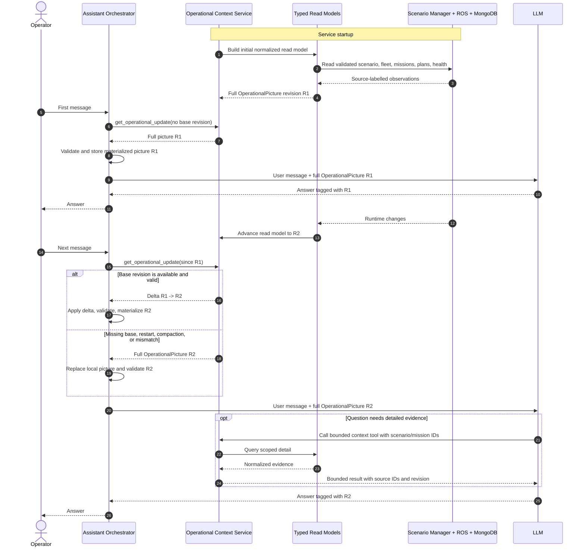
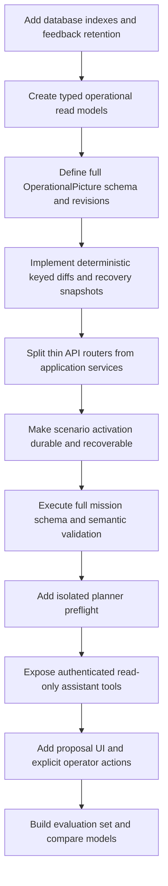

# LLM Assistant Context And Memory Architecture

> **Documentation label: FUTURE**
> Proposed later design. It describes the current backend and persistence
> boundaries that a future assistant must respect, but it is not authorization
> to build LLM benchmarking or assistant integration during the current phase.

This design is for natural-language mission generation and runtime explanation.
Project priorities and compatibility rules are in
[PROJECT_PLANNING.md](../PROJECT_PLANNING.md), and current ownership boundaries
are defined by [ARCHITECTURE.md](ARCHITECTURE.md).

## Current Boundary

```text
Browser
  -> FastAPI compatibility API
     -> mission commands through the old REST protocol
     -> normalized ROS reads through rosbridge
     -> scenario activation, MongoDB, and Docker orchestration
  -> editable ROS runtime in backend/

legacy_ros/
  -> frozen, read-only compatibility evidence only
```

All new ROS behavior and assistant-facing integration belongs in `backend/` or
the FastAPI/core layers. The old REST payloads, ROS names, and legacy spellings
remain compatibility contracts, but they do not make `legacy_ros/` the active
implementation. A future assistant must use current `backend/` source and live
backend observations for implementation behavior. It should consult
`legacy_ros/` and `docs/legacy_nodes/` only when an answer explicitly needs
frozen compatibility evidence.

## Core Rule

```text
The LLM does not read ROS, MongoDB, runtime files, or Docker directly.
It receives a current operational picture from backend-owned context tools.
```

The backend must resolve contradictions and freshness before returning context.
Giving the model raw infrastructure access would bypass scenario scoping,
normalization, authorization, retention limits, and the distinction between a
declared state and an observed live state.

## Current Persistence Model

The editable stack uses the MongoDB files under `data/backend-mongo/`. The
separate `data/legacy-mongo/` store belongs to the frozen comparison stack and
must not be used as current operational context.

| Source | Current role | Assistant rule |
| --- | --- | --- |
| `RuntimeDB.MissionConfig` | Mission configurations accepted by the compatibility runtime | Return the canonicalized config and identify adapter translation; do not treat HTTP acceptance as execution success |
| `RuntimeDB.Planning` | Raw planner task JSON per mission | Use for full plan detail, after validating mission and scenario identity |
| `RuntimeDB.MissionFeedback` | Periodic mission snapshots | Prefer the latest valid snapshot and compact the history; waypoint tasks, not planner `READY`, prove path availability |
| `RuntimeDB.Logs` | Runtime log records | Group repeated messages and bound by mission, severity, and time/order |
| `RuntimeDB.ConnectedVehicles` | Currently registered vehicle IDs | Treat as observed connectivity, not as the complete scenario fleet definition |
| `VehicleDB.Vehicles` | Vehicle profiles advertised by the backend runtime | Join with scenario agents and connectivity; do not silently substitute one source for another |
| `MapDB.rma` | Seeded map authoring library and startup fallback | Never use as the active planning world after a scenario has been activated |
| `MapDB._scenario_versions` | Catalog metadata for immutable scenario versions | Resolve scenarios by stable `scenario_id` plus `version`/`map_collection` |
| `MapDB.scenario_<id>_<version>` | Frozen features and OSM roads for one scenario version | This exact collection is the map authority for missions in that active scenario |
| `MapDB._active_scenario` | Published mirror of active scenario state | Never trust alone; validate it against the backend runtime manager and live readiness proofs |
| `data/runtime/active_scenario.json` | Local operational state used by the scenario manager | Access only through `ScenarioRuntimeManager.validated_active()`; a file marked ready can become stale |
| `data/runtime/active_planner.yaml` | Generated planner collection/token configuration | Verification evidence, not a user-editable knowledge source |
| `data/runtime/user_features_<map>.geojson` | Mutable authoring features | Not active merely because they exist; they enter runtime only through a frozen scenario snapshot |
| Browser scenario draft | Scenario currently selected or edited in the UI | Draft state is neither catalog truth nor active runtime truth |

The active world is therefore not a single Mongo document. It is a validated
conjunction of the recorded scenario/version, exact immutable MapDB collection,
planner collection and activation token, running coordination/planner/robot
containers, and all required vehicle registrations. An assistant must surface
`inactive`, `activating`, `ready`, `stale`, and `failed` states instead of
falling back to the global map library.

### Database Observation, 2026-08-22

A read-only inspection of the persisted editable-backend database found:

- five immutable scenario versions and one active-scenario marker;
- an active five-robot scenario marked `stale`, with zero currently registered
  vehicles because the ROS runtime was not running;
- 81,472 `RuntimeDB.MissionFeedback` documents, compared with one mission
  configuration, one plan, and 18 log records;
- only MongoDB's default `_id` index on all inspected collections.

These counts are observations, not contracts. They demonstrate why assistant
queries need indexes, projections, strict limits, freshness labels, and a
compacted mission timeline rather than raw history retrieval.

## Operational Authority

When sources disagree, assistant tools should apply this order within the
documentation authority rules:

| Question | Authoritative interpretation |
| --- | --- |
| What scenario is usable now? | `ScenarioRuntimeManager.validated_active()` and all of its live readiness proofs |
| What map can this mission use? | The exact versioned `map_collection` recorded for the validated active scenario |
| Which robots belong to the scenario? | The immutable scenario definition |
| Which robots are connected now? | Registered IDs plus current vehicle/edge observations; report missing or mismatched IDs explicitly |
| What is the mission state? | Latest valid ROS/Mongo mission feedback, not an optimistic HTTP acknowledgement |
| Does a route exist? | Non-empty waypoint tasks in mission feedback; use `Planning` for additional plan detail |
| What contract applies? | Schemas and the ROS Compatibility ICD, interpreted through current adapters and `backend/` source |
| How did the frozen system behave? | `legacy_ros/` and `REFERENCE` documents, explicitly labelled as comparison evidence |

Every result should include `observed_at`, source identifiers, scenario ID and
version when applicable, a freshness/status field, and warnings for missing or
contradictory evidence.

## Operational Picture On Every Message

Every model invocation receives a materialized `OperationalPicture`. The first
message in a conversation gets a full picture. Each later message asks the
backend for a revisioned diff from the last picture already held in context.
The orchestration layer applies the diff and injects the resulting full current
picture into the new model input.

This provides delta efficiency without asking the model to reconstruct current
truth from conversational prose. A delta is transport data; the materialized
picture is what the model reasons over.

The protocol should use:

- an opaque, monotonic `picture_revision` scoped to one backend runtime;
- `base_revision` and `picture_revision` on every delta;
- `changed` values as complete replacements at documented object boundaries;
- `removed` paths or stable entity IDs, never implicit deletion;
- `observed_at`, per-section freshness, warnings, and source references;
- stable keys such as mission ID, agent ID, scenario ID/version, and feature ID;
- a full-snapshot fallback after compaction, backend restart, missing base,
  schema-version change, or checksum mismatch.

Do not use JSON Merge Patch for arrays of agents, missions, tasks, or warnings;
array-position changes are ambiguous. Diff keyed entities by stable ID and
replace small ordered arrays, such as a bounded warning list, as a whole.

A response envelope can take this shape:

```json
{
  "schema_version": "1.0",
  "mode": "delta",
  "base_revision": "runtime-a:1842",
  "picture_revision": "runtime-a:1847",
  "observed_at": "2026-08-22T14:32:05Z",
  "changed": {
    "missions/mission-123/status": {
      "value": 5,
      "name": "STARTED",
      "source": "mission_feedback"
    },
    "agents/robot-2/connectivity": "disconnected"
  },
  "removed": [
    "warnings/planner-waiting"
  ],
  "sources": [
    {
      "id": "RuntimeDB.MissionFeedback/mission-123/latest",
      "observed_at": "2026-08-22T14:32:04Z"
    }
  ]
}
```

The orchestration layer should reject a delta unless its `base_revision`
matches the materialized picture. It then validates the updated picture against
the operational-picture schema and optionally verifies a checksum. On failure
it requests a full snapshot before invoking the model. Each assistant response
should record the `picture_revision` it used so operators can reproduce the
answer.

Large immutable geometry and full waypoint arrays do not belong in the picture
on every message. Keep their scenario/map/plan IDs, hashes, bounds, counts, and
summaries in the picture; retrieve exact data with a bounded tool only when the
current question needs it.

## Assistant Setup And Per-Message Sequence



## Assistant-Facing Tools

The assistant needs a small application-level tool set. These are logical
operations, not permission to expose Mongo queries or ROS calls directly.

| Tool | Result |
| --- | --- |
| `get_operational_update(since_revision?)` | Full picture on first use or recovery; otherwise a validated diff from the supplied revision |
| `list_scenarios(filters)` | Scenario IDs and latest immutable versions, clearly separating catalog entries from the active runtime |
| `get_scenario_context(id, version)` | Frozen features/roads summary, declared agents, active status, bounds, and source collection |
| `list_missions(filters)` | Mission IDs, scenario version, timestamps, authoritative statuses, and path availability |
| `get_mission_context(id)` | Canonical config, plan summary, latest feedback, compact timeline, grouped warnings, and source IDs |
| `get_fleet_context()` | Declared agents, advertised profiles, current registrations, locations, capabilities, and mismatches |
| `search_active_map_features(query)` | Matches only within an explicitly identified scenario version, with geometry summaries and bounds |
| `retrieve_contracts(query)` | Relevant schema, ICD, `CURRENT` backend documentation, and source references with authority labels |
| `validate_mission_definition(json)` | Full schema plus semantic, scenario, map, fleet, coordinate, and compatibility errors/warnings |
| `preflight_mission(json)` | A side-effect-free feasibility result tied to an immutable scenario version |
| `propose_mission(json)` | A staged proposal for operator review; never an automatic ROS command |

Read and proposal tools should be separate from Init, Approve, Start, Stop, or
scenario activation permissions. The current old REST status envelope contains
no mission ID and targets the last initialized mission, so an assistant must
not present mission-specific approve/start URLs as safe concurrent-mission
control.

## Safe Mission Pipeline

```text
natural language
  -> candidate canonical mission JSON
  -> complete JSON Schema validation
  -> backend compatibility and semantic validation
  -> validated active-scenario/map/fleet checks
  -> isolated, side-effect-free planner preflight
  -> operator review of proposal, assumptions, and warnings
  -> explicit Init
  -> authoritative feedback
  -> explicit Approve / Start
```

Deterministic checks must cover:

- valid schema version, behavior, request, mission, task, and primitive enums;
- unique, scenario-member, currently registered and capable vehicle IDs;
- supported geometry for the behavior and `[lon, lat]` coordinates;
- geometry containment in the active scenario and resolvable feature IDs;
- speed, formation, coverage, and vehicle constraints;
- risk-safe road access, endpoint projection, and route feasibility;
- non-empty information required by the editable planner;
- binding to the same scenario ID, version, map hash, and activation token from
  validation through operator approval.

The current mission endpoint performs partial handwritten structural checks; it
does not execute the complete canonical JSON Schema. That gap must be closed
before an LLM-generated mission can be considered safe. An LLM repair loop may
respond to validator errors, but it must never bypass deterministic validation.

Planner preflight must also be isolated. The editable planner currently keeps
global mission/path state and a planning request replaces its cached result, so
the live planner service is not a safe dry-run engine without a request-scoped
graph/state boundary.

## Context Packing And Memory

Return current evidence and compact events, not raw collections:

- group repeated logs and feedback changes with count and latest occurrence;
- summarize paths by agent, waypoint count, distance, endpoints, and risk or
  snap warnings;
- include raw coordinates only when needed for validation or explanation;
- keep command acknowledgement, mission status, planner status, and
  `path_status` as separate facts;
- label missing, stale, inferred, and frozen-reference data;
- include source document IDs/versions without exposing unrestricted database
  handles;
- cap documents, coordinates, log groups, and response size at the backend.

Use three separate forms of memory:

1. **Normalized live read models** for current scenario, fleet, mission, plan,
   and health state.
2. **Authority-aware retrieval** over schemas, ICDs, current backend docs, and
   narrowly selected source explanations.
3. **Compact mission timelines** that turn repeated feedback/log rows into
   durable state transitions for debugging and after-action review.

Conversation memory is not operational truth. Assistant summaries and user
preferences must never be written into `RuntimeDB`, `VehicleDB`, active scenario
state, or immutable MapDB collections. Start with structured filtering and
full-text search; add a vector database only if evaluation shows a material
retrieval benefit.

## Architecture Prerequisites

Before integrating an LLM, the backend should provide:

1. A backend-owned operational query service/repository instead of Mongo helper
   functions embedded in HTTP handlers. It should return typed, bounded read
   models and preserve provenance.
2. Required database indexes, at minimum mission/time-or-order lookups for
   feedback and logs; scenario/version uniqueness and catalog lookups; and
   feature ID/type/geospatial indexes on scenario collections. Add uniqueness
   only after verifying compatibility-writer semantics.
3. A retention/compaction policy for periodic feedback. Preserve meaningful
   state transitions and plan evidence while expiring or archiving redundant
   snapshots.
4. One declared source of truth for scenario activation. Treat the Mongo
   activation record as durable state and runtime files as generated artifacts,
   or choose the reverse explicitly; do not leave two peer authorities. Live
   readiness must still be reconciled.
5. A durable, idempotent activation state machine with an activation record,
   phases, recovery, and rollback/retry behavior around Mongo, config files,
   Docker, ROS registration, and runtime cleanup.
6. A mission application service used by the live FastAPI routes. The existing
   `MissionService`/ports and the live compatibility API are currently parallel
   designs rather than one execution path.
7. Full schema and semantic validation plus a request-scoped planner preflight.
8. A revisioned operational-context service that produces deterministic full
   pictures and keyed diffs, retains a bounded revision window, and falls back
   safely when the consumer's base revision is unavailable.
9. Authentication, role/capability checks, audit records, and environment
   guards around command, activation, Docker, and test-reset operations.
10. A backend mission-command contract that targets a mission explicitly before
    concurrent mission control or autonomous tool use is enabled. Keep the old
    REST bridge as a compatibility adapter during migration.

## Recommended Build Order



1. Add Mongo indexes and feedback retention/compaction with migration tests.
2. Add typed operational repositories and compact read models with source and
   freshness metadata.
3. Define and version the full `OperationalPicture` schema, then add
   deterministic keyed diffs and full-snapshot recovery.
4. Split the FastAPI monolith into thin routers over mission, scenario, map,
   diagnostics, and operational-query application services.
5. Make scenario activation durable and recoverable with one explicit state
   authority.
6. Execute full JSON Schema and semantic validation at the mission boundary.
7. Add an isolated planner-preflight boundary tied to an immutable scenario
   version.
8. Add authenticated read-only assistant context tools and authority-aware
   document retrieval.
9. Add a UI proposal panel with validation results and explicit operator
   actions.
10. Build a verified natural-language-to-mission evaluation set before choosing
    hosted, local, or fine-tuned models.

The first useful assistant should explain backend state and draft safe,
scenario-bound proposals. Autonomous mission execution is not a current goal.
