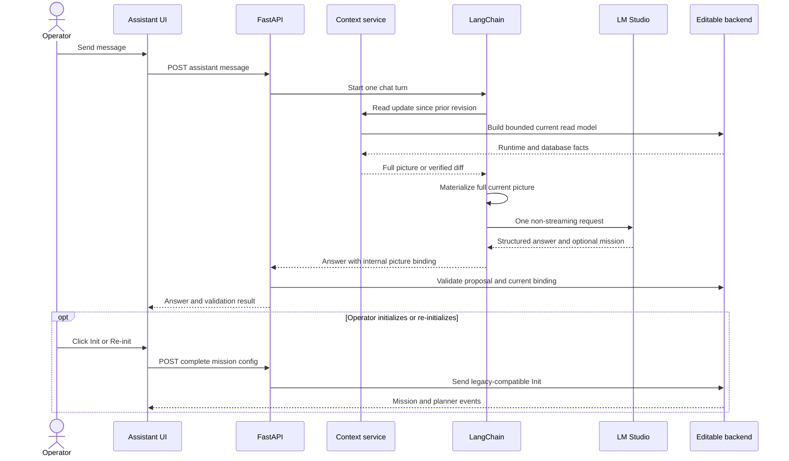

# LLM Assistant Context Architecture

> **Documentation label: CURRENT**
> Verified against the implementation on 2026-08-27. Source and tests remain
> authoritative for volatile details.

This document covers the implemented assistant only. Broader system ownership
is defined by [ARCHITECTURE.md](ARCHITECTURE.md), and project constraints by
[PROJECT_PLANNING.md](../PROJECT_PLANNING.md).

## Boundary

```text
Browser UI
  -> FastAPI adapter and assistant API
     -> bounded reads from current adapter state, scenario runtime, and MongoDB
     -> LangChain request to LM Studio
     -> deterministic mission validation
     -> explicit operator commands through the legacy-compatible REST protocol
  -> editable ROS runtime in backend/

legacy_ros/ -> frozen comparison evidence only
```

The assistant reasons about the editable `backend/` runtime. It never reads
ROS, MongoDB, Docker, or files directly, and it has no command tools. The old
REST and ROS formats remain compatibility contracts at the adapter boundary;
they do not make `legacy_ros/` the active implementation.

## Setup And Per-Message Sequence



The former diagram failed because a semicolon in a sequence message was treated
as a Mermaid statement separator. The replacement uses simple message text and
valid sequence arrows.

## What Happens On Every Message

1. `submitAssistantMessage()` adds the user message and a temporary response to
   the selected browser conversation, then calls `POST /api/assistant/messages`.
2. `assistant_router.send_message()` runs `AssistantOrchestrator.chat()` in a
   worker thread. The model provider is created lazily on first use.
3. `_prepare_turn()` locks the conversation and the single LM Studio request
   slot, gets current operational context, builds the versioned LangChain
   prompt, and optionally captures the exact redacted model messages for debug.
4. `OperationalContextService` rebuilds a bounded read model from the current
   backend sources. The first turn receives a full snapshot. Later turns ask
   for a checksum-bound diff from the conversation's last revision. If the base
   is unavailable or invalid, a full recovery snapshot is returned.
5. The orchestrator applies that update and verifies its checksum. The model is
   always given the resulting full current picture, so every message is
   grounded even though unchanged context is transferred internally as a diff.
6. `LangChainOpenAIProvider.invoke()` makes exactly one non-streaming model
   request. It parses the requested JSON envelope locally and never makes a
   repair or retry generation.
7. `_finalize_turn()` records a bounded history turn and attaches the internal
   environment binding used for generation.
8. `_assistant_response_payload()` validates any mission proposal against the
   canonical schema, semantic rules, vehicle membership, and the current
   environment identity. Proposal validity and command readiness are reported
   separately.
9. The UI replaces the temporary message, registers a valid proposal as a
   mission working copy, and persists the bounded browser transcript.

### Operational picture contents

The model-facing picture contains:

- `current_environment`: readiness, map summary, bounded active Point or Polygon
  features, and `operator_objectives` drawn in the map UI. Operator objectives
  are marked mutable, non-active, and inline-only;
- `agents`: declared, registered, connected, and profile facts without silently
  treating those categories as equivalent;
- `missions` and `plans`: bounded configuration, feedback, status, task, and
  waypoint-count summaries;
- `health` and `warnings`: source failures, freshness, and adapter diagnostics.

Current database inputs are bounded reads from
`RuntimeDB.ConnectedVehicles`, `VehicleDB.Vehicles`,
`RuntimeDB.MissionConfig`, `RuntimeDB.MissionFeedback`,
`RuntimeDB.Planning`, and the active versioned MapDB collection. The separate
operator-objective projection reads only Point objectives from the current
map's bounded user-feature file. Full road
geometry, full paths, log bodies, credentials, Mongo document IDs, and internal
environment identifiers do not enter the model prompt.

The backend retains internal identity fields for the post-generation race
check. The LLM sees a neutral `current_environment`, not scenario-management
concepts or scenario IDs.

## Mission Draft And Command Lifecycle

The LLM can explain state and return a complete canonical proposal. It cannot
initialize, approve, start, or otherwise command a mission.

```text
new proposal -> deterministic validation -> local working copy
             -> operator Init -> backend plan
             -> operator Approve -> operator Start

working-copy edit after Init -> Changes pending -> operator Re-init
                             -> replacement plan for the same mission ID
```

Identity rules are explicit in prompt version `mission/v4` and enforced in code:

- For a new mission the model returns `mission_id: ""`. Backend
  canonicalization assigns a UUID programmatically; the UI then uses that
  complete proposal in the ordinary mission editor and Init endpoint.
- For an edit, the model returns the complete mission and preserves its exact
  non-empty mission ID. It does not return a patch.
- Initialization does not freeze the working copy. A later assistant response
  can revise it, including while the environment is temporarily stale.
- A revision does not inherit the old plan. The UI marks `Changes pending`,
  blocks Approve and Start for the changed definition, and enables Re-init when
  the current environment is ready.
- Re-init posts the complete revised config through the same
  `/api/missions/init` path and replaces stale route state in the UI.
- Approve and Start require the selected definition to equal the last
  initialized config and to be the backend's current command target.

Mission feedback with non-empty task waypoints proves a usable path. Planner
`READY` alone does not.

## Main Code Map

| File | Main responsibility in the loop |
| --- | --- |
| `frontend/src/App.tsx` | Sends messages, registers/revises proposals, renders mission cards and map state, and gates Init, Re-init, Approve, and Start. |
| `frontend/src/assistantHistory.ts` | Persists and bounds browser conversations; strips debug traces or evicts old conversations if storage is full. |
| `frontend/src/api.ts` | Typed HTTP client for assistant and mission endpoints plus the ROS-derived SSE event stream. |
| `src/c2_imugs2/api/app.py` | `create_app()` composes runtime services, lazy assistant construction, status reporting, mission state, and event normalization. |
| `src/c2_imugs2/api/routers.py` | Defines assistant endpoints and runs the deterministic post-model proposal and environment-binding gate. |
| `src/c2_imugs2/assistant/config.py` | Loads validated non-secret LM Studio and context limits from environment variables. |
| `src/c2_imugs2/assistant/factory.py` | Wires the context service, LangChain provider, prompts, and orchestrator without contacting the model. |
| `src/c2_imugs2/assistant/prompts.py` | Loads editable versioned prompt files and constructs `ChatPromptTemplate`. |
| `src/c2_imugs2/assistant/orchestrator.py` | Owns the one-request turn, context diff materialization, model-safe projection, bounded memory, locks, and debug trace. |
| `src/c2_imugs2/assistant/provider.py` | Configures `ChatOpenAI` for LM Studio and normalizes structured output, usage, and any returned tool-call metadata. |
| `src/c2_imugs2/operations/live.py` | Joins current runtime, adapter state, bounded Mongo reads, and operator Point objectives into the typed read model. |
| `src/c2_imugs2/operations/models.py` | Defines immutable operational read-model, item, section, source, and picture value objects. |
| `src/c2_imugs2/operations/service.py` | Creates revisions, keyed diffs, removals, checksums, materialization, and full-snapshot recovery. |
| `src/c2_imugs2/api/services.py` | Canonicalizes proposals, assigns missing IDs, checks environment and vehicles, initializes through REST, and guards status changes. |
| `src/c2_imugs2/infrastructure/legacy/rest.py` | Translates canonical mission JSON to the old REST compatibility envelope. |

The former `operational_picture.py` and `operational_context.py` names described
different layers but looked redundant. They now live together under
`operations/`: `models.py` contains immutable data structures and validation,
`service.py` owns revision/diff/materialization state, and `live.py` adapts
external runtime sources into those structures. Keeping value objects separate
from stateful I/O makes diff logic testable without MongoDB or FastAPI.

The default prompt release is:

```text
src/c2_imugs2/assistant/prompt_templates/mission/v4/prompt.json
```

Its manifest composes ordered behavioral sections, the canonical mission
contract, representative examples, dynamic user-message context, and the
structured output contract. Family-qualified IDs leave room for parallel
task- or model-specific releases while every response records the exact ID.
Historical flat `v1` through `v3` releases remain loadable but are not edited.

## Runtime Defaults

```text
base URL                 http://10.67.80.81:1234/v1
model                    qwen/qwen3.8-27b
prompt version           mission/v4
reasoning effort         xhigh
thinking                 enabled and preserved
maximum output tokens    65536
model retries            0
token streaming          disabled
model tools              none
backend history          6 turns per conversation, 128 conversations
browser history          80 transcript items, 20 conversations
```

The API key is read only from the server-side environment variable named by
`C2_IMUGS2_LLM_API_KEY_ENV_VAR` and is redacted from prompts and debug output.

Only one model invocation may be in flight. Concurrent requests fail with HTTP
`429`; they are not queued onto the local server. SSE still streams runtime
mission and planner events to the UI, but assistant tokens are not streamed.

## Debug And Persistence

Append `?assistantDebug=1` to the UI URL to reveal the debug switch. Enable it
before sending a turn to capture the exact redacted LangChain messages, provider
result metadata, actual returned tool calls, and deterministic backend events.
No tools are currently bound to the LLM, so the normal tool-call count is zero.

The browser stores up to 20 conversations with 80 transcript items each. The
backend stores only the last six turns and last materialized picture for up to
128 conversations in process memory. Deleting a conversation clears both sides
while the API process is alive. After an API restart, browser messages remain,
but they are not replayed into new backend model memory.

## Known Limits

- Proposal validation is not planner preflight. It does not prove route
  existence, execution, or success.
- Geometry containment, complete vehicle capability checks, and isolated
  planner preflight still need stronger deterministic validation.
- Assistant history, operational revisions, and adapter mission state are
  process-local; durable cross-worker orchestration is not implemented.
- The legacy status command has no mission ID, so the adapter safely permits
  Approve and Start only for the last successfully initialized target.
- Context diffing protects continuity and reduces repeated internal transfer,
  but the bounded backend read model is still rebuilt on every message.
- Command and infrastructure endpoints still need authentication and audit
  before any autonomous model tooling could be considered.

## Verification

Backend tests cover the assistant, operational context, live read model, and
API. They check exactly one model call per message, xhigh thinking, full/diff
recovery, secret redaction, programmatic new mission IDs, stale-environment
draft edits, binding-race rejection, and the non-streaming endpoint contract.
Browser history bounds are defined and enforced in `assistantHistory.ts`.
