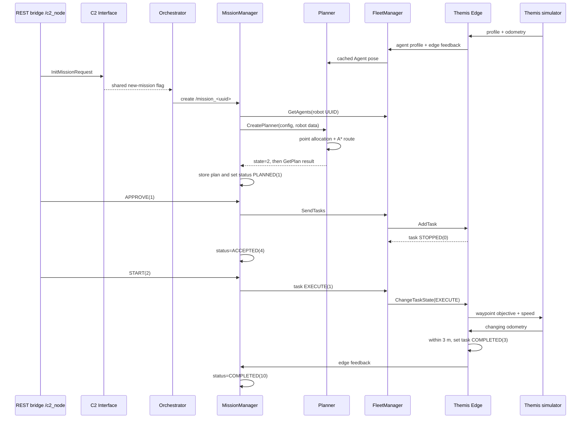

# Single-Robot Mission: Complete Code Walkthrough

This walkthrough follows one real backend use case from beginning to end:
send the configured **Themis Fr** robot from its simulated position to one GPS
point, then observe the mission become complete. It intentionally starts at the
legacy REST boundary and stays inside the backend and ROS components; the UI is
not involved.

Every source reference uses a repository-relative GitHub line anchor such as
`#L31-L77`. The visible label also contains the line range, so the location is
still clear in editors that do not interpret the anchor. These links describe
the current source snapshot and can move when lines are added or removed.

## Walkthrough Index

1. [The concrete example](#1-the-concrete-example)
2. [The whole execution at a glance](#2-the-whole-execution-at-a-glance)
3. [The robot becomes available](#3-the-robot-becomes-available)
4. [INIT enters through REST and becomes a ROS message](#4-init-enters-through-rest-and-becomes-a-ros-message)
5. [Central coordination creates the mission runtime](#5-central-coordination-creates-the-mission-runtime)
6. [The mission runtime requests a plan](#6-the-mission-runtime-requests-a-plan)
7. [The planner assigns the point and calculates a route](#7-the-planner-assigns-the-point-and-calculates-a-route)
8. [The route becomes a stored robot task](#8-the-route-becomes-a-stored-robot-task)
9. [APPROVE sends a stopped task to the robot edge](#9-approve-sends-a-stopped-task-to-the-robot-edge)
10. [START changes that task to executing](#10-start-changes-that-task-to-executing)
11. [The edge turns each waypoint into an autonomy objective](#11-the-edge-turns-each-waypoint-into-an-autonomy-objective)
12. [The simulator moves and reports its position](#12-the-simulator-moves-and-reports-its-position)
13. [The edge and mission manager detect completion](#13-the-edge-and-mission-manager-detect-completion)
14. [What to watch while it runs](#14-what-to-watch-while-it-runs)
15. [What this happy path reveals](#15-what-this-happy-path-reveals)

## 1. The Concrete Example

The example uses these fixed inputs. UUIDs generated later for the task,
primitive, and objectives will be different on each run.

| Value | Example |
| --- | --- |
| Mission | `11111111-2222-4333-8444-555555555555` |
| Robot | `f9992bb3-9871-451f-90a0-9207eb9fe6c5` |
| Robot name/prefix | `Themis Fr` / `Themis_Fr` |
| Simulated start | `[4.392588, 50.844317]` |
| Destination | `[4.39243, 50.84405]` |
| Behavior | `0`, `NAVIGATE` |
| Route preference | `road_usage = 1.0` |
| Requested speed | `1.3 m/s` |

Coordinate pairs keep the order `[longitude, latitude]` throughout this
example. The legacy C++ serializer may wrap a Point pair as
`[[longitude, latitude]]`; the planner accepts either shape. In ROS odometry,
the simulator stores longitude in `position.x` and latitude in `position.y`.

### Runtime configuration behind those values

**File purpose — `docker-compose.backend.yml`:** assembles the editable backend
runtime and wires the central coordinator, planner, REST bridge, MongoDB, and
the robot's edge/autonomy pair. The central services are defined at
[L37-L84](../docker-compose.backend.yml#L37-L84); the one-robot service and its
UUID/topic prefix are at [L99-L119](../docker-compose.backend.yml#L99-L119).

**File purpose — `config_autonomy.yaml`:** supplies the simulated vehicle's
initial pose, coordinate mode, dynamics, and profile. The Themis values are at
[L6-L23](../backend/config/config_autonomy.yaml#L6-L23).

**File purpose — `config_agent-tasks-supervisor.yaml`:** configures the edge
executor's connection checks, waypoint completion, and speed control. The
active settings are at
[L1-L22](../backend/config/config_agent-tasks-supervisor.yaml#L1-L22): start
times are disabled, completion tolerance is `3.0 m`, and speed mode is `1`.

**File purpose — `config_planner.yaml`:** selects the planner mode and map used
to build the routing graph. The deployed RMA-map settings are at
[L1-L18](../backend/config/config_planner.yaml#L1-L18).

**File purpose — `executor.cpp`:** boots the three central ROS nodes in one
multithreaded executor and connects C2 Interface and Orchestrator with direct
C++ pointers. The complete wiring is at
[`main()`, L15-L48](../backend/fog/centralized-coordination/src/centralized_coordination/src/executor.cpp#L15-L48).

### Mission configuration

This is the decoded mission object the ROS backend ultimately receives:

```json
{
  "mission_id": "11111111-2222-4333-8444-555555555555",
  "behavior": 0,
  "vehicles": [
    "f9992bb3-9871-451f-90a0-9207eb9fe6c5"
  ],
  "objective": {
    "geometries": [
      {
        "geometry": {
          "geometry_type": "Point",
          "coordinates": [4.39243, 50.84405]
        }
      }
    ]
  },
  "transit": {
    "optimalization": {
      "road_usage": 1.0
    },
    "desired_vehicle_constraints": {
      "max_speed": 1.3
    }
  }
}
```

The REST bridge has an unusual double-JSON contract: `mission_config` in the
outer request must be a **string containing JSON**, not a nested object.
Conceptually, the three requests are:

```jsonc
// 1. INIT. The <escaped JSON string> is the object above, JSON-encoded again.
{
  "action": "initialize",
  "mission_id": "11111111-2222-4333-8444-555555555555",
  "mission_config": "<escaped JSON string>"
}

// 2. Send only after mission feedback says status 1 (PLANNED).
{"action": "change_status", "requested_state": 1}

// 3. Send after status 4 and Edge feedback/logs confirm the task is installed.
{"action": "change_status", "requested_state": 2}
```

The status numbers are part of the ROS contract.

**File purpose — `c2_msgs/json/Enums.hpp`:** defines the shared numeric mission
statuses, requests, and behaviors used by the coordinator. See mission statuses
at [L28-L41](../backend/fog/centralized-coordination/src/message_packages/c2_msgs/json/Enums.hpp#L28-L41),
requests at [L43-L51](../backend/fog/centralized-coordination/src/message_packages/c2_msgs/json/Enums.hpp#L43-L51),
and behaviors at [L53-L58](../backend/fog/centralized-coordination/src/message_packages/c2_msgs/json/Enums.hpp#L53-L58).

```text
Mission request: INIT=0, APPROVE=1, START=2
Mission status:  NONE=0, PLANNED=1, ACCEPTED=4, STARTED=5, COMPLETED=10
```

**File purpose — `task_msgs/json/Enums.hpp`:** defines the separate task-level
request and runtime state numbers used between Fleet and Edge. See
[L16-L32](../backend/fog/centralized-coordination/src/message_packages/task_msgs/json/Enums.hpp#L16-L32).

```text
Task request: EXECUTE=1
Task state:   STOPPED=0, STARTED=1, COMPLETED=3
```

## 2. The Whole Execution At A Glance



The key distinction is:

```text
INIT    creates a plan
APPROVE installs that plan as a stopped robot task
START   allows the robot task to execute
```

## 3. The Robot Becomes Available

This is a prerequisite, not a result of `INIT`. Planning waits until Themis has
already advertised a profile and pose.

### 3.1 The simulator publishes its identity data and pose

**File purpose — `test_autonomy.cpp`:** implements the current test autonomy: a
small kinematic robot simulator that accepts objectives and publishes vehicle
profile, status, and odometry. Its constructor starts the interfaces and motion
timer at
[`Autonomy::Autonomy()`, L7-L18](../backend/edge/agent-tasks-supervisor/ros2ws/src/agent_tasks_supervisor/src/test/test_autonomy.cpp#L7-L18).

The simulator:

- builds its initial global odometry from `start_location` in
  [`_initOdometry()`, L103-L137](../backend/edge/agent-tasks-supervisor/ros2ws/src/agent_tasks_supervisor/src/test/test_autonomy.cpp#L103-L137);
- builds the vehicle constraints and sensor profile in
  [`_initVehicleProfile()`, L139-L210](../backend/edge/agent-tasks-supervisor/ros2ws/src/agent_tasks_supervisor/src/test/test_autonomy.cpp#L139-L210);
- publishes localization every `500 ms` and profile/status every `1 s` through
  the interfaces created in
  [`_initInterface()`, L41-L60](../backend/edge/agent-tasks-supervisor/ros2ws/src/agent_tasks_supervisor/src/test/test_autonomy.cpp#L41-L60).

```text
/Themis_Fr/edge/multi_robot/vehicle_profile
/Themis_Fr/edge/multi_robot/localization
/Themis_Fr/edge/multi_robot/autonomy_status
```

### 3.2 Edge translates autonomy data into robot-level data

**File purpose — `agent_tasks_supervisor_node.cpp`:** is the per-robot Edge
executor. It is the adapter between generic Fleet tasks and this robot's
autonomy topics, and it owns execution gating and waypoint completion.
Its autonomy-side topic bindings are in
[`_initAutonomyInterface()`, L58-L78](../backend/edge/agent-tasks-supervisor/ros2ws/src/agent_tasks_supervisor/src/agent_tasks_supervisor_node.cpp#L58-L78),
and its fog-side publishers/services are in
[`_initFogInterface()`, L81-L107](../backend/edge/agent-tasks-supervisor/ros2ws/src/agent_tasks_supervisor/src/agent_tasks_supervisor_node.cpp#L81-L107).

The profile callback converts the autonomy profile into a JSON agent profile at
[`_vehicle_profile_subscriber_callback()`, L670-L746](../backend/edge/agent-tasks-supervisor/ros2ws/src/agent_tasks_supervisor/src/agent_tasks_supervisor_node.cpp#L670-L746).
The edge republishes that profile every two seconds at
[`_agent_profile_publisher_callback()`, L250-L255](../backend/edge/agent-tasks-supervisor/ros2ws/src/agent_tasks_supervisor/src/agent_tasks_supervisor_node.cpp#L250-L255).

```text
Themis autonomy profile
  -> Edge adds agent_id = f999...e6c5
  -> /multi_robot/edge/agent_profile
```

### 3.3 Fleet registers the robot and feeds its live pose to the planner

**File purpose — `fleet_manager_node.cpp`:** maintains the central in-memory
robot registry and dispatches mission tasks to each robot's Edge services.
The profile callback registers or refreshes Themis at
[`_agent_profile_subscriber_callback()`, L267-L298](../backend/fog/centralized-coordination/src/centralized_coordination/src/fleet_manager_node.cpp#L267-L298),
while
[`_initAgent()`, L345-L355](../backend/fog/centralized-coordination/src/centralized_coordination/src/fleet_manager_node.cpp#L345-L355)
stores the robot and
[`_createEdgeClient()`, L363-L390](../backend/fog/centralized-coordination/src/centralized_coordination/src/fleet_manager_node.cpp#L363-L390)
creates its `add_task` and state-change clients.

When Edge feedback arrives, Fleet copies its odometry and publishes a compact
planner `Agent` message at
[`_edge_feedback_subscriber_callback()`, L301-L343](../backend/fog/centralized-coordination/src/centralized_coordination/src/fleet_manager_node.cpp#L301-L343).

**File purpose — `planner_node.py`:** is the ROS boundary around path planning;
it caches missions and agent poses, triggers path calculation, reports planner
state, and converts paths into task JSON. Themis's latest pose is cached in
[`agent_subscriber_callback()`, L193-L201](../backend/fog/planner/ros2ws/src/planner/planner/planner_node.py#L193-L201).

At this point the information needed later is:

```text
Fleet registry:  robot UUID -> profile + Edge service clients
Planner cache:   robot UUID -> Buddy(localization=[longitude, latitude])
```

## 4. INIT Enters Through REST And Becomes A ROS Message

### 4.1 The HTTP handler decodes the double JSON

**File purpose — `main.cpp`:** boots `/c2_node`, binds the legacy REST listener,
and spins the ROS node. The exact `http://localhost:5001/mission_control`
binding is at
[`main()`, L6-L27](../backend/fog/command-control/src/backend/ros2-rest-api/ros2_ws/src/c2_ros2_rest_api/src/main.cpp#L6-L27).

**File purpose — `MissionHandler.cpp`:** owns the `/mission_control` HTTP POST
handler and routes the two supported actions to the ROS-facing `C2` node.
[`MissionHandler::handle_post_request()`, L31-L77](../backend/fog/command-control/src/backend/ros2-rest-api/ros2_ws/src/c2_ros2_rest_api/src/MissionHandler.cpp#L31-L77)
does the following:

```text
read action
if initialize:
    require outer mission_id and mission_config
    read mission_config as a string
    parse that string as JSON
    cache it in C2
    publish InitMissionRequest
```

The outer HTTP `mission_id` is only checked and printed. The effective ID comes
from `mission_config.mission_id` in the next file.

### 4.2 The REST ROS node publishes the request

**File purpose — `c2_rest.cpp`:** holds the last initialized mission and turns
REST handler calls into legacy ROS mission-request topics.
[`C2::setMissionConfig()`, L12-L16](../backend/fog/command-control/src/backend/ros2-rest-api/ros2_ws/src/c2_ros2_rest_api/src/c2_rest.cpp#L12-L16)
extracts and caches the inner mission ID.
[`C2::sendInitMission()`, L18-L24](../backend/fog/command-control/src/backend/ros2-rest-api/ros2_ws/src/c2_ros2_rest_api/src/c2_rest.cpp#L18-L24)
serializes the JSON again into this ROS message:

```text
topic: /multi_robot/mission_init_request
InitMissionRequest
  mission_id: UUID bytes for 11111111-2222-4333-8444-555555555555
  mission_config: "{...JSON string...}"
```

The publisher/subscriber topic setup is visible in
[`C2::initSwarmManagerInterface()`, L45-L60](../backend/fog/command-control/src/backend/ros2-rest-api/ros2_ws/src/c2_ros2_rest_api/src/c2_rest.cpp#L45-L60).
HTTP `200` means the request was published; it does not mean that planning
succeeded.

## 5. Central Coordination Creates The Mission Runtime

### 5.1 C2 Interface parses the ROS string

**File purpose — `c2_interface_node.cpp`:** is the central ROS ingress boundary.
It converts ROS mission requests into typed/shared coordinator state and routes
later status requests to the orchestrator.
[`Interface::_initMissionCallback()`, L114-L182](../backend/fog/centralized-coordination/src/centralized_coordination/src/c2_interface_node.cpp#L114-L182)
parses `mission_config`, replaces its mission ID with the ID carried in the ROS
message, and sets `flag_new_mission`.

```cpp
MissionConfig::FromJsonString(request->mission_config)
state.flag_new_mission = true
state.mission_id = mission_id
state.mission_info.mission_config = parsed_config
```

The validation placeholder at line 142 is always `true`. The callback constructs
an init response at lines 161–164 but never publishes it.

**File purpose — `MissionConfig.hpp`:** defines the legacy C++ mission model and
its JSON parser/serializer. The top-level parser reads ID, behavior, vehicles,
objective, and transit at
[`MissionConfig::FromJson()`, L974-L1062](../backend/fog/centralized-coordination/src/message_packages/c2_msgs/json/MissionConfig.hpp#L974-L1062).
The objective's `geometries[]` array is parsed at
[`MissionObjective::FromJson()`, L424-L462](../backend/fog/centralized-coordination/src/message_packages/c2_msgs/json/MissionConfig.hpp#L424-L462),
and each inline Point wrapper is decoded at
[`MissionGeometry::FromJson()`, L22-L87](../backend/fog/centralized-coordination/src/message_packages/c2_msgs/json/MissionConfig.hpp#L22-L87).
For direct legacy REST calls, note that transit reads the historical spelling
`optimalization`, not canonical `optimization`; that branch is at
[L913-L921](../backend/fog/centralized-coordination/src/message_packages/c2_msgs/json/MissionConfig.hpp#L913-L921).

### 5.2 Orchestrator notices the flag, persists the config, and creates one node

**File purpose — `orchestrator_node.cpp`:** owns the central mission registry. It
polls C2 Interface state, persists mission configuration, creates one
`MissionManager` node per mission, and routes later lifecycle commands to it.

The orchestrator checks the shared flag every five seconds in
[`_TimerLoop()` and `_managerActions()`, L83-L130](../backend/fog/centralized-coordination/src/centralized_coordination/src/orchestrator_node.cpp#L83-L130).
It stores the config and creates the runtime in
[`_addMission()`, L323-L360](../backend/fog/centralized-coordination/src/centralized_coordination/src/orchestrator_node.cpp#L323-L360).

The actual runtime node is created and spun on a detached thread in
[`_createMissionManagerNode()`, L425-L458](../backend/fog/centralized-coordination/src/centralized_coordination/src/orchestrator_node.cpp#L425-L458):

```text
logical mission ID: 11111111-2222-4333-8444-555555555555
ROS node:           /mission_11111111_2222_4333_8444_555555555555
status service:     multi_robot/mission_11111111_2222_4333_8444_555555555555/mission_status_change
```

There can therefore be roughly five seconds between `INIT` and construction of
the mission runtime.

## 6. The Mission Runtime Requests A Plan

### 6.1 `NONE` means “begin initialization/planning” here

**File purpose — `mission_manager.cpp`:** implements one mission's lifecycle.
It coordinates Planner and Fleet, stores the plan, follows Edge feedback, and
publishes mission feedback.

Its constructor loads the persisted mission config, creates its ROS interfaces,
sets the initial state, and starts the timers at
[`MissionManager::MissionManager()`, L15-L47](../backend/fog/centralized-coordination/src/centralized_coordination/src/mission_manager.cpp#L15-L47).
The state machine runs every `50 ms`; the planning loop runs every `1 s`.

The action for initial status `NONE(0)` is at
[`_stateMachineActions()`, L632-L668](../backend/fog/centralized-coordination/src/centralized_coordination/src/mission_manager.cpp#L632-L668):

```cpp
case NONE:
    active_mission = true;
    reload mission config;
    create planner;
    planning_needed = true;
```

### 6.2 MissionManager asks Fleet for exactly the configured robot

**File purpose — `mission_manager.cpp`:** remains the per-mission coordinator;
this function prepares the inputs for Planner rather than calculating a route.
[`MissionManager::_createPlanner()`, L337-L394](../backend/fog/centralized-coordination/src/centralized_coordination/src/mission_manager.cpp#L337-L394)
reads `mission_config.vehicles`, asks Fleet for those UUIDs, and then sends the
config and returned agent messages to `/multi_robot/planner/create`.

```text
vehicles = [f999...e6c5]
  -> Fleet GetAgents([f999...e6c5])
  -> CreatePlanner(id, complete config JSON, returned Agent messages)
```

**File purpose — `fleet_manager_node.cpp`:** is the robot registry queried by
the mission runtime. [`GetAgents_callback()`, L421-L467](../backend/fog/centralized-coordination/src/centralized_coordination/src/fleet_manager_node.cpp#L421-L467)
looks up the requested UUID in Fleet's in-memory list and returns the robot's
profile and last odometry.

## 7. The Planner Assigns The Point And Calculates A Route

### 7.1 The ROS planner stores the mission, then waits for a cached pose

**File purpose — `planner_node.py`:** coordinates the Python planning library
with ROS services, agent topics, timers, and planner state messages.
[`set_mission_service_callback()`, L263-L292](../backend/fog/planner/ros2ws/src/planner/planner/planner_node.py#L263-L292)
stores the mission under its ID and reports planner state `0` (initialized).

Its one-second
[`planning_timer_callback()`, L219-L260](../backend/fog/planner/ros2ws/src/planner/planner/planner_node.py#L219-L260)
then performs this gate:

```python
agents_to_plan = cached_agents whose id is in mission.vehicles
if no matching agents:
    stay in planner state 1 and return
else:
    set robot nominal speed from mission max_speed
    solve mission
    cache paths
    set planner state 2
```

The `agents` included in `CreatePlanner` are not consumed by this callback; the
planner independently relies on the `/multi_robot/planner/agent` cache created
in step 3.

### 7.2 Point interpretation and one-to-one allocation

**File purpose — `multi_robot_path_planning.py`:** interprets mission JSON into
goals and allocations, invokes low-level routing, and turns returned graph
states into coordinate paths.
[`_solve_mission_with_graph()`, L77-L240](../backend/fog/planner/ros2ws/src/path_planning_lib/path_planning_lib/multi_robot_path_planning.py#L77-L240)
extracts the Point at lines 88–110, selects behavior `0` at lines 123–133, and
routes the single allocation at lines 195–209.

**File purpose — `task_allocation.py`:** assigns mission destinations to robots
before route search. It builds the Euclidean cost matrix in
[`compute_cost_matrix()`, L19-L50](../backend/fog/planner/ros2ws/src/path_planning_lib/path_planning_lib/task_allocation.py#L19-L50)
and applies the Hungarian assignment in
[`hungarian_allocation()`, L52-L73](../backend/fog/planner/ros2ws/src/path_planning_lib/path_planning_lib/task_allocation.py#L52-L73).
For one robot and one Point, the outcome is simply:

```python
{
    "f9992bb3-9871-451f-90a0-9207eb9fe6c5": [
        [4.39243, 50.84405]
    ]
}
```

### 7.3 A* snaps to the graph and avoids risk edges

**File purpose — `mapf.py`:** contains the low-level graph search algorithms.
For this use case, its `AStar` class selects routable graph nodes, applies the
road/risk policy, searches, and reconstructs graph states.

- [`AStar.__init__()`, L20-L29](../backend/fog/planner/ros2ws/src/path_planning_lib/path_planning_lib/mapf.py#L20-L29)
  turns `road_usage=1.0` into roads-only mode.
- [`edge_is_blocked()` and `step_cost()`, L63-L84](../backend/fog/planner/ros2ws/src/path_planning_lib/path_planning_lib/mapf.py#L63-L84)
  reject risk edges and, in roads-only mode, non-road edges.
- [`search()`, L116-L191](../backend/fog/planner/ros2ws/src/path_planning_lib/path_planning_lib/mapf.py#L116-L191)
  snaps start/destination to routable nodes and runs A*.
- [`nearest_routable_node()`, L193-L211](../backend/fog/planner/ros2ws/src/path_planning_lib/path_planning_lib/mapf.py#L193-L211)
  contains the roads-only snapping choice.

**File purpose — `multi_robot_path_planning.py`:** also owns the final
coordinate-path construction around that graph search.
[`_path_to_point()`, L498-L517](../backend/fog/planner/ros2ws/src/path_planning_lib/path_planning_lib/multi_robot_path_planning.py#L498-L517)
converts route nodes to `[x, y]`, appends the exact requested destination if it
differs from the final graph node, and simplifies the path.

The calculated value now has this shape; intermediate coordinates depend on the
loaded map and graph:

```python
{
    "f9992bb3-9871-451f-90a0-9207eb9fe6c5": [
        [4.3925, 50.8443],
        # ...zero or more simplified graph waypoints...
        [4.39243, 50.84405]
    ]
}
```

## 8. The Route Becomes A Stored Robot Task

### 8.1 Planner converts every route coordinate to an objective

**File purpose — `planner_node.py`:** besides coordinating planning, owns the
legacy plan JSON boundary consumed by Fleet and Edge.
[`path_to_plan_json()`, L296-L358](../backend/fog/planner/ros2ws/src/planner/planner/planner_node.py#L296-L358)
creates:

- one random task UUID for Themis;
- one reusable primitive definition of type `waypoint`;
- one objective per route coordinate, each referring to that primitive and
  supplying `coordinates`, `speed`, and `max_speed`;
- one entry in `tasks` keyed by the robot UUID.

The result has this shape:

```jsonc
{
  "mission_id": "11111111-2222-4333-8444-555555555555",
  "tasks": {
    "f9992bb3-9871-451f-90a0-9207eb9fe6c5": {
      "task_id": "<generated-task-uuid>",
      "primitives": [
        {
          "primitive_id": "<generated-primitive-uuid>",
          "primitive_type": "waypoint",
          "completion": {"ends_objective": true, "ends_task": false}
        }
      ],
      "objectives": [
        {
          "objective_id": "<generated-objective-uuid>",
          "parallel_execution": true,
          "primitives": [{
            "primitive_id": "<generated-primitive-uuid>",
            "parameters": {
              "coordinates": [4.3925, 50.8443],
              "speed": 1.3,
              "max_speed": 1.3
            }
          }]
        }
      ]
    }
  }
}
```

The example shows one objective for space; a normal road path produces several.
[`get_plan_service_callback()`, L361-L368](../backend/fog/planner/ros2ws/src/planner/planner/planner_node.py#L361-L368)
returns this JSON from the planner's current cached `paths`.

### 8.2 MissionManager waits for planner state `2`, gets, records, and exposes it

**File purpose — `mission_manager.cpp`:** is responsible for turning “planner
ready” into a mission plan, rather than assuming the state message itself
contains a usable route.

The planner-state subscriber filters state messages by this mission ID in
[`_planner_state_subscriber_callback()`, L410-L445](../backend/fog/centralized-coordination/src/centralized_coordination/src/mission_manager.cpp#L410-L445).
The planning timer sees state `2` and calls `GetPlan` in
[`_getPlanning_try()` and `_plannification_timer_callback()`, L583-L626](../backend/fog/centralized-coordination/src/centralized_coordination/src/mission_manager.cpp#L583-L626).

[`_requestPlanning()`, L273-L319](../backend/fog/centralized-coordination/src/centralized_coordination/src/mission_manager.cpp#L273-L319)
receives the plan, then schedules mission status `PLANNED(1)`.
[`_register_planning_result()`, L462-L536](../backend/fog/centralized-coordination/src/centralized_coordination/src/mission_manager.cpp#L462-L536)
records the planned robot/task/waypoints for feedback and stores the complete
plan in `RuntimeDB.Planning`.

**File purpose — `mongodb_handler.hpp`:** is the thin persistence layer for
runtime mission configurations, plans, feedback, vehicles, and connection
records. The `Planning` collection name and plan replacement operation are at
[`RuntimeDatabase::MongoDbHandler`, L36-L93](../backend/fog/centralized-coordination/src/centralized_coordination/include/custom_libraries/mongodb_handler.hpp#L36-L93).

```text
planner state 2
  -> GetPlan
  -> plan.tasks[Themis]
  -> RuntimeDB.Planning
  -> mission feedback contains waypoints
  -> mission PLANNED(1)
```

This is the safe point at which to send `APPROVE`.

## 9. APPROVE Sends A Stopped Task To The Robot Edge

### 9.1 The same REST/ROS ingress carries request `1`

**File purpose — `MissionHandler.cpp`:** routes HTTP mission commands. Its
`change_status` branch reads `requested_state` and calls the ROS node at
[`handle_post_request()`, L37-L43](../backend/fog/command-control/src/backend/ros2-rest-api/ros2_ws/src/c2_ros2_rest_api/src/MissionHandler.cpp#L37-L43).

**File purpose — `c2_rest.cpp`:** publishes the status request for its cached
mission. [`C2::sendChangeStatus()`, L33-L39](../backend/fog/command-control/src/backend/ros2-rest-api/ros2_ws/src/c2_ros2_rest_api/src/c2_rest.cpp#L33-L39)
publishes `mission_request_status=1` with the cached mission UUID.

**File purpose — `c2_interface_node.cpp`:** routes central ROS status requests
into orchestration. [`Interface::_changeMissionStatusCallback()`, L185-L209](../backend/fog/centralized-coordination/src/centralized_coordination/src/c2_interface_node.cpp#L185-L209)
converts the UUID and calls the orchestrator directly.

**File purpose — `orchestrator_node.cpp`:** finds the correct per-mission
runtime and forwards the request to its service in
[`_changeMissionStatus()`, L465-L497](../backend/fog/centralized-coordination/src/centralized_coordination/src/orchestrator_node.cpp#L465-L497).

### 9.2 MissionManager maps APPROVE to ACCEPTED and queues dispatch

**File purpose — `mission_manager.cpp`:** owns the lifecycle rules and actions
for this particular mission.
[`_changeMissionStatus_callback()`, L876-L921](../backend/fog/centralized-coordination/src/centralized_coordination/src/mission_manager.cpp#L876-L921)
validates the requested transition and queues the new state.
[`_convert_requested_status_to_mission_status()`, L925-L954](../backend/fog/centralized-coordination/src/centralized_coordination/src/mission_manager.cpp#L925-L954)
maps `APPROVE(1)` to `ACCEPTED(4)`.

The `50 ms`
[`_stateMachineCallback()`, L545-L578](../backend/fog/centralized-coordination/src/centralized_coordination/src/mission_manager.cpp#L545-L578)
applies that state. Its `ACCEPTED` action calls `_sendAgentTasks()` at
[`_stateMachineActions()`, L656-L660](../backend/fog/centralized-coordination/src/centralized_coordination/src/mission_manager.cpp#L656-L660),
which queues Fleet dispatch in
[`_sendAgentTasks()`, L1056-L1076](../backend/fog/centralized-coordination/src/centralized_coordination/src/mission_manager.cpp#L1056-L1076).

### 9.3 Fleet reloads the plan and calls Themis's AddTask service

**File purpose — `fleet_manager_node.cpp`:** translates the stored mission plan
into one concrete task-service request per robot.

The sequence is explicit in these functions:

1. [`SendTasks_callback()`, L469-L487](../backend/fog/centralized-coordination/src/centralized_coordination/src/fleet_manager_node.cpp#L469-L487)
   only sets a flag and targeted mission ID.
2. [`_setAgentTasksFromPlanning()`, L490-L559](../backend/fog/centralized-coordination/src/centralized_coordination/src/fleet_manager_node.cpp#L490-L559)
   reloads `RuntimeDB.Planning` and parses primitives/objectives.
3. [`_sendAllTasksForMission()`, L596-L606](../backend/fog/centralized-coordination/src/centralized_coordination/src/fleet_manager_node.cpp#L596-L606)
   iterates the robot-keyed tasks.
4. [`_sendAgentTask()`, L561-L594](../backend/fog/centralized-coordination/src/centralized_coordination/src/fleet_manager_node.cpp#L561-L594)
   calls the robot-specific `AddTask` service with `task_type=0` (`DRIVE`) and
   `override=true`.

```text
/multi_robot/edge/agent_f9992bb3_9871_451f_90a0_9207eb9fe6c5/add_task
  task_id: <generated-task-uuid>
  task_type: 0
  override: true
  task_config: "{primitives:[...], objectives:[...]}"
```

### 9.4 Edge parses the task but deliberately leaves it stopped

**File purpose — `agent_tasks_supervisor_node.cpp`:** owns the robot's current
task and converts its JSON graph into executable in-memory objectives.
[`_addTaskService_callback()`, L759-L893](../backend/edge/agent-tasks-supervisor/ros2ws/src/agent_tasks_supervisor/src/agent_tasks_supervisor_node.cpp#L759-L893)
rebuilds primitive definitions, merges each objective's parameter overrides,
installs the task, and returns state `0`.

```text
Edge current task
  task_state = STOPPED(0)
  objectives = [route waypoint 0, route waypoint 1, ..., exact destination]
  current_objective_index = 0
```

`APPROVE` therefore makes a task available on the robot; it does **not** move
the robot. Before sending `START`, wait for mission feedback to say
`ACCEPTED(4)` and for `/multi_robot/edge/feedback` or the Fleet/Edge logs to
confirm that the stopped task is installed. `ACCEPTED` alone is not a strict
dispatch-complete barrier.

## 10. START Changes That Task To Executing

The HTTP-to-MissionManager route is the same as in step 9, now with
`requested_state=2`.

**File purpose — `mission_manager.cpp`:** maps the command to mission state and
fans it out as a task command.
[`_convert_requested_status_to_mission_status()`, L925-L954](../backend/fog/centralized-coordination/src/centralized_coordination/src/mission_manager.cpp#L925-L954)
maps `START(2)` to `STARTED(5)`. The `STARTED` state action calls
`_changeAgentTaskStatuses(1)` at
[`_stateMachineActions()`, L661-L668](../backend/fog/centralized-coordination/src/centralized_coordination/src/mission_manager.cpp#L661-L668).
[`_changeAgentTaskStatuses()`, L1078-L1097](../backend/fog/centralized-coordination/src/centralized_coordination/src/mission_manager.cpp#L1078-L1097)
sends task request `1`, meaning `EXECUTE`, to Fleet.

**File purpose — `fleet_manager_node.cpp`:** fans that mission-wide task status
out to each robot named in the stored plan.
[`ChangeMissionTaskStatuses_callback()`, L608-L629](../backend/fog/centralized-coordination/src/centralized_coordination/src/fleet_manager_node.cpp#L608-L629)
queues the request;
[`_changeMissionTaskStatuses()` and `_changeAgentTaskStatus()`, L631-L670](../backend/fog/centralized-coordination/src/centralized_coordination/src/fleet_manager_node.cpp#L631-L670)
load the plan and call Themis's `change_task_state` service.

```text
/multi_robot/edge/agent_f9992bb3_9871_451f_90a0_9207eb9fe6c5/change_task_state
  task_id: <generated-task-uuid>
  task_requested_state: EXECUTE(1)
```

**File purpose — `agent_tasks_supervisor_node.cpp`:** applies robot-level task
commands. [`_changeTaskStateService_callback()`, L987-L995](../backend/edge/agent-tasks-supervisor/ros2ws/src/agent_tasks_supervisor/src/agent_tasks_supervisor_node.cpp#L987-L995)
sets the current task state to `STARTED(1)`.

## 11. The Edge Turns Each Waypoint Into An Autonomy Objective

### 11.1 The execution gate must be open

**File purpose — `agent_tasks_supervisor_node.cpp`:** gates task execution so
that a loaded task cannot command autonomy until both halves are connected and
the task is started.
[`_taskControl_timer_callback()`, L333-L357](../backend/edge/agent-tasks-supervisor/ros2ws/src/agent_tasks_supervisor/src/agent_tasks_supervisor_node.cpp#L333-L357)
runs every `200 ms` and requires:

```cpp
connected_to_autonomy
&& connected_to_fog
&& current_task.task_state == STARTED
&& start_time_passed
```

The current config sets `use_start_time=false`, so loading the task makes the
last condition true. Localization refreshes autonomy connectivity in
[`_localization_subscriber_callback()`, L608-L615](../backend/edge/agent-tasks-supervisor/ros2ws/src/agent_tasks_supervisor/src/agent_tasks_supervisor_node.cpp#L608-L615),
and Fleet heartbeat messages refresh fog connectivity in
[`_connection_check_subscriber_callback()`, L618-L625](../backend/edge/agent-tasks-supervisor/ros2ws/src/agent_tasks_supervisor/src/agent_tasks_supervisor_node.cpp#L618-L625).

### 11.2 Edge selects speed and publishes the current objective

**File purpose — `agent_tasks_supervisor_node.cpp`:** also converts the current
task objective into the autonomy message understood by Themis.
[`_speed_control_timer_callback()`, L524-L574](../backend/edge/agent-tasks-supervisor/ros2ws/src/agent_tasks_supervisor/src/agent_tasks_supervisor_node.cpp#L524-L574)
uses speed mode `1` to cap the task waypoint speed. Then
[`_set_objective_publisher_callback()`, L280-L327](../backend/edge/agent-tasks-supervisor/ros2ws/src/agent_tasks_supervisor/src/agent_tasks_supervisor_node.cpp#L280-L327)
publishes every `500 ms`:

```text
/Themis_Fr/edge/multi_robot/autonomy_set_objective
AutonomySetObjective
  null_objective: false
  objective.id: <current-objective-uuid>
  objective.max_speed: 1.3
  objective.primitives[0]: JSON waypoint with [longitude, latitude]
```

## 12. The Simulator Moves And Reports Its Position

### 12.1 It accepts the first waypoint primitive

**File purpose — `test_autonomy.cpp`:** is the kinematic stand-in for a real
vehicle autonomy stack. It consumes Edge objectives but does no obstacle
avoidance or vehicle dynamics.
[`Autonomy::_objective_subscriber_callback()`, L64-L101](../backend/edge/agent-tasks-supervisor/ros2ws/src/agent_tasks_supervisor/src/test/test_autonomy.cpp#L64-L101)
parses the first primitive whose type is `waypoint` and saves its coordinates as
`_current_arrival_point`.

### 12.2 Its 100 ms loop advances the GPS position

**File purpose — `test_autonomy.cpp`:** updates the simulated pose for the
active objective.
[`Autonomy::_motion_control_callback()`, L214-L280](../backend/edge/agent-tasks-supervisor/ros2ws/src/agent_tasks_supervisor/src/test/test_autonomy.cpp#L214-L280)
computes the longitude/latitude difference, approximates metres as degrees, and
moves by `max_speed × 0.1 s` on each tick.

```text
start [4.392588, 50.844317]
  -> move toward route waypoint 0
  -> move toward route waypoint 1
  -> ...
  -> approach [4.39243, 50.84405]
```

The updated odometry is published by
[`_localization_publisher_callback()`, L283-L293](../backend/edge/agent-tasks-supervisor/ros2ws/src/agent_tasks_supervisor/src/test/test_autonomy.cpp#L283-L293)
every `500 ms`. Edge receives that message, and its next feedback also lets
Fleet refresh the planner's cached robot position.

## 13. The Edge And Mission Manager Detect Completion

### 13.1 Edge completes each objective using odometry

**File purpose — `agent_tasks_supervisor_node.cpp`:** owns waypoint progression
and task completion independently of the simulator's own status flag.
[`_objectiveControl_timer_callback()`, L359-L440](../backend/edge/agent-tasks-supervisor/ros2ws/src/agent_tasks_supervisor/src/agent_tasks_supervisor_node.cpp#L359-L440)
checks the current objective every `500 ms`.
[`_check_if_primitive_completed()`, L442-L495](../backend/edge/agent-tasks-supervisor/ros2ws/src/agent_tasks_supervisor/src/agent_tasks_supervisor_node.cpp#L442-L495)
calculates GPS distance between odometry `x/y` and the waypoint and considers it
complete within the configured `3.0 m`.

[`_switch_to_next_objective()` and `_task_completed()`, L496-L523](../backend/edge/agent-tasks-supervisor/ros2ws/src/agent_tasks_supervisor/src/agent_tasks_supervisor_node.cpp#L496-L523)
advance through the route. After the final objective:

```cpp
current_task.task_state = COMPLETED; // numeric value 3
```

### 13.2 Edge publishes robot/task feedback

**File purpose — `agent_tasks_supervisor_node.cpp`:** exposes the robot's latest
task and odometry to the central backend.
[`_feedback_publisher_callback()`, L257-L277](../backend/edge/agent-tasks-supervisor/ros2ws/src/agent_tasks_supervisor/src/agent_tasks_supervisor_node.cpp#L257-L277)
publishes every two seconds on `/multi_robot/edge/feedback`:

```text
agent_id: f9992bb3-9871-451f-90a0-9207eb9fe6c5
task_id: <generated-task-uuid>
task_state: COMPLETED(3)
current_objective_id: <final-objective-uuid>
odometry: approximately [4.39243, 50.84405]
```

### 13.3 The one planned robot finishing completes the mission

**File purpose — `mission_manager.cpp`:** correlates global Edge feedback with
the robot/task IDs belonging to this mission and derives overall completion.
[`_edge_feedback_subscriber_callback()`, L779-L822](../backend/fog/centralized-coordination/src/centralized_coordination/src/mission_manager.cpp#L779-L822)
matches both IDs and calls `_agent_task_completed()` for task state `3`.

[`_agent_task_completed()`, L247-L267](../backend/fog/centralized-coordination/src/centralized_coordination/src/mission_manager.cpp#L247-L267)
compares the finished and planned robot sets. Here they are identical:

```text
planned  = {f999...e6c5}
finished = {f999...e6c5}
equal    = true
  -> schedule mission COMPLETED(10)
```

The state machine applies `COMPLETED`; its action makes the mission inactive at
[`_stateMachineActions()`, L692-L696](../backend/fog/centralized-coordination/src/centralized_coordination/src/mission_manager.cpp#L692-L696).
Finally,
[`_publishMissionFeedback()`, L827-L871](../backend/fog/centralized-coordination/src/centralized_coordination/src/mission_manager.cpp#L827-L871)
persists feedback and publishes `/multi_robot/mission_feedback` every second.
Because the mission is now inactive, that final feedback has status `10` but an
empty task/path list.

## 14. What To Watch While It Runs

Start the editable backend stack:

```bash
docker compose -f docker-compose.backend.yml up --build
```

In another terminal, construct the inner JSON and let `jq` encode it as the
outer request's string field:

```bash
mission_config=$(
  jq -nc '{
    mission_id: "11111111-2222-4333-8444-555555555555",
    behavior: 0,
    vehicles: ["f9992bb3-9871-451f-90a0-9207eb9fe6c5"],
    objective: {geometries: [{geometry: {
      geometry_type: "Point",
      coordinates: [4.39243, 50.84405]
    }}]},
    transit: {
      optimalization: {road_usage: 1.0},
      desired_vehicle_constraints: {max_speed: 1.3}
    }
  }'
)

jq -nc \
  --arg mission_id "11111111-2222-4333-8444-555555555555" \
  --arg mission_config "$mission_config" \
  '{action:"initialize", mission_id:$mission_id, mission_config:$mission_config}' |
curl -sS -X POST http://localhost:5001/mission_control \
  -H 'Content-Type: application/json' --data-binary @-
```

After feedback contains a non-empty path and status `PLANNED(1)`, approve it:

```bash
curl -sS -X POST http://localhost:5001/mission_control \
  -H 'Content-Type: application/json' \
  --data '{"action":"change_status","requested_state":1}'
```

After feedback says `ACCEPTED(4)` and Edge feedback or logs show the stopped
task is installed, start it:

```bash
curl -sS -X POST http://localhost:5001/mission_control \
  -H 'Content-Type: application/json' \
  --data '{"action":"change_status","requested_state":2}'
```

The most useful live topics are:

```bash
docker exec c2-imugs2-backend-centralized-coordination bash -lc \
  'source /opt/ros/humble/setup.bash && \
   source /app/centralized_coordination/install/setup.bash && \
   ros2 topic echo /multi_robot/mission_feedback'

docker exec c2-imugs2-backend-centralized-coordination bash -lc \
  'source /opt/ros/humble/setup.bash && \
   source /app/centralized_coordination/install/setup.bash && \
   ros2 topic echo /multi_robot/edge/feedback'

docker exec c2-imugs2-backend-centralized-coordination bash -lc \
  'source /opt/ros/humble/setup.bash && \
   source /app/centralized_coordination/install/setup.bash && \
   ros2 topic echo /multi_robot/planner/state'
```

The expected observations are:

| Moment | Planner | Mission | Edge task | Robot |
| --- | --- | --- | --- | --- |
| Before INIT | no mission entry | absent | none | profile/pose publishing |
| Planning | `0 -> 1 -> 2` | `NONE(0)` | none | stationary |
| Plan received | `2` | `PLANNED(1)` | none | stationary |
| After APPROVE | `2` | `ACCEPTED(4)` | `STOPPED(0)` | stationary |
| After START | `2` | `STARTED(5)` | `STARTED(1)` | pose changes |
| Final waypoint | `2` | then `COMPLETED(10)` | `COMPLETED(3)` | within 3 m |

Timing matters because several stages are timer-driven: Orchestrator polls every
five seconds, MissionManager changes state every `50 ms`, its planning loop runs
every second, Fleet processes queued work every `500 ms`, Edge checks execution
every `200 ms`, and Edge feedback is published every two seconds.

## 15. What This Happy Path Reveals

The walkthrough is the intended path, but the exact linked code also exposes
important limits:

1. **APPROVE and START are separate barriers.** APPROVE installs a stopped task;
   START executes it. Sending START before the ACCEPTED transition can be
   rejected, and overlapping Fleet calls can race.
2. **HTTP success is only ingress success.** The handler replies before the
   asynchronous ROS planning/dispatch work finishes.
3. **A robot must already be cached.** Planner ignores the `CreatePlanner.agents`
   payload and uses its independent, non-expiring Agent cache.
4. **Road-only does not guarantee the exact destination is on a road.** A* routes
   between snapped graph nodes, then `_path_to_point()` appends the exact Point;
   the final short segment can therefore leave the road.
5. **A failed route is easy to mistake for a plan.** File-purpose reminder:
   `multi_robot_path_planning.py` interprets missions and coordinates route
   calculation. Its fallback at
   [`_a_star_or_direct_path()`, L242-L248](../backend/fog/planner/ros2ws/src/path_planning_lib/path_planning_lib/multi_robot_path_planning.py#L242-L248)
   returns only the robot's current position. The per-mission lifecycle
   coordinator in `mission_manager.cpp` also checks for the literal string
   `"tasks":[]`, while the planner emits an empty object `"tasks": {}`; see
   [`_requestPlanning()`, L284-L311](../backend/fog/centralized-coordination/src/centralized_coordination/src/mission_manager.cpp#L284-L311).
6. **Completion comes from Edge's three-metre check.** The simulator's autonomy
   status is not needed for this configured path.
7. **Progress and final completion are different.** Final completion reliably
   matches robot ID + task ID + task state. Waypoint trimming compares an
   objective UUID with primitive UUIDs and generally does not advance correctly.
8. **Completed feedback drops the route.** Once `COMPLETED(10)` makes the mission
   inactive, the next published feedback deliberately clears its task list.
9. **The REST bridge holds only one current mission ID.** A later initialization
   changes the target used by all subsequent status requests, so concurrent
   control through this endpoint is unsafe.

The essential source path for this example is therefore:

```text
MissionHandler -> C2 -> Interface -> Orchestrator -> MissionManager
  -> Planner / TaskAllocator / AStar
  -> MissionManager -> FleetManager -> AgentTaskSupervisor
  -> Test Autonomy -> AgentTaskSupervisor -> MissionManager
```
