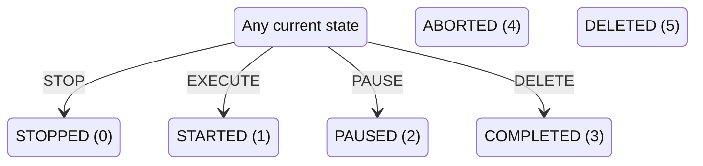

# Edge task lifecycle

The edge service copies TaskRequestState's numeric value directly into TaskState.

## Extracted state values

| Value | State | Source description |
|---:|---|---|
| `0` | `STOPPED` | stopped, but not completed or started |
| `1` | `STARTED` | started |
| `2` | `PAUSED` | paused |
| `3` | `COMPLETED` | completed the task |
| `4` | `ABORTED` | aborted |
| `5` | `DELETED` | deleted |

## Extracted transitions

| From | Trigger | To | Evidence |
|---|---|---|---|
| `ANY` | STOP | `STOPPED` | [`backend/edge/agent-tasks-supervisor/ros2ws/src/agent_tasks_supervisor/src/agent_tasks_supervisor_node.cpp:987`](https://github.com/LEBaz2211/C2_imugs2/blob/main/backend/edge/agent-tasks-supervisor/ros2ws/src/agent_tasks_supervisor/src/agent_tasks_supervisor_node.cpp#L987) |
| `ANY` | EXECUTE | `STARTED` | [`backend/edge/agent-tasks-supervisor/ros2ws/src/agent_tasks_supervisor/src/agent_tasks_supervisor_node.cpp:987`](https://github.com/LEBaz2211/C2_imugs2/blob/main/backend/edge/agent-tasks-supervisor/ros2ws/src/agent_tasks_supervisor/src/agent_tasks_supervisor_node.cpp#L987) |
| `ANY` | PAUSE | `PAUSED` | [`backend/edge/agent-tasks-supervisor/ros2ws/src/agent_tasks_supervisor/src/agent_tasks_supervisor_node.cpp:987`](https://github.com/LEBaz2211/C2_imugs2/blob/main/backend/edge/agent-tasks-supervisor/ros2ws/src/agent_tasks_supervisor/src/agent_tasks_supervisor_node.cpp#L987) |
| `ANY` | DELETE | `COMPLETED` | [`backend/edge/agent-tasks-supervisor/ros2ws/src/agent_tasks_supervisor/src/agent_tasks_supervisor_node.cpp:987`](https://github.com/LEBaz2211/C2_imugs2/blob/main/backend/edge/agent-tasks-supervisor/ros2ws/src/agent_tasks_supervisor/src/agent_tasks_supervisor_node.cpp#L987) |

## Extracted request mapping

| Request | Resulting state | Evidence |
|---|---|---|
| `STOP` | `STOPPED` | [`backend/edge/agent-tasks-supervisor/ros2ws/src/agent_tasks_supervisor/src/agent_tasks_supervisor_node.cpp:987`](https://github.com/LEBaz2211/C2_imugs2/blob/main/backend/edge/agent-tasks-supervisor/ros2ws/src/agent_tasks_supervisor/src/agent_tasks_supervisor_node.cpp#L987) |
| `EXECUTE` | `STARTED` | [`backend/edge/agent-tasks-supervisor/ros2ws/src/agent_tasks_supervisor/src/agent_tasks_supervisor_node.cpp:987`](https://github.com/LEBaz2211/C2_imugs2/blob/main/backend/edge/agent-tasks-supervisor/ros2ws/src/agent_tasks_supervisor/src/agent_tasks_supervisor_node.cpp#L987) |
| `PAUSE` | `PAUSED` | [`backend/edge/agent-tasks-supervisor/ros2ws/src/agent_tasks_supervisor/src/agent_tasks_supervisor_node.cpp:987`](https://github.com/LEBaz2211/C2_imugs2/blob/main/backend/edge/agent-tasks-supervisor/ros2ws/src/agent_tasks_supervisor/src/agent_tasks_supervisor_node.cpp#L987) |
| `DELETE` | `COMPLETED` | [`backend/edge/agent-tasks-supervisor/ros2ws/src/agent_tasks_supervisor/src/agent_tasks_supervisor_node.cpp:987`](https://github.com/LEBaz2211/C2_imugs2/blob/main/backend/edge/agent-tasks-supervisor/ros2ws/src/agent_tasks_supervisor/src/agent_tasks_supervisor_node.cpp#L987) |
