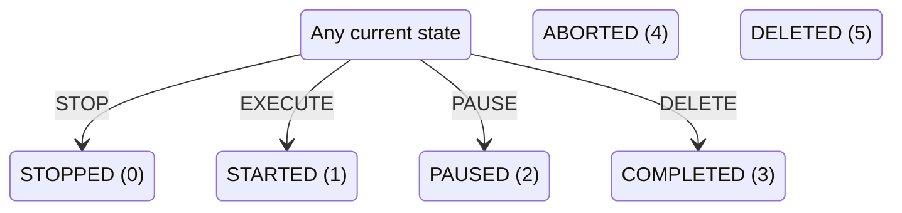
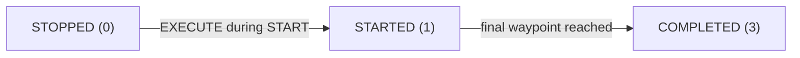

# Edge task lifecycle

> **Documentation label: GENERATED**
> Static discovery from the editable `backend/`, adapter, frontend, and schemas;
> declarations are not proof of runtime availability. Linked runtime examples are
> separate `legacy_ros` evidence from `docker-compose.legacy-ros.yml` and do not verify the current editable backend.

The edge service copies TaskRequestState's numeric value directly into TaskState.

## Extracted state values

| Value | State | Source description |
|---:|---|---|
| `0` | `STOPPED` | stopped, but not completed or started |
| `1` | `STARTED` | started |
| `2` | `PAUSED` | paused |
| `3` | `COMPLETED` | completed the task |
| `4` | `ABORTED` | aborted |
| `5` | `DELETED` | deleted |

## Extracted transitions

| From | Trigger | To | Evidence |
|---|---|---|---|
| `ANY` | STOP | `STOPPED` | [`backend/edge/agent-tasks-supervisor/ros2ws/src/agent_tasks_supervisor/src/agent_tasks_supervisor_node.cpp:1091`](https://github.com/LEBaz2211/C2_imugs2/blob/main/backend/edge/agent-tasks-supervisor/ros2ws/src/agent_tasks_supervisor/src/agent_tasks_supervisor_node.cpp#L1091) |
| `ANY` | EXECUTE | `STARTED` | [`backend/edge/agent-tasks-supervisor/ros2ws/src/agent_tasks_supervisor/src/agent_tasks_supervisor_node.cpp:1091`](https://github.com/LEBaz2211/C2_imugs2/blob/main/backend/edge/agent-tasks-supervisor/ros2ws/src/agent_tasks_supervisor/src/agent_tasks_supervisor_node.cpp#L1091) |
| `ANY` | PAUSE | `PAUSED` | [`backend/edge/agent-tasks-supervisor/ros2ws/src/agent_tasks_supervisor/src/agent_tasks_supervisor_node.cpp:1091`](https://github.com/LEBaz2211/C2_imugs2/blob/main/backend/edge/agent-tasks-supervisor/ros2ws/src/agent_tasks_supervisor/src/agent_tasks_supervisor_node.cpp#L1091) |
| `ANY` | DELETE | `COMPLETED` | [`backend/edge/agent-tasks-supervisor/ros2ws/src/agent_tasks_supervisor/src/agent_tasks_supervisor_node.cpp:1091`](https://github.com/LEBaz2211/C2_imugs2/blob/main/backend/edge/agent-tasks-supervisor/ros2ws/src/agent_tasks_supervisor/src/agent_tasks_supervisor_node.cpp#L1091) |

## Extracted request mapping

| Request | Resulting state | Evidence |
|---|---|---|
| `STOP` | `STOPPED` | [`backend/edge/agent-tasks-supervisor/ros2ws/src/agent_tasks_supervisor/src/agent_tasks_supervisor_node.cpp:1091`](https://github.com/LEBaz2211/C2_imugs2/blob/main/backend/edge/agent-tasks-supervisor/ros2ws/src/agent_tasks_supervisor/src/agent_tasks_supervisor_node.cpp#L1091) |
| `EXECUTE` | `STARTED` | [`backend/edge/agent-tasks-supervisor/ros2ws/src/agent_tasks_supervisor/src/agent_tasks_supervisor_node.cpp:1091`](https://github.com/LEBaz2211/C2_imugs2/blob/main/backend/edge/agent-tasks-supervisor/ros2ws/src/agent_tasks_supervisor/src/agent_tasks_supervisor_node.cpp#L1091) |
| `PAUSE` | `PAUSED` | [`backend/edge/agent-tasks-supervisor/ros2ws/src/agent_tasks_supervisor/src/agent_tasks_supervisor_node.cpp:1091`](https://github.com/LEBaz2211/C2_imugs2/blob/main/backend/edge/agent-tasks-supervisor/ros2ws/src/agent_tasks_supervisor/src/agent_tasks_supervisor_node.cpp#L1091) |
| `DELETE` | `COMPLETED` | [`backend/edge/agent-tasks-supervisor/ros2ws/src/agent_tasks_supervisor/src/agent_tasks_supervisor_node.cpp:1091`](https://github.com/LEBaz2211/C2_imugs2/blob/main/backend/edge/agent-tasks-supervisor/ros2ws/src/agent_tasks_supervisor/src/agent_tasks_supervisor_node.cpp#L1091) |

## State path in the verified navigation run

The [one-robot Point-navigation run](../examples/single-robot-point-navigation.md) followed this concrete path:

| Order | State | Value | Runtime event |
|---:|---|---:|---|
| 1 | `STOPPED` | `0` | AddTask during APPROVE |
| 2 | `STARTED` | `1` | EXECUTE during START |
| 3 | `COMPLETED` | `3` | final waypoint reached |

Example evidence: [`fixtures/verified_runs/single_robot_point_navigation.json:1`](https://github.com/LEBaz2211/C2_imugs2/blob/main/fixtures/verified_runs/single_robot_point_navigation.json#L1), [`docs/LEGACY_SINGLE_ROBOT_MISSION_CODE_WALKTHROUGH.md:11`](https://github.com/LEBaz2211/C2_imugs2/blob/main/docs/LEGACY_SINGLE_ROBOT_MISSION_CODE_WALKTHROUGH.md#L11)
