# Mission lifecycle

Allowed mission status transitions enforced by MissionManager.

```mermaid
stateDiagram-v2
  state "NONE (0)" as N_NONE
  state "PLANNED (1)" as N_PLANNED
  state "PLANNED_ALTERNATIVE (2)" as N_PLANNED_ALTERNATIVE
  state "PLANNED_FAILED (3)" as N_PLANNED_FAILED
  state "ACCEPTED (4)" as N_ACCEPTED
  state "STARTED (5)" as N_STARTED
  state "PAUSED (6)" as N_PAUSED
  state "FAILED (7)" as N_FAILED
  state "STOPPED (8)" as N_STOPPED
  state "DELETED (9)" as N_DELETED
  state "COMPLETED (10)" as N_COMPLETED
  N_NONE --> N_PLANNED: allowed status change
  N_NONE --> N_STOPPED: allowed status change
  N_NONE --> N_FAILED: allowed status change
  N_NONE --> N_DELETED: allowed status change
  N_PLANNED --> N_NONE: allowed status change
  N_PLANNED --> N_PLANNED_ALTERNATIVE: allowed status change
  N_PLANNED --> N_ACCEPTED: allowed status change
  N_PLANNED --> N_STOPPED: allowed status change
  N_PLANNED --> N_FAILED: allowed status change
  N_PLANNED --> N_DELETED: allowed status change
  N_PLANNED_ALTERNATIVE --> N_NONE: allowed status change
  N_PLANNED_ALTERNATIVE --> N_ACCEPTED: allowed status change
  N_PLANNED_ALTERNATIVE --> N_STOPPED: allowed status change
  N_PLANNED_ALTERNATIVE --> N_FAILED: allowed status change
  N_PLANNED_ALTERNATIVE --> N_DELETED: allowed status change
  N_PLANNED_FAILED --> N_STOPPED: allowed status change
  N_PLANNED_FAILED --> N_FAILED: allowed status change
  N_ACCEPTED --> N_NONE: allowed status change
  N_ACCEPTED --> N_PLANNED_ALTERNATIVE: allowed status change
  N_ACCEPTED --> N_STARTED: allowed status change
  N_ACCEPTED --> N_STOPPED: allowed status change
  N_ACCEPTED --> N_FAILED: allowed status change
  N_ACCEPTED --> N_DELETED: allowed status change
  N_STARTED --> N_NONE: allowed status change
  N_STARTED --> N_PLANNED_ALTERNATIVE: allowed status change
  N_STARTED --> N_PAUSED: allowed status change
  N_STARTED --> N_FAILED: allowed status change
  N_STARTED --> N_STOPPED: allowed status change
  N_STARTED --> N_COMPLETED: allowed status change
  N_STARTED --> N_DELETED: allowed status change
  N_PAUSED --> N_NONE: allowed status change
  N_PAUSED --> N_PLANNED_ALTERNATIVE: allowed status change
  N_PAUSED --> N_STARTED: allowed status change
  N_PAUSED --> N_FAILED: allowed status change
  N_PAUSED --> N_STOPPED: allowed status change
  N_PAUSED --> N_COMPLETED: allowed status change
  N_PAUSED --> N_DELETED: allowed status change
  N_FAILED --> N_NONE: allowed status change
  N_FAILED --> N_STOPPED: allowed status change
  N_FAILED --> N_COMPLETED: allowed status change
  N_FAILED --> N_DELETED: allowed status change
  N_STOPPED --> N_NONE: allowed status change
  N_STOPPED --> N_STARTED: allowed status change
  N_STOPPED --> N_FAILED: allowed status change
  N_STOPPED --> N_DELETED: allowed status change
  N_DELETED --> N_NONE: allowed status change
  N_COMPLETED --> N_NONE: allowed status change
  N_COMPLETED --> N_STOPPED: allowed status change
  N_COMPLETED --> N_DELETED: allowed status change
```

## Extracted state values

| Value | State | Source description |
|---:|---|---|
| `0` | `NONE` | NOT USED |
| `1` | `PLANNED` | Mission is correctly planned |
| `2` | `PLANNED_ALTERNATIVE` | Mission has alternative planned |
| `3` | `PLANNED_FAILED` | Mission planning failed |
| `4` | `ACCEPTED` | Mission is accepted |
| `5` | `STARTED` | Mission is started |
| `6` | `PAUSED` | Mission is paused |
| `7` | `FAILED` | Mission has failed |
| `8` | `STOPPED` | Mission is finished by request.  itwill not stop a mission, except if FAILED or another mission is started. |
| `9` | `DELETED` | Missio is deleted from the system. |
| `10` | `COMPLETED` |  |

## Extracted transitions

| From | Trigger | To | Evidence |
|---|---|---|---|
| `NONE` | allowed status change | `NONE` | [`backend/fog/centralized-coordination/src/centralized_coordination/src/mission_manager.cpp:716`](https://github.com/LEBaz2211/C2_imugs2/blob/main/backend/fog/centralized-coordination/src/centralized_coordination/src/mission_manager.cpp#L716) |
| `NONE` | allowed status change | `PLANNED` | [`backend/fog/centralized-coordination/src/centralized_coordination/src/mission_manager.cpp:716`](https://github.com/LEBaz2211/C2_imugs2/blob/main/backend/fog/centralized-coordination/src/centralized_coordination/src/mission_manager.cpp#L716) |
| `NONE` | allowed status change | `STOPPED` | [`backend/fog/centralized-coordination/src/centralized_coordination/src/mission_manager.cpp:716`](https://github.com/LEBaz2211/C2_imugs2/blob/main/backend/fog/centralized-coordination/src/centralized_coordination/src/mission_manager.cpp#L716) |
| `NONE` | allowed status change | `FAILED` | [`backend/fog/centralized-coordination/src/centralized_coordination/src/mission_manager.cpp:716`](https://github.com/LEBaz2211/C2_imugs2/blob/main/backend/fog/centralized-coordination/src/centralized_coordination/src/mission_manager.cpp#L716) |
| `NONE` | allowed status change | `DELETED` | [`backend/fog/centralized-coordination/src/centralized_coordination/src/mission_manager.cpp:716`](https://github.com/LEBaz2211/C2_imugs2/blob/main/backend/fog/centralized-coordination/src/centralized_coordination/src/mission_manager.cpp#L716) |
| `PLANNED` | allowed status change | `NONE` | [`backend/fog/centralized-coordination/src/centralized_coordination/src/mission_manager.cpp:718`](https://github.com/LEBaz2211/C2_imugs2/blob/main/backend/fog/centralized-coordination/src/centralized_coordination/src/mission_manager.cpp#L718) |
| `PLANNED` | allowed status change | `PLANNED_ALTERNATIVE` | [`backend/fog/centralized-coordination/src/centralized_coordination/src/mission_manager.cpp:718`](https://github.com/LEBaz2211/C2_imugs2/blob/main/backend/fog/centralized-coordination/src/centralized_coordination/src/mission_manager.cpp#L718) |
| `PLANNED` | allowed status change | `ACCEPTED` | [`backend/fog/centralized-coordination/src/centralized_coordination/src/mission_manager.cpp:718`](https://github.com/LEBaz2211/C2_imugs2/blob/main/backend/fog/centralized-coordination/src/centralized_coordination/src/mission_manager.cpp#L718) |
| `PLANNED` | allowed status change | `STOPPED` | [`backend/fog/centralized-coordination/src/centralized_coordination/src/mission_manager.cpp:718`](https://github.com/LEBaz2211/C2_imugs2/blob/main/backend/fog/centralized-coordination/src/centralized_coordination/src/mission_manager.cpp#L718) |
| `PLANNED` | allowed status change | `FAILED` | [`backend/fog/centralized-coordination/src/centralized_coordination/src/mission_manager.cpp:718`](https://github.com/LEBaz2211/C2_imugs2/blob/main/backend/fog/centralized-coordination/src/centralized_coordination/src/mission_manager.cpp#L718) |
| `PLANNED` | allowed status change | `DELETED` | [`backend/fog/centralized-coordination/src/centralized_coordination/src/mission_manager.cpp:718`](https://github.com/LEBaz2211/C2_imugs2/blob/main/backend/fog/centralized-coordination/src/centralized_coordination/src/mission_manager.cpp#L718) |
| `PLANNED_ALTERNATIVE` | allowed status change | `NONE` | [`backend/fog/centralized-coordination/src/centralized_coordination/src/mission_manager.cpp:720`](https://github.com/LEBaz2211/C2_imugs2/blob/main/backend/fog/centralized-coordination/src/centralized_coordination/src/mission_manager.cpp#L720) |
| `PLANNED_ALTERNATIVE` | allowed status change | `ACCEPTED` | [`backend/fog/centralized-coordination/src/centralized_coordination/src/mission_manager.cpp:720`](https://github.com/LEBaz2211/C2_imugs2/blob/main/backend/fog/centralized-coordination/src/centralized_coordination/src/mission_manager.cpp#L720) |
| `PLANNED_ALTERNATIVE` | allowed status change | `STOPPED` | [`backend/fog/centralized-coordination/src/centralized_coordination/src/mission_manager.cpp:720`](https://github.com/LEBaz2211/C2_imugs2/blob/main/backend/fog/centralized-coordination/src/centralized_coordination/src/mission_manager.cpp#L720) |
| `PLANNED_ALTERNATIVE` | allowed status change | `FAILED` | [`backend/fog/centralized-coordination/src/centralized_coordination/src/mission_manager.cpp:720`](https://github.com/LEBaz2211/C2_imugs2/blob/main/backend/fog/centralized-coordination/src/centralized_coordination/src/mission_manager.cpp#L720) |
| `PLANNED_ALTERNATIVE` | allowed status change | `DELETED` | [`backend/fog/centralized-coordination/src/centralized_coordination/src/mission_manager.cpp:720`](https://github.com/LEBaz2211/C2_imugs2/blob/main/backend/fog/centralized-coordination/src/centralized_coordination/src/mission_manager.cpp#L720) |
| `PLANNED_FAILED` | allowed status change | `STOPPED` | [`backend/fog/centralized-coordination/src/centralized_coordination/src/mission_manager.cpp:722`](https://github.com/LEBaz2211/C2_imugs2/blob/main/backend/fog/centralized-coordination/src/centralized_coordination/src/mission_manager.cpp#L722) |
| `PLANNED_FAILED` | allowed status change | `FAILED` | [`backend/fog/centralized-coordination/src/centralized_coordination/src/mission_manager.cpp:722`](https://github.com/LEBaz2211/C2_imugs2/blob/main/backend/fog/centralized-coordination/src/centralized_coordination/src/mission_manager.cpp#L722) |
| `ACCEPTED` | allowed status change | `NONE` | [`backend/fog/centralized-coordination/src/centralized_coordination/src/mission_manager.cpp:724`](https://github.com/LEBaz2211/C2_imugs2/blob/main/backend/fog/centralized-coordination/src/centralized_coordination/src/mission_manager.cpp#L724) |
| `ACCEPTED` | allowed status change | `PLANNED_ALTERNATIVE` | [`backend/fog/centralized-coordination/src/centralized_coordination/src/mission_manager.cpp:724`](https://github.com/LEBaz2211/C2_imugs2/blob/main/backend/fog/centralized-coordination/src/centralized_coordination/src/mission_manager.cpp#L724) |
| `ACCEPTED` | allowed status change | `ACCEPTED` | [`backend/fog/centralized-coordination/src/centralized_coordination/src/mission_manager.cpp:724`](https://github.com/LEBaz2211/C2_imugs2/blob/main/backend/fog/centralized-coordination/src/centralized_coordination/src/mission_manager.cpp#L724) |
| `ACCEPTED` | allowed status change | `STARTED` | [`backend/fog/centralized-coordination/src/centralized_coordination/src/mission_manager.cpp:724`](https://github.com/LEBaz2211/C2_imugs2/blob/main/backend/fog/centralized-coordination/src/centralized_coordination/src/mission_manager.cpp#L724) |
| `ACCEPTED` | allowed status change | `STOPPED` | [`backend/fog/centralized-coordination/src/centralized_coordination/src/mission_manager.cpp:724`](https://github.com/LEBaz2211/C2_imugs2/blob/main/backend/fog/centralized-coordination/src/centralized_coordination/src/mission_manager.cpp#L724) |
| `ACCEPTED` | allowed status change | `FAILED` | [`backend/fog/centralized-coordination/src/centralized_coordination/src/mission_manager.cpp:724`](https://github.com/LEBaz2211/C2_imugs2/blob/main/backend/fog/centralized-coordination/src/centralized_coordination/src/mission_manager.cpp#L724) |
| `ACCEPTED` | allowed status change | `DELETED` | [`backend/fog/centralized-coordination/src/centralized_coordination/src/mission_manager.cpp:724`](https://github.com/LEBaz2211/C2_imugs2/blob/main/backend/fog/centralized-coordination/src/centralized_coordination/src/mission_manager.cpp#L724) |
| `STARTED` | allowed status change | `NONE` | [`backend/fog/centralized-coordination/src/centralized_coordination/src/mission_manager.cpp:726`](https://github.com/LEBaz2211/C2_imugs2/blob/main/backend/fog/centralized-coordination/src/centralized_coordination/src/mission_manager.cpp#L726) |
| `STARTED` | allowed status change | `PLANNED_ALTERNATIVE` | [`backend/fog/centralized-coordination/src/centralized_coordination/src/mission_manager.cpp:726`](https://github.com/LEBaz2211/C2_imugs2/blob/main/backend/fog/centralized-coordination/src/centralized_coordination/src/mission_manager.cpp#L726) |
| `STARTED` | allowed status change | `PAUSED` | [`backend/fog/centralized-coordination/src/centralized_coordination/src/mission_manager.cpp:726`](https://github.com/LEBaz2211/C2_imugs2/blob/main/backend/fog/centralized-coordination/src/centralized_coordination/src/mission_manager.cpp#L726) |
| `STARTED` | allowed status change | `FAILED` | [`backend/fog/centralized-coordination/src/centralized_coordination/src/mission_manager.cpp:726`](https://github.com/LEBaz2211/C2_imugs2/blob/main/backend/fog/centralized-coordination/src/centralized_coordination/src/mission_manager.cpp#L726) |
| `STARTED` | allowed status change | `STOPPED` | [`backend/fog/centralized-coordination/src/centralized_coordination/src/mission_manager.cpp:726`](https://github.com/LEBaz2211/C2_imugs2/blob/main/backend/fog/centralized-coordination/src/centralized_coordination/src/mission_manager.cpp#L726) |
| `STARTED` | allowed status change | `COMPLETED` | [`backend/fog/centralized-coordination/src/centralized_coordination/src/mission_manager.cpp:726`](https://github.com/LEBaz2211/C2_imugs2/blob/main/backend/fog/centralized-coordination/src/centralized_coordination/src/mission_manager.cpp#L726) |
| `STARTED` | allowed status change | `DELETED` | [`backend/fog/centralized-coordination/src/centralized_coordination/src/mission_manager.cpp:726`](https://github.com/LEBaz2211/C2_imugs2/blob/main/backend/fog/centralized-coordination/src/centralized_coordination/src/mission_manager.cpp#L726) |
| `PAUSED` | allowed status change | `NONE` | [`backend/fog/centralized-coordination/src/centralized_coordination/src/mission_manager.cpp:728`](https://github.com/LEBaz2211/C2_imugs2/blob/main/backend/fog/centralized-coordination/src/centralized_coordination/src/mission_manager.cpp#L728) |
| `PAUSED` | allowed status change | `PLANNED_ALTERNATIVE` | [`backend/fog/centralized-coordination/src/centralized_coordination/src/mission_manager.cpp:728`](https://github.com/LEBaz2211/C2_imugs2/blob/main/backend/fog/centralized-coordination/src/centralized_coordination/src/mission_manager.cpp#L728) |
| `PAUSED` | allowed status change | `STARTED` | [`backend/fog/centralized-coordination/src/centralized_coordination/src/mission_manager.cpp:728`](https://github.com/LEBaz2211/C2_imugs2/blob/main/backend/fog/centralized-coordination/src/centralized_coordination/src/mission_manager.cpp#L728) |
| `PAUSED` | allowed status change | `FAILED` | [`backend/fog/centralized-coordination/src/centralized_coordination/src/mission_manager.cpp:728`](https://github.com/LEBaz2211/C2_imugs2/blob/main/backend/fog/centralized-coordination/src/centralized_coordination/src/mission_manager.cpp#L728) |
| `PAUSED` | allowed status change | `STOPPED` | [`backend/fog/centralized-coordination/src/centralized_coordination/src/mission_manager.cpp:728`](https://github.com/LEBaz2211/C2_imugs2/blob/main/backend/fog/centralized-coordination/src/centralized_coordination/src/mission_manager.cpp#L728) |
| `PAUSED` | allowed status change | `COMPLETED` | [`backend/fog/centralized-coordination/src/centralized_coordination/src/mission_manager.cpp:728`](https://github.com/LEBaz2211/C2_imugs2/blob/main/backend/fog/centralized-coordination/src/centralized_coordination/src/mission_manager.cpp#L728) |
| `PAUSED` | allowed status change | `DELETED` | [`backend/fog/centralized-coordination/src/centralized_coordination/src/mission_manager.cpp:728`](https://github.com/LEBaz2211/C2_imugs2/blob/main/backend/fog/centralized-coordination/src/centralized_coordination/src/mission_manager.cpp#L728) |
| `FAILED` | allowed status change | `NONE` | [`backend/fog/centralized-coordination/src/centralized_coordination/src/mission_manager.cpp:730`](https://github.com/LEBaz2211/C2_imugs2/blob/main/backend/fog/centralized-coordination/src/centralized_coordination/src/mission_manager.cpp#L730) |
| `FAILED` | allowed status change | `STOPPED` | [`backend/fog/centralized-coordination/src/centralized_coordination/src/mission_manager.cpp:730`](https://github.com/LEBaz2211/C2_imugs2/blob/main/backend/fog/centralized-coordination/src/centralized_coordination/src/mission_manager.cpp#L730) |
| `FAILED` | allowed status change | `COMPLETED` | [`backend/fog/centralized-coordination/src/centralized_coordination/src/mission_manager.cpp:730`](https://github.com/LEBaz2211/C2_imugs2/blob/main/backend/fog/centralized-coordination/src/centralized_coordination/src/mission_manager.cpp#L730) |
| `FAILED` | allowed status change | `DELETED` | [`backend/fog/centralized-coordination/src/centralized_coordination/src/mission_manager.cpp:730`](https://github.com/LEBaz2211/C2_imugs2/blob/main/backend/fog/centralized-coordination/src/centralized_coordination/src/mission_manager.cpp#L730) |
| `STOPPED` | allowed status change | `NONE` | [`backend/fog/centralized-coordination/src/centralized_coordination/src/mission_manager.cpp:732`](https://github.com/LEBaz2211/C2_imugs2/blob/main/backend/fog/centralized-coordination/src/centralized_coordination/src/mission_manager.cpp#L732) |
| `STOPPED` | allowed status change | `STARTED` | [`backend/fog/centralized-coordination/src/centralized_coordination/src/mission_manager.cpp:732`](https://github.com/LEBaz2211/C2_imugs2/blob/main/backend/fog/centralized-coordination/src/centralized_coordination/src/mission_manager.cpp#L732) |
| `STOPPED` | allowed status change | `FAILED` | [`backend/fog/centralized-coordination/src/centralized_coordination/src/mission_manager.cpp:732`](https://github.com/LEBaz2211/C2_imugs2/blob/main/backend/fog/centralized-coordination/src/centralized_coordination/src/mission_manager.cpp#L732) |
| `STOPPED` | allowed status change | `DELETED` | [`backend/fog/centralized-coordination/src/centralized_coordination/src/mission_manager.cpp:732`](https://github.com/LEBaz2211/C2_imugs2/blob/main/backend/fog/centralized-coordination/src/centralized_coordination/src/mission_manager.cpp#L732) |
| `DELETED` | allowed status change | `NONE` | [`backend/fog/centralized-coordination/src/centralized_coordination/src/mission_manager.cpp:734`](https://github.com/LEBaz2211/C2_imugs2/blob/main/backend/fog/centralized-coordination/src/centralized_coordination/src/mission_manager.cpp#L734) |
| `COMPLETED` | allowed status change | `NONE` | [`backend/fog/centralized-coordination/src/centralized_coordination/src/mission_manager.cpp:736`](https://github.com/LEBaz2211/C2_imugs2/blob/main/backend/fog/centralized-coordination/src/centralized_coordination/src/mission_manager.cpp#L736) |
| `COMPLETED` | allowed status change | `STOPPED` | [`backend/fog/centralized-coordination/src/centralized_coordination/src/mission_manager.cpp:736`](https://github.com/LEBaz2211/C2_imugs2/blob/main/backend/fog/centralized-coordination/src/centralized_coordination/src/mission_manager.cpp#L736) |
| `COMPLETED` | allowed status change | `DELETED` | [`backend/fog/centralized-coordination/src/centralized_coordination/src/mission_manager.cpp:736`](https://github.com/LEBaz2211/C2_imugs2/blob/main/backend/fog/centralized-coordination/src/centralized_coordination/src/mission_manager.cpp#L736) |

## Extracted request mapping

| Request | Resulting state | Evidence |
|---|---|---|
| `INIT` | `NONE` | [`backend/fog/centralized-coordination/src/centralized_coordination/src/mission_manager.cpp:930`](https://github.com/LEBaz2211/C2_imugs2/blob/main/backend/fog/centralized-coordination/src/centralized_coordination/src/mission_manager.cpp#L930) |
| `APPROVE` | `ACCEPTED` | [`backend/fog/centralized-coordination/src/centralized_coordination/src/mission_manager.cpp:933`](https://github.com/LEBaz2211/C2_imugs2/blob/main/backend/fog/centralized-coordination/src/centralized_coordination/src/mission_manager.cpp#L933) |
| `START` | `STARTED` | [`backend/fog/centralized-coordination/src/centralized_coordination/src/mission_manager.cpp:936`](https://github.com/LEBaz2211/C2_imugs2/blob/main/backend/fog/centralized-coordination/src/centralized_coordination/src/mission_manager.cpp#L936) |
| `PAUSE` | `PAUSED` | [`backend/fog/centralized-coordination/src/centralized_coordination/src/mission_manager.cpp:939`](https://github.com/LEBaz2211/C2_imugs2/blob/main/backend/fog/centralized-coordination/src/centralized_coordination/src/mission_manager.cpp#L939) |
| `STOP` | `STOPPED` | [`backend/fog/centralized-coordination/src/centralized_coordination/src/mission_manager.cpp:942`](https://github.com/LEBaz2211/C2_imugs2/blob/main/backend/fog/centralized-coordination/src/centralized_coordination/src/mission_manager.cpp#L942) |
| `DELETE` | `DELETED` | [`backend/fog/centralized-coordination/src/centralized_coordination/src/mission_manager.cpp:945`](https://github.com/LEBaz2211/C2_imugs2/blob/main/backend/fog/centralized-coordination/src/centralized_coordination/src/mission_manager.cpp#L945) |
